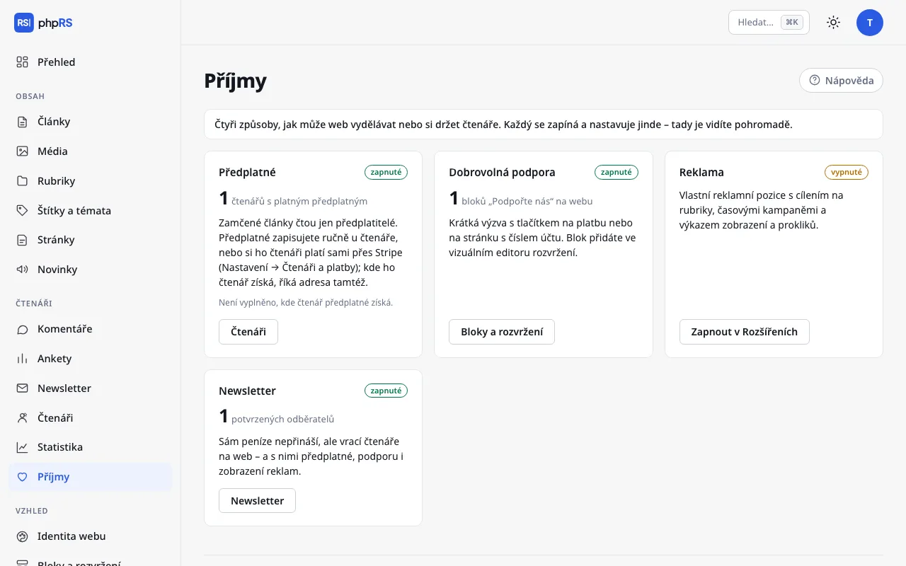

# Podpora a příjmy

Web může žít z předplatného, z dobrovolných příspěvků čtenářů a z reklamy. Tato stránka popisuje blok **Podpořte nás** a obrazovku **Příjmy**, která všechny zdroje ukazuje pohromadě.

Dobrovolné příspěvky phpRS nepřijímá ani nezpracovává a nevidí, kdo kolik přispěl. Blok Podpořte nás je výzva s tlačítkem, které čtenáře zavede tam, kde platba proběhne. Jinak je to u předplatného: to si čtenáři mohou platit kartou přes službu Stripe a web jim ho sám zapíná a prodlužuje – viz [Platby přes Stripe](platby-stripe.md).

## Blok Podpořte nás

Blok vypíše krátkou výzvu a tlačítko se srdcem. Nepotřebuje žádné rozšíření.

### Příprava

Rozhodněte se, kam tlačítko povede:

| Možnost | Co zadáte |
|---|---|
| Platební odkaz služby (Stripe, Donio, Darujme, Ko-fi…) | adresu začínající `https://` |
| Vlastní stránka s číslem účtu a QR kódem | adresu stránky na webu, například `/podporte-nas` |

Vlastní stránku vytvořte v **Obsah → Stránky**. QR kód pro platbu do ní vložte jako obrázek z Médií.

### Přidání bloku

1. Otevřete **Vzhled → Bloky a rozvržení**.
2. V zóně, kde má výzva být, klepněte na **+ Přidat blok** a ve skupině **Čtenáři a redakce** zvolte **Podpořte nás**.
3. V nastavení vyplňte:
   - **Výzva** – jedna až dvě věty. Prázdné pole znamená výchozí text: „Děláme nezávislou žurnalistiku. Pokud vám naše práce dává smysl, podpořte ji.“
   - **Text tlačítka** – nejvýše 60 znaků. Prázdné znamená **Podpořit redakci**.
   - **Kam tlačítko vede** – platební odkaz nebo adresa stránky.
4. Klepněte na **Uložit**.

Dokud pole **Kam tlačítko vede** nevyplníte, blok ukáže jen text výzvy bez tlačítka. Adresa musí začínat `https://`, `http://` nebo lomítkem; jiná se neuloží. Odkaz mimo web se čtenáři otevře s ochranou `noopener`.

### Kam blok umístit

- Do zóny **Pod obsahem** – čtenář ho uvidí po dočtení článku.
- Do pravého sloupce jako stálou připomínku.
- Polem **Jen v rubrice** ho můžete omezit na rubriku, polem **Stránky** třeba jen na hlavní stránku.

Blok upravujte ve vizuálním editoru. Formulářový seznam bloků nabízí **Text tlačítka**, **Kam tlačítko vede** i text výzvy – viz [Bloky a rozvržení](../vzhled/bloky-a-rozvrzeni.md).

Na vícejazyčném webu mějte blok pro každý jazyk zvlášť a polem **Jazyková verze** určete, kde se který zobrazí. Výchozí texty se překládají samy, vaše vlastní výzva ne.

## Obrazovka Příjmy

**Čtenáři → Příjmy** je rozcestník pro administrátora. Nic se na ní nenastavuje. Ukazuje čtyři karty – čtyři způsoby, jak může web vydělávat nebo si držet čtenáře. Každá karta má štítek **zapnuté** nebo **vypnuté**, jedno hlavní číslo a odkaz tam, kde se věc spravuje.

| Karta | Číslo | Kam vede odkaz |
|---|---|---|
| **Předplatné** | čtenářů s platným předplatným; s platbami přes Stripe navíc počet platících a součet plateb za posledních 30 dní podle měn | **Čtenáři** |
| **Dobrovolná podpora** | bloků „Podpořte nás“ na webu (jen zobrazené, ne skryté) | **Bloky a rozvržení** |
| **Reklama** | zobrazení aktivních reklam; pod tím počet aktivních reklam a prokliků | **Reklama** |
| **Newsletter** | potvrzených odběratelů | **Newsletter** |

U vypnutého rozšíření vede odkaz **Zapnout v Rozšířeních** do **Správa → Rozšíření**. Karta Dobrovolná podpora je zapnutá, jakmile je na webu aspoň jeden zobrazený blok Podpořte nás.

Karta Předplatné upozorní hlášením **Není vyplněno, kde čtenář předplatné získá.**, když chybí adresa v **Nastavení → Čtenáři a platby** a nejsou zapnuté ani platby přes Stripe. Bez ní čtenář u zamčeného článku nevidí tlačítko **Získat předplatné**. Postup je na stránce [Zamčený obsah a předplatné](zamceny-obsah.md).

Newsletter sám peníze nepřináší. Na přehledu je proto, že vrací čtenáře na web – a s nimi předplatné, podporu i zobrazení reklam.

### Co přehled neukazuje

Jediné částky na přehledu jsou platby předplatného přijaté přes Stripe za posledních 30 dní (před odečtením poplatků Stripe). Dobrovolné příspěvky a platby převodem přehled nevidí – kolik jste vybrali, zjistíte u své banky nebo platební služby. Hlavní číslo na kartě Předplatné je počet čtenářů, kterým předplatné právě platí, ať už ho zaplatili přes Stripe, nebo jste ho zapsali ručně.

## Související

- [Zamčený obsah a předplatné](zamceny-obsah.md)
- [Platby přes Stripe](platby-stripe.md)
- [Reklama](reklama.md)
- [Newsletter](newsletter.md)
- [Bloky a rozvržení](../vzhled/bloky-a-rozvrzeni.md)
