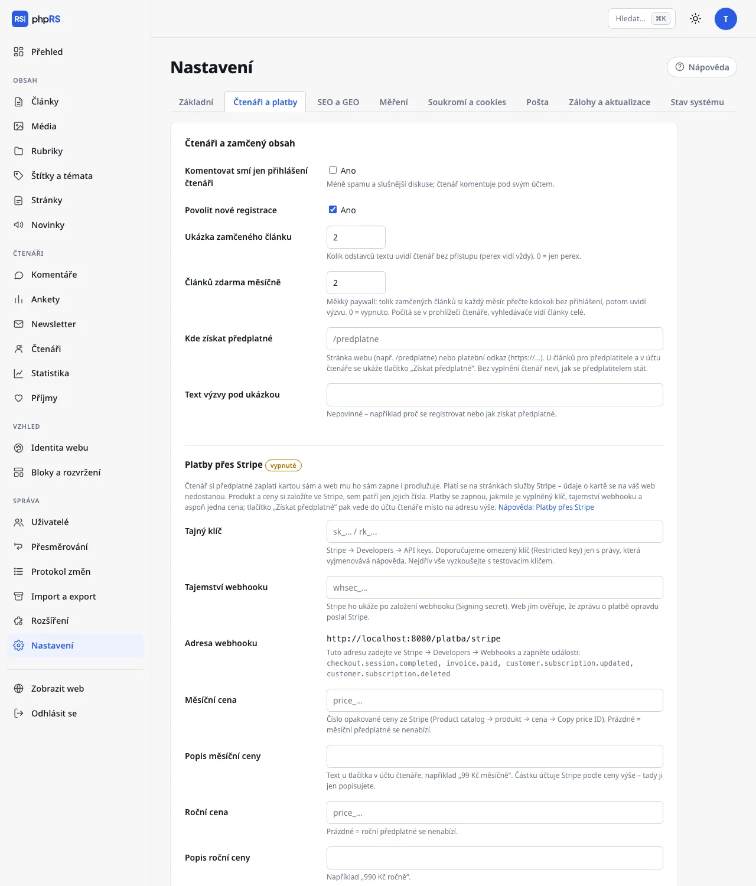

# Zamčený obsah a předplatné

Článek můžete vyhradit přihlášeným čtenářům nebo předplatitelům. Ostatní uvidí titulek, perex, začátek textu a výzvu. Předplatné čtenář získá jedním ze dvou způsobů: zaplatí si ho sám kartou přes službu Stripe a web mu ho sám zapne i prodlužuje (viz [Platby přes Stripe](platby-stripe.md)), nebo platbu přijmete po svém a předplatné mu zapíšete ručně. Oba způsoby jdou používat zároveň.

Všechno na této stránce vyžaduje rozšíření **Čtenáři a zamčený obsah** (**Správa → Rozšíření**). Registraci a účty popisuje stránka [Účty čtenářů](ucty-ctenaru.md).

## Zamčení článku

Ve formuláři článku je se zapnutým rozšířením v rozbalovacím oddílu **Další nastavení** pole **Kdo smí číst**:

| Volba | Kdo čte celý článek |
|---|---|
| **Všichni** | kdokoli (výchozí) |
| **Jen přihlášení čtenáři** | každý, kdo má účet čtenáře a je přihlášený |
| **Jen předplatitelé** | přihlášený čtenář s platným předplatným |

Volbu můžete kdykoli změnit, i u vydaného článku. Člen redakce přihlášený do administrace vidí všechny články celé.

## Co vidí čtenář bez přístupu

- titulek, perex a hlavní obrázek,
- ukázku: prvních několik odstavců textu,
- rámeček s výzvou.

Výzva se liší podle zámku:

| Zámek | Nadpis výzvy | Tlačítka |
|---|---|---|
| Jen přihlášení čtenáři | **Pokračování je pro přihlášené čtenáře** | **Přihlásit se**, **Zaregistrovat se** (jsou-li registrace povolené) |
| Jen předplatitelé | **Tento článek je pro předplatitele** | **Získat předplatné** a pro nepřihlášené **Už předplatné mám – přihlásit se** |

Tlačítko **Získat předplatné** vede se zapnutými platbami přes Stripe do účtu čtenáře, kde se předplatné platí; jinak na adresu z pole **Kde získat předplatné**.

Po přihlášení se čtenář vrátí na článek, ze kterého přišel. Ze zamčeného článku se nevypisují ani otázky a odpovědi.

### Nastavení

Otevřete **Nastavení → Čtenáři a platby**, oddíl **Čtenáři a zamčený obsah**:

| Pole | Význam | Výchozí |
|---|---|---|
| **Ukázka zamčeného článku** | kolik odstavců textu uvidí čtenář bez přístupu; perex vidí vždy; 0 = jen perex; nejvýše 10 | 2 |
| **Článků zdarma měsíčně** | měkký paywall, viz níže; 0 = vypnuto; nejvýše 50 | 0 |
| **Kde získat předplatné** | kam vede tlačítko **Získat předplatné**, dokud nejsou zapnuté platby přes Stripe | prázdné |
| **Text výzvy pod ukázkou** | vlastní věta ve výzvě, nejvýše 300 znaků; prázdné = výchozí text | prázdné |

Na téže záložce je pod ním oddíl **Platby přes Stripe** – popisuje ji [samostatná stránka](platby-stripe.md).

## Kde získat předplatné

Se zapnutými [platbami přes Stripe](platby-stripe.md) se toto pole nepoužívá: tlačítko **Získat předplatné** vede do účtu čtenáře, kde si přihlášený čtenář vybere měsíční nebo roční předplatné a zaplatí kartou. Nepřihlášený se nejdřív přihlásí nebo zaregistruje.

Bez plateb přes Stripe zadejte do pole **Kde získat předplatné** jednu z možností:

- stránku svého webu, například `/predplatne` – vytvořte ji v **Obsah → Stránky** a popište na ní cenu a způsob platby (číslo účtu, QR kód),
- platební odkaz začínající `https://`.

Jiný tvar adresy se ignoruje. Dokud pole nevyplníte (a nemáte zapnuté platby přes Stripe), tlačítko **Získat předplatné** se nezobrazí – ani u zamčených článků, ani v účtu čtenáře – a čtenář neví, jak se předplatitelem stát. Obrazovka **Příjmy** na to upozorní hlášením **Není vyplněno, kde čtenář předplatné získá.**

## Ruční zápis předplatného

Ručně předplatné zapisujete typicky po přijetí platby na účet, nebo když ho chcete někomu darovat. Funguje to i se zapnutými platbami přes Stripe: datum zapsané ručně platba nikdy nezkrátí – platí to pozdější z obou.

1. Otevřete **Čtenáři → Čtenáři** a čtenáře najděte podle e-mailu.
2. Ve sloupci **Předplatné** zvolte v nabídce **změnit…** jednu z možností **+ 1 měsíc**, **+ 3 měsíce** nebo **+ 1 rok**. Změna se uloží hned.
3. Hlášení potvrdí nové datum: **Předplatné platí do …**

Prodloužení se počítá od konce běžícího předplatného; u čtenáře bez předplatného nebo s prošlým od dneška. Opakovanou volbou tedy dobu sčítáte. Volba **zrušit** předplatné odebere.

Štítek ve sloupci ukazuje stav: **do** s datem, **skončilo**, nebo **nemá**. U čtenářů, kteří platí přes Stripe, je pod ním ještě stav předplatného ze Stripe (například **Stripe: platí**); u ostatních s platným předplatným poznámka **zapsáno ručně**. Předplatné platí do konce uvedeného dne. Po jeho uplynutí čtenář bez dalšího zásahu ztrácí přístup k článkům pro předplatitele; účet mu zůstává. Čtenář musí mít účet dřív, než mu předplatné zapíšete – požádejte ho, ať se zaregistruje e-mailem, ze kterého platil nebo který uvedl u platby.

## Měkký paywall

Pole **Článků zdarma měsíčně** dovolí každému návštěvníkovi přečíst si několik zamčených článků měsíčně bez přihlášení. Teprve potom uvidí výzvu.

- Počítají se jen otevřené zamčené články, každý jednou. Výpisy se nepočítají.
- Pod článkem čteným zdarma je poznámka **Čtete 2. z 5 článků, které máte tento měsíc zdarma.** s odkazem **Přihlásit se**.
- Po vyčerpání výzva doplní: **Tento měsíc jste už přečetli všech 5 článků zdarma.**
- Nový měsíc začíná znovu od nuly.

Počítadlo je v podepsané cookie `phprs_cteno` v prohlížeči čtenáře. Kdo cookies smaže nebo otevře web v anonymním okně, začíná znovu. U měkkého paywallu je to obvyklé a záměrné: cílem je vlídně upozornit věrné čtenáře, ne neprodyšně zamknout.

## Výpisy, kanály a vyhledávače

| Místo | Co obsahuje u zamčeného článku |
|---|---|
| Výpisy na webu (hlavní stránka, rubrika, štítek, hledání) | titulek, perex a obrázek jako u ostatních článků; zvláštní značku zámku nemají |
| RSS | titulek a perex (stejně jako u všech článků) |
| JSON Feed, Markdown verze článku, Veřejné API | perex a ukázka, nikdy celý text; API navíc vrací příznak `zamceno` |
| Newsletter a oznámení | titulek a perex s odkazem na web |

Text zamčeného článku se ořezává na jediném místě dřív, než se dostane do kterékoli šablony nebo kanálu. Nejde ho tedy získat oklikou.

**Vyhledávače.** Strukturovaná data zamčeného článku nesou údaj `isAccessibleForFree: False`. Vyhledávač tak ví, že jde o placený obsah, a ne o podvržený text. Při tvrdém zámku (měkký paywall vypnutý) vidí robot totéž co nepřihlášený čtenář: perex a ukázku. Se zapnutým měkkým paywallem vidí články celé, protože neposílá cookies a každý článek je pro něj první v měsíci. Chcete-li, aby se celé texty indexovaly, zapněte měkký paywall aspoň s jedním článkem měsíčně.

## Související

- [Účty čtenářů](ucty-ctenaru.md)
- [Platby přes Stripe](platby-stripe.md)
- [Podpora a příjmy](podpora-a-prijmy.md)
- [SEO](../seo-a-ai/seo.md)
- [Komentáře](../redakce/komentare.md)
