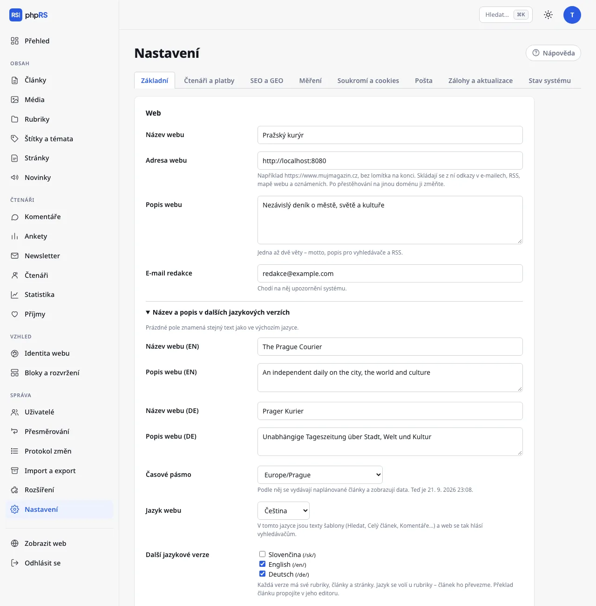

# Jazyky webu

phpRS umí web v jednom jazyce i web s několika jazykovými verzemi vedle sebe. Tato stránka popisuje, jak jazyky zapnout a co systém přeloží sám. Práci s obsahem popisuje stránka [Překlad obsahu](preklad-obsahu.md).

K dispozici jsou čtyři jazyky: čeština, slovenština, angličtina a němčina.

## Výchozí jazyk

Každý web má jeden výchozí jazyk. Nastavuje se v **Nastavení → Základní** v poli **Jazyk webu**; při instalaci se převezme jazyk, ve kterém jste instalovali.

V tomto jazyce jsou texty šablony – Hledat, Celý článek, Komentáře, texty formulářů, e-maily čtenářům – a web se tak hlásí vyhledávačům (atribut `lang`, Open Graph, strukturovaná data). Obsah ve výchozím jazyce žije na adresách bez předpony: `/clanek/…`, `/rubrika/…`.

Web v jediném jazyce nic dalšího nepotřebuje. Jazyk administrace s jazykem webu nesouvisí; každý uživatel si ho volí v nabídce **Můj účet**.

> Výchozí jazyk zvolte na začátku a potom ho neměňte. Obsah výchozího jazyka není v databázi označen kódem jazyka, ale tím, že žádný kód nemá. Po změně výchozího jazyka by se všechen dosavadní obsah začal hlásit k novému jazyku.

## Další jazykové verze

1. Otevřete **Správa → Rozšíření**, zaškrtněte **Jazykové verze webu** a uložte.
2. V **Nastavení → Základní** se pod polem **Jazyk webu** objeví **Další jazykové verze**. Zaškrtněte jazyky, které chcete přidat, a uložte.
3. Níže rozbalte **Název a popis v dalších jazykových verzích** a vyplňte **Název webu** a **Popis webu** pro každou verzi. Prázdné pole znamená stejnou hodnotu jako ve výchozím jazyce.
4. Pro každou verzi založte aspoň jednu rubriku v daném jazyce – viz [Překlad obsahu](preklad-obsahu.md). Bez rubriky nemá verze kam ukládat články.

Každá další verze žije na adrese s předponou jazyka: `/en/`, `/de/`, `/sk/`. Má vlastní hlavní stránku, rubriky, články, stránky, štítky, archiv, vyhledávání i kanály (`/en/rss.xml`, `/en/feed.json`). Soubory, obrázky v `media/`, mapa webu a API jsou společné.

Po vypnutí rozšíření zůstane obsah dalších verzí v databázi, ale na webu přestane být dostupný. Po opětovném zapnutí se vrátí.

## Co se překládá samo a co ne

| Část webu | Kdo překládá |
|---|---|
| Texty šablony: navigace, tlačítka, popisky formulářů, hlášení, stránkování, stránka 404 | systém – slovníky jsou součástí phpRS |
| E-maily čtenářům: potvrzení odběru, registrace, přihlašovací odkaz, patička newsletteru | systém – v jazyce verze, na které čtenář akci provedl |
| Výchozí texty bloků (výzva bloku Oznámení, Podpořte nás, Účet čtenáře) | systém |
| Cookie lišta – tlačítka | systém |
| Tvar data | systém, viz níže |
| **Název a popis webu** | vy, v **Nastavení → Základní** |
| Rubriky, články, stránky | redakce – každá verze má své |
| Novinky a ankety | redakce – u každé položky se volí **Jazyková verze** |
| Nadpisy bloků, bloky Text a Menu | redakce – blok pro každý jazyk zvlášť |
| Text cookie lišty, text výzvy pod zamčeným článkem, text režimu údržby | nepřekládá se – jedno znění pro celý web |

Texty, které zadáváte v Nastavení a které nemají pole pro další jazyky, se zobrazí ve všech verzích stejně. U dvojjazyčného webu je proto pište stručně, případně dvojjazyčně.

Chybí-li ve slovníku některý text, zůstane česky. Web se kvůli tomu nerozbije.

## Přepínač jazyků

Všechny tři vestavěné šablony vypisují přepínač jazyků v záhlaví – kódy jazyků (CS, EN, DE…) jako odkazy. Aktuální jazyk je zvýrazněný. Na webu s jediným jazykem se přepínač nevypisuje.

Kam přepínač vede:

- u **článku**, **rubriky** a **stránky**, které mají propojený překlad, přímo na protějšek v druhém jazyce,
- jinak na hlavní stránku dané jazykové verze.

Propojení překladů popisuje stránka [Překlad obsahu](preklad-obsahu.md). Přepínač nabízí jen vydané články a zobrazené rubriky a stránky.

Čtenář, který otevře adresu článku v nesprávné verzi (například `/clanek/…` u anglického článku), je přesměrován na správnou adresu s předponou.

## Značky hreflang

Značky `hreflang` říkají vyhledávačům, že dvě adresy jsou jazykové verze téhož obsahu. Systém je vkládá sám:

- na **hlavní stránce** odkazují na hlavní stránky všech verzí,
- u **článku, rubriky a stránky** jen na existující propojené překlady.

Obsah bez propojeného překladu značky nemá – vyhledávač by jinak dostal odkaz na nesouvisející stránku. Každá verze se také hlásí vlastním `lang` a `og:locale` (`cs_CZ`, `sk_SK`, `en_US`, `de_DE`).

## Datum v jazykových verzích

| Jazyk | Datum u článku | Datum slovy v záhlaví |
|---|---|---|
| čeština, slovenština | 18. 9. 2026 | názvy dnů a měsíců v daném jazyce |
| angličtina | 18 Sep 2026 | anglicky |
| němčina | 18.09.2026 | německy |

Desetinná čísla (například hodnocení recenze) mají v angličtině tečku, v ostatních jazycích čárku. Časové pásmo je pro celý web jedno – **Nastavení → Základní → Časové pásmo**.

## Co je společné pro všechny verze

- šablona, rozvržení a [Identita webu](../vzhled/identita-webu.md),
- uživatelé administrace a jejich oprávnění,
- Média,
- účty čtenářů a předplatné,
- nastavení SEO, měření a cookies,
- obrazovka **Titulní strana** – ruční pořadí skládá jen hlavní stránku výchozího jazyka; v ostatních verzích se články řadí podle připnutí a data.

## Související

- [Překlad obsahu](preklad-obsahu.md)
- [AI asistent](../psani/ai-asistent.md)
- [Bloky a rozvržení](../vzhled/bloky-a-rozvrzeni.md)
- [SEO](../seo-a-ai/seo.md)
