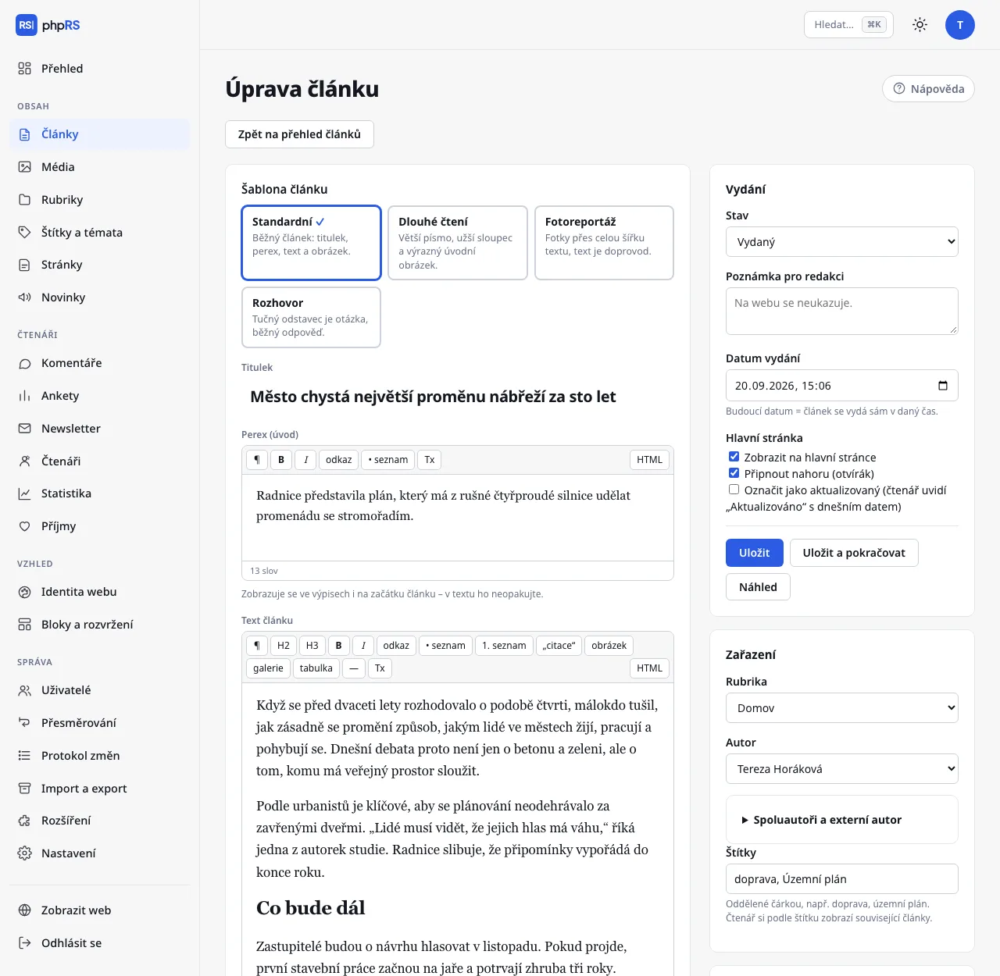

# Editor článku

Článek píšete v **Obsah → Články → Nový článek**. Vlevo je titulek, perex a text, vpravo nastavení: vydání, zařazení, hlavní obrázek a další volby. Na úzké obrazovce se nastavení přesune pod text.

K uložení stačí **Titulek** a **Rubrika**. Bez rubriky článek uložit nejde.

## Titulek, perex a text

- **Titulek** – nejvýše 255 znaků. Oddíl **Kontrola přístupnosti** ve sloupci nastavení upozorní, když má přes 110 znaků nebo je psaný verzálkami.
- **Perex (úvod)** – úvodní odstavec. Zobrazuje se ve výpisech i na začátku článku, v textu ho proto neopakujte. Perex má zkrácenou lištu nástrojů.
- **Text článku** – vlastní obsah s úplnou lištou nástrojů.

## Lišta nástrojů

| Tlačítko | Co dělá |
|---|---|
| **¶** | odstavec |
| **H2**, **H3** | mezititulek a menší mezititulek |
| **B**, **I** | tučně (Ctrl+B) a kurzíva (Ctrl+I) |
| **odkaz** | vloží nebo upraví odkaz (Ctrl+K) |
| **• seznam**, **1. seznam** | odrážkový a číslovaný seznam |
| **„citace“** | citace |
| **obrázek** | vloží obrázek nebo přílohu z Médií |
| **galerie** | vloží fotogalerii |
| **tabulka** | vloží tabulku 3 × 3 se záhlavím |
| **—** | oddělovací čára |
| **Tx** | odstraní formátování a odkaz |
| **HTML** | přepne na zdrojový kód a zpět |

Obrázkům, galeriím a přílohám se věnuje stránka [Obrázky, galerie a přílohy](obrazky-a-galerie.md).

### Odkazy

1. Označte text a klepněte na **odkaz**.
2. Do pole **Adresa** napište adresu (`https://…` nebo místní, například `/o-nas`). Vlastní článek najdete v poli **…nebo najděte vlastní článek** – stačí část titulku; u dosud nevydaných článků je poznámka *nevydaný*.
3. Podle potřeby zaškrtněte **otevřít v novém okně** a potvrďte tlačítkem **Vložit odkaz**.

Existující odkaz upravíte stejně: postavte do něj kurzor a klepněte na **odkaz**. Tlačítko **Zrušit odkaz** ho odstraní.

### Tabulky

Když je kurzor v tabulce, objeví se nad textem druhá lišta: **+ řádek**, **+ sloupec**, **− řádek**, **− sloupec** a **smazat tabulku**. První řádek je záhlaví. Tabulku bez záhlaví kontrola přístupnosti hlásí.

### Vkládání z Wordu a z webu

Vložený text editor sám vyčistí. Zůstanou odstavce, mezititulky, seznamy, odkazy, tabulky a obrázky; cizí styly, písma a barvy zmizí. Nadpis první úrovně se změní na mezititulek H2.

### Režim HTML

Tlačítko **HTML** ukáže zdrojový kód článku. Dokud je zapnuté, ostatní tlačítka lišty nereagují. Druhým klepnutím se vrátíte do běžného zobrazení.

## Počet slov

Pod editorem vidíte počet slov a u textu článku i odhad doby čtení (200 slov za minutu).

## Automatické ukládání rozepsaného textu

Rozepsaný formulář se průběžně ukládá, aby o něj nepřipravil pád prohlížeče ani výpadek spojení:

- do **prohlížeče** zhruba 1,5 vteřiny po poslední změně – pod editorem se objeví *rozepsaný text uložen v prohlížeči* a čas,
- na **server** nejvýše jednou za 15 vteřin – *rozepsaný text uložen i na serveru*. Díky tomu můžete pokračovat na jiném zařízení.

Rozepsaný stav není uložený článek. Na webu ani ve výpisu článků se nic nezmění, dokud neklepnete na **Uložit**.

Když formulář otevřete znovu a existuje novější rozepsaná verze, nad formulářem se zobrazí upozornění s tlačítky **Obnovit ji** a **Zahodit**. Nabízí se novější z obou kopií. Verze starší než 14 dní se nenabízejí. Uložením článku rozepsaná kopie zaniká.

## Zámek proti souběžné úpravě

Otevřením článku si ho zamknete. Zámek platí tři minuty a otevřený editor ho každou minutu prodlužuje. Kolega, který článek otevře ve stejnou dobu, uvidí hlášení, že ho máte otevřený, a že si uložením navzájem přepíšete změny. Editor mu přesto zůstane přístupný – domluvte se, kdo bude pokračovat. Uložením se článek uvolní.

## Kontrola přístupnosti

Oddíl **Kontrola přístupnosti** ve sloupci nastavení běží při psaní a hlásí:

- obrázek bez popisu – popis doplníte rovnou v kontrole a potvrdíte Enterem,
- mezititulek, který přeskakuje úroveň (H3 bez H2 nad sebou), a prázdný mezititulek,
- odkaz, jehož text neříká, kam vede („zde“, „více“, holá adresa),
- tabulku bez záhlaví,
- vložený rámec bez názvu,
- příliš dlouhý titulek, titulek verzálkami a chybějící perex.

Když je vše v pořádku, zobrazí se *✓ Obrázky mají popisy, nadpisy i odkazy jsou v pořádku.* Kontrola uložení nebrání.

## Uložení a náhled

- **Uložit** – uloží a vrátí vás na přehled článků.
- **Uložit a pokračovat** – uloží a zůstane v editoru.
- **Náhled** – otevře uložený článek v šabloně webu v novém okně. Funguje i u konceptu, ale jen přihlášeným do administrace. Ukazuje naposledy uloženou verzi, ne rozepsaný text. Komentáře a hodnocení se v náhledu nezobrazují.

Stavy článku a plánované vydání popisuje stránka [Plánování a revize](planovani-a-revize.md).

## Další pole formuláře

- **Spoluautoři a externí autor** (rozbalovací řádek v oddílu **Zařazení**) – další členové redakce, nebo host či agentura bez účtu. Externí autor se na webu uvede místo autora z redakce.
- **Adresa článku** (v **Další nastavení**) – část adresy za `/clanek/`. Vytvoří se z titulku; když ji u vydaného článku změníte, stará adresa se sama přesměruje na novou.
- **Klíčová slova** (v **Další nastavení**) – pomáhají hledání na webu.
- **Zdroj** (v **Další nastavení**) – u převzatých textů.

## Související

- [Vkládání videa a příspěvků ze sítí](vkladani-obsahu.md)
- [Typy obsahu](typy-obsahu.md)
- [AI asistent](ai-asistent.md)
