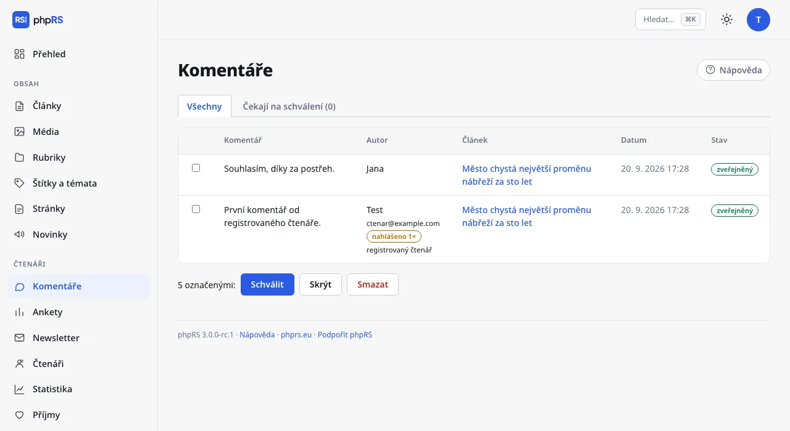

# Komentáře

Komentáře pod články jsou součástí rozšíření **Komentáře a hodnocení**, které je po instalaci zapnuté. Vypíná a zapíná ho administrátor ve **Správa → Rozšíření**. Moderuje se v **Čtenáři → Komentáře**; přístup má redaktor a administrátor.

## Kde se komentáře povolují

Komentáře se pod článkem zobrazí, když platí všechny tři podmínky:

1. je zapnuté rozšíření **Komentáře a hodnocení**,
2. v **Nastavení → Základní** je zapnutá volba **Komentáře pod články**,
3. článek má v oddílu **Další nastavení → Možnosti** zaškrtnuto **Povolit komentáře** (u nového článku zaškrtnuto je).

U citlivého tématu tedy stačí komentáře vypnout u jednoho článku.

## Režimy moderace

**Nastavení → Základní → Nový komentář:**

| Volba | Jak se chová |
|---|---|
| **zveřejnit hned (podezřelé počkají na schválení)** | komentář je vidět okamžitě; komentář se dvěma a více odkazy čeká na schválení |
| **zveřejnit až po schválení redakcí** | každý komentář čeká na schválení |

Čtenáři se po odeslání zobrazí buď poděkování, nebo zpráva, že se komentář zobrazí po schválení redakcí.

## Kdo smí komentovat

Ve výchozím stavu může komentovat kdokoli. Vyplní **Jméno**, nepovinný **E-mail** (nezveřejňuje se) a text o délce nejvýše 5 000 znaků.

Se zapnutým rozšířením **Čtenáři a zamčený obsah** přibude v **Nastavení → Čtenáři a platby** volba **Komentovat smí jen přihlášení čtenáři**. Nepřihlášený pak místo formuláře uvidí výzvu k přihlášení. Přihlášený čtenář komentuje pod jménem ze svého účtu a u jeho komentářů je značka ✓ (*registrovaný čtenář*).

## Ochrana proti spamu

Formulář chrání vestavěný antispam. K ověření nepoužívá CAPTCHA ani cookies a nevolá žádnou cizí službu:

- formulář nese podepsanou časovou značku – nejde odeslat dřív než za několik vteřin ani po několika hodinách,
- skryté pole, které člověk nevidí a robot vyplní; takový komentář se zahodí a robot se nedozví, že neuspěl,
- z jedné adresy projde nejvýše 5 komentářů za 10 minut,
- komentář s více odkazy čeká na schválení i v režimu okamžitého zveřejnění.

## Moderace

**Čtenáři → Komentáře** má dvě záložky: **Všechny** a **Čekají na schválení** s počtem. U každého komentáře vidíte text, jméno a e-mail odesílatele, krátký otisk jeho adresy (stejný otisk = stejný pisatel; samotná IP adresa se neukládá), článek, datum a stav (*zveřejněný* nebo *čeká / skrytý*).

1. Zaškrtněte komentáře.
2. Pod tabulkou zvolte **Schválit**, **Skrýt**, nebo **Smazat**.

- **Schválit** komentář zveřejní a vynuluje nahlášení.
- **Skrýt** ho stáhne z webu, ale ponechá v administraci. Lze ho později znovu schválit.
- **Smazat** je nevratné a smaže i reakce na komentář.

Text komentáře upravit nejde. Počet komentářů čekajících na schválení ukazuje i **Přehled**.

## Reakce a upozornění čtenářům

Čtenář může tlačítkem **Reagovat** odpovědět na komentář. Reakce se zobrazí odsazená pod ním; vlákna mají jednu úroveň.

Kdo při komentování vyplní e-mail a zaškrtne **Dát mi e-mailem vědět, když mi někdo odpoví**, dostane zprávu, jakmile je odpověď na jeho komentář zveřejněna – tedy u schvalovaných komentářů až po schválení. E-mail obsahuje odkaz do diskuse a odkaz, kterým si další upozornění k tomuto komentáři vypne. Zpráva přijde v jazyce té verze webu, pod jejímž článkem čtenář komentoval.

## Nahlášení komentáře

U každého komentáře je odkaz **nahlásit**. Čtenář jím upozorní redakci na nevhodný příspěvek:

- z jedné adresy se nahlášení téhož komentáře počítá jednou za den,
- po třech nahlášeních se komentář sám skryje a čeká na posouzení redakcí,
- v moderaci má nahlášený komentář značku *nahlášeno 2×*.

Schválením se počet nahlášení vynuluje a komentář se vrátí na web.

## E-maily redakci

**Nastavení → Základní → Další možnosti → E-mail redakci o komentářích:**

- **když komentář čeká na schválení** (výchozí),
- **při každém novém komentáři**,
- **neposílat**.

Zpráva chodí na **E-mail redakce** z Nastavení → Základní, nejvýše jednou za 10 minut. Obsahuje článek, autora a začátek komentáře, počet čekajících a odkaz do moderace.

## Hodnocení hvězdičkami

Totéž rozšíření přidává pod články hodnocení hvězdičkami (1–5). Opakované hlasování u téhož článku systém 30 dní nepřijme. Vypíná se v **Nastavení → Základní → Další možnosti → Hodnocení článků hvězdičkami**.

## Související

- [Role a oprávnění](role-a-opravneni.md)
- [Pošta](../provoz/posta.md) – aby upozornění docházela
- [Bezpečnost](../provoz/bezpecnost.md)
