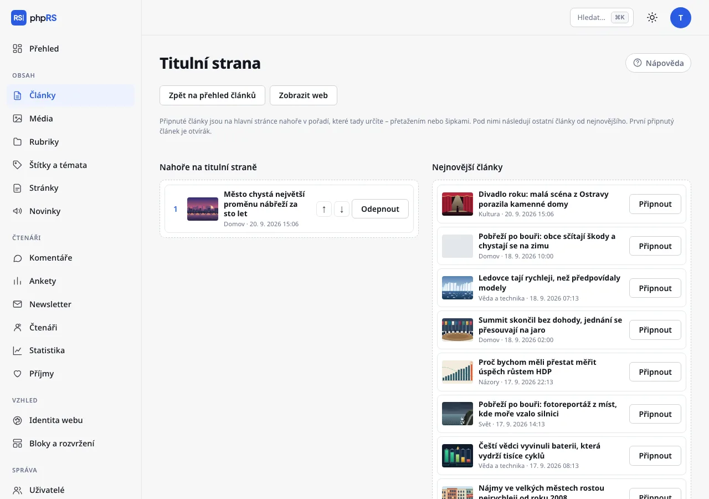
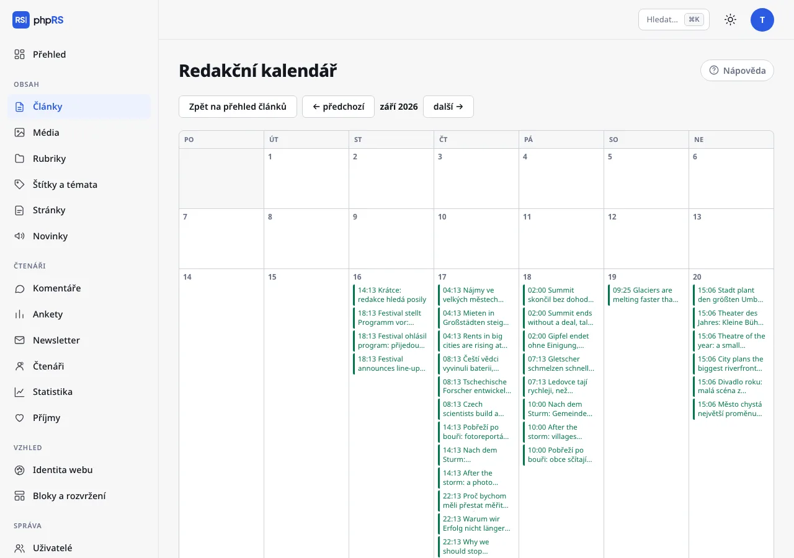
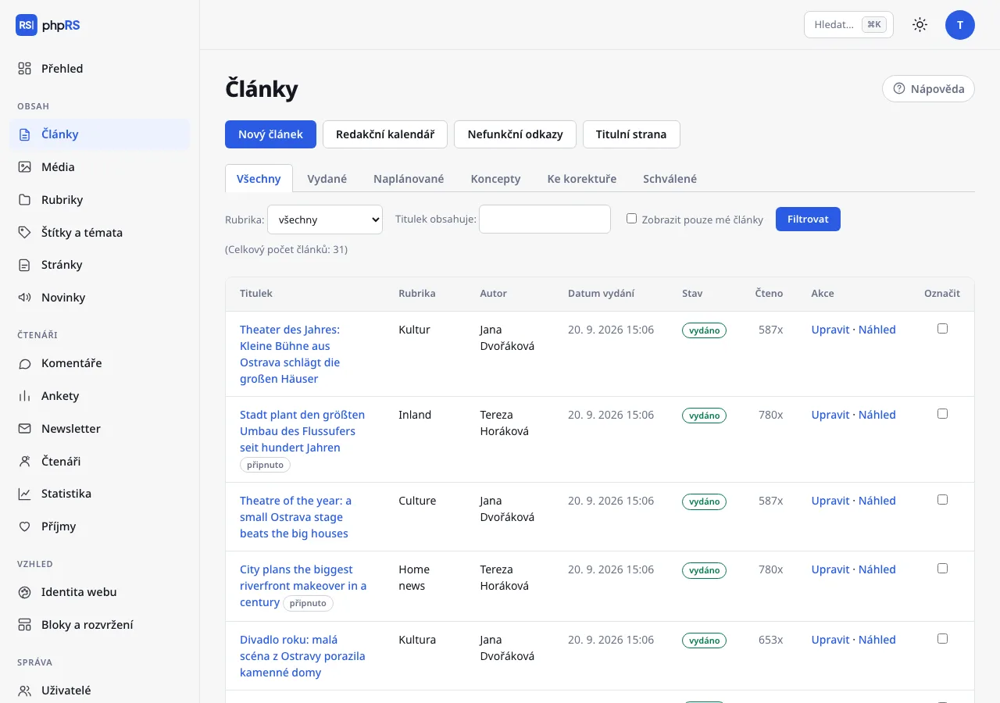

# Titulní strana a kalendář

Tato stránka popisuje nástroje, kterými redakce řídí, co je na webu nahoře, co kdy vyjde a jak rychle udělat hromadnou změnu. Všechny najdete v **Obsah → Články** v řádku odkazů nad výpisem.

## Titulní strana

Hlavní stránka webu řadí články od nejnovějšího. Připnuté články jsou nad nimi v pořadí, které určí redakce. O titulní straně rozhoduje jen ten, kdo smí vydávat; ostatní odkaz **Titulní strana** nevidí.

### Skládání titulní strany

1. Otevřete **Obsah → Články → Titulní strana**.
2. Vlevo je sloupec **Nahoře na titulní straně** s připnutými články, vpravo **Nejnovější články** – posledních 30 vydaných článků, které se na hlavní stránce zobrazují. Na webu s jazykovými verzemi skládá obrazovka jen výchozí jazyk; v ostatních jazycích připínejte volbou **Připnout nahoru (otvírák)** přímo u článku.
3. Článek připnete tlačítkem **Připnout**, nebo ho přetáhnete do levého sloupce. **Odepnout** ho vrátí mezi ostatní.
4. Pořadí připnutých změníte přetažením nebo šipkami **↑** a **↓**.
5. Klepněte na **Uložit titulní stranu**. Odkazem **Zobrazit web** si výsledek zkontrolujete.

První připnutý článek je otvírák. Připnout lze nejvýše 30 článků. Pod připnutými následují ostatní články od nejnovějšího.

### Volby přímo u článku

Totéž v menším jde nastavit ve formuláři článku v oddílu **Vydání → Hlavní stránka**:

- **Zobrazit na hlavní stránce** – bez zaškrtnutí je článek jen ve své rubrice, ve vyhledávání a na stránkách štítků. U nového článku je volba zapnutá.
- **Připnout nahoru (otvírák)** – připne článek bez otevírání Titulní strany. Takto připnutý článek se zařadí pod články seřazené ručně na Titulní straně.

Připnutý článek má ve výpisu článků značku *připnuto*. Připnutí samo nekončí – až zpráva zestárne, článek odepněte. Datum, po kterém má článek z hlavní stránky zmizet úplně, nastavíte polem **Stáhnout z hlavní stránky** (viz [Plánování a revize](../psani/planovani-a-revize.md)).

Kolik článků se na hlavní stránku vejde, určuje administrátor v **Nastavení → Základní → Článků na stránku**.

## Redakční kalendář

**Obsah → Články → Redakční kalendář** ukazuje měsíční mřížku článků podle data vydání.

- Každý článek je v kalendáři uveden časem a titulkem. Klepnutím otevřete jeho editor.
- Barvy: zeleně vydané, modře naplánované, oranžově koncepty, fialově články ke korektuře (čárkovaně) a schválené, které čekají na vydání (plnou čarou).
- Dnešní den je zvýrazněný. Mezi měsíci listujete odkazy **← předchozí** a **další →**.
- Datum článku v kalendáři přesunout nejde – změníte ho v úpravě článku v poli **Datum vydání**.

Autor vidí v kalendáři jen své články, uživatel omezený na rubriky jen články ze svých rubrik.

Kalendář se hodí i na plánování dopředu: založte koncept s pracovním titulkem a budoucím datem. V kalendáři bude vidět oranžově a na webu se neobjeví, dokud ho někdo nevydá.

## Výpis článků a hromadné akce

Výpis ukazuje 20 článků na stránku. Zúžíte ho záložkami stavu (**Všechny**, **Vydané**, **Naplánované**, **Koncepty**, **Ke korektuře**, **Schválené**), polem **Rubrika:**, na webu s jazykovými verzemi polem **Jazyk:**, polem **Titulek obsahuje:** a volbou **Zobrazit pouze mé články**; potvrďte tlačítkem **Filtrovat**.

Hromadná akce:

1. Ve sloupci **Označit** zaškrtněte články.
2. Pod tabulkou v nabídce **S označenými:** zvolte akci a doplňte, co si vyžádá (rubriku nebo štítek).
3. Klepněte na **Provést**.

| Akce | Co udělá |
|---|---|
| **přesunout do rubriky…** | přesune články do zvolené rubriky; uživatel omezený na rubriky jen do svých |
| **přidat štítek…** | přidá článkům štítek; neznámý štítek založí |
| **zamknout pro přihlášené čtenáře** | článek si přečtou jen přihlášení čtenáři |
| **odemknout pro všechny** | zruší zamčení |

Zamykání se nabízí jen se zapnutým rozšířením **Čtenáři a zamčený obsah** (**Správa → Rozšíření**).

Tlačítko **Smazat označené** články po potvrzení smaže. Smazání je nevratné. Kdo nemá právo vydávat, vydané články hromadně měnit ani mazat nemůže – systém je přeskočí a v hlášení uvede počet skutečně upravených.

## Nefunkční odkazy

**Obsah → Články → Nefunkční odkazy.** Systém na pozadí prochází vydané články – jeden za pět minut, každý jednou za měsíc – a zkouší, zda odkazy v nich ještě fungují. Obrazovka ukazuje článek, odkaz, problém (například *stránka neexistuje (404)*) a datum zjištění. Po opravě odkazu klepněte na **Zkontrolovat znovu**. Kontrolu lze vypnout v **Nastavení → Základní → Další možnosti → Hledat nefunkční odkazy**.

## Paleta příkazů

Klávesová zkratka **Ctrl+K** (na Macu **⌘K**) nebo pole **Hledat…** vpravo nahoře otevře paletu příkazů. Když je kurzor v textu článku, vkládá Ctrl+K odkaz – paletu tehdy otevřete polem **Hledat…**.

- Napište název sekce (*rubriky*), akce (*nový článek*, *redakční kalendář*, *titulní strana*) nebo část titulku článku.
- Šipkami **↑** **↓** vyberte, **Enter** otevře, **Esc** zavře.
- Hledání funguje i bez diakritiky.
- Nalezený článek se otevře rovnou v editoru.

Paleta nabízí jen to, kam smíte: sekce podle vašich oprávnění a články, které smíte upravovat. Administrátor v ní najde i jednotlivé záložky Nastavení.

## Související

- [Předávka a korektura](predavka-a-korektura.md)
- [Rubriky, štítky a seriály](../psani/rubriky-stitky-serialy.md)
