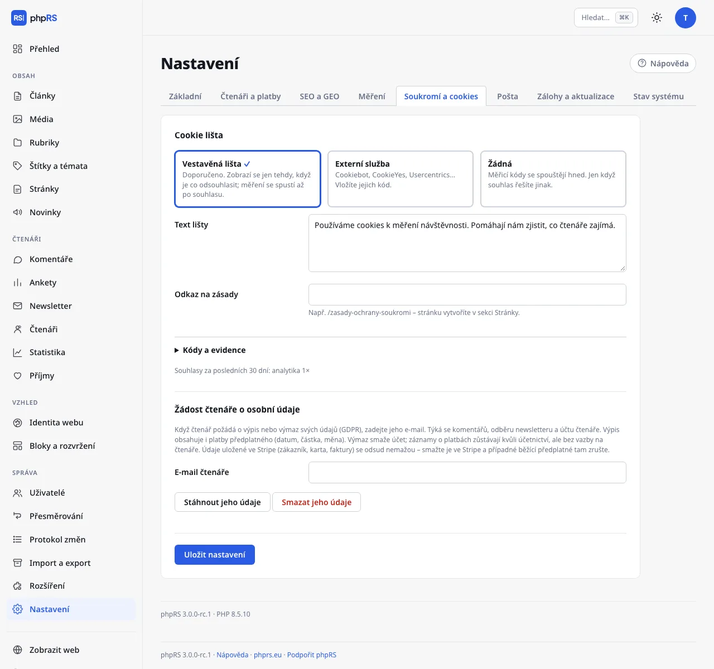

# Měření a soukromí

Tato stránka popisuje dvě záložky nastavení, které spolu souvisejí: **Nastavení → Měření** (čím měříte návštěvnost) a **Nastavení → Soukromí a cookies** (zda a jak se ptáte návštěvníka na souhlas). Obě spravuje administrátor.

Základní představa: co cookies nepoužívá, běží hned a bez lišty. Co cookies používá, čeká na souhlas.

## Vestavěná statistika

Volba **Vestavěná statistika** v záložce Měření je po instalaci zapnutá. Patří k ní rozšíření **Statistika** (**Správa → Rozšíření**; výchozí: zapnuto) a obrazovka **Čtenáři → Statistika**.

Měření nepoužívá cookies a neukládá IP adresy, takže nepotřebuje souhlas návštěvníka:

- návštěvník se pozná podle otisku složeného z IP adresy, prohlížeče a soli, která platí jeden den; samotná IP adresa se nikam nezapisuje,
- otisky se po dvou dnech mažou, takže čtenáře nejde sledovat v čase,
- roboti a náhledy článků z administrace se nepočítají.

Obrazovka **Statistika** ukazuje za zvolené **Období** (7, 30 nebo 90 dní):

| Údaj | Význam |
|---|---|
| **Návštěvy** | počet různých návštěvníků po dnech |
| **Zobrazené stránky** | počet zobrazení stránek |
| **Stránek na návštěvu** | poměr obou čísel |
| **Zobrazení a návštěvy po dnech** | sloupcový graf; světlá část sloupce jsou zobrazení, tmavá návštěvy |
| **Nejčtenější články** | podle zobrazení v období |
| **Odkud čtenáři přicházejí** | 15 nejčastějších webů, ze kterých návštěvníci přišli |

Když je měření vypnuté, obrazovka hlásí **Měření je vypnuté. Zapnete ho v Nastavení → Měření.**

## Externí analytika

Externí nástroje jsou nepovinné. Vyplňte jen ty, které používáte.

| Pole | Co zadat | Souhlas |
|---|---|---|
| **Google Analytics** | ID měření ve tvaru `G-XXXXXXXXXX` | spouští se až po souhlasu |
| **Matomo – adresa** a **Matomo – ID webu** | adresa vaší instalace a číslo webu; měří se, jen když jsou vyplněné obě | spouští se až po souhlasu |
| **Plausible – doména** | doména webu, např. `example.cz` | nepoužívá cookies, načítá se bez souhlasu |
| **Vlastní kód do hlavičky** | libovolný kód | vloží se na každou stránku bez ohledu na souhlas – jen pro kódy, které neukládají cookies |

Matomo, Plausible a vlastní kód jsou v rozbalovacím oddílu **Další nástroje (Matomo, Plausible, vlastní kód)**.

Google Analytics se vkládá s režimem souhlasu: dokud návštěvník nesouhlasí, mají všechna úložiště stav „zamítnuto“ a měřicí skript se nenačte.

## Cookie lišta

V záložce **Soukromí a cookies** zvolte jeden ze tří režimů:

| Režim | Chování |
|---|---|
| **Vestavěná lišta** | Výchozí a doporučený. Lišta se zobrazí jen tehdy, když je co odsouhlasit. Měření se spustí až po souhlasu. |
| **Externí služba** | Cookiebot, CookieYes, Usercentrics… Vložíte jejich kód; souhlas řídí jejich lišta. |
| **Žádná** | Měřicí a marketingové kódy se spouštějí hned. Jen když souhlas řešíte jinak. |

### Vestavěná lišta

Lišta se zobrazí, jen když máte vyplněné Google Analytics, Matomo nebo **Marketingové kódy**. Web, který používá jen vestavěnou statistiku nebo Plausible, lištu nezobrazuje vůbec – není se na co ptát.

Návštěvník má tlačítka **Přijmout vše**, **Jen nezbytné** a **Nastavení**. V nastavení si vybere kategorie:

- **Nezbytné – bez nich web nefunguje** (vždy zapnuté),
- **Analytické – anonymní měření návštěvnosti** (jen když měříte nástrojem s cookies),
- **Marketingové – cílení reklamy** (jen když máte marketingové kódy nebo zapnutou reklamu s kódem reklamní sítě),

a potvrdí je tlačítkem **Uložit výběr**. Volba se uloží do cookie `phprs_souhlas` na 6 měsíců. Změnit ji může kdykoli tlačítkem **Nastavení cookies**, které na webu zůstává.

Co vyplnit:

| Pole | Význam |
|---|---|
| **Text lišty** | Věta pro návštěvníka. Výchozí: „Používáme cookies k měření návštěvnosti. Pomáhají nám zjistit, co čtenáře zajímá.“ |
| **Odkaz na zásady** | Například `/zasady-ochrany-soukromi`. Stránku vytvořte v **Obsah → Stránky**. V liště se zobrazí jako **Více informací**. |

Tlačítka lišty se překládají do jazyka webu sama; text lišty je jeden pro všechny jazykové verze.

### Kódy a evidence

| Pole | Význam |
|---|---|
| **Kód externí služby** | Skript od poskytovatele (u Cookiebotu řádek s `data-cbid`). Načte se jako první. Použije se v režimu Externí služba. |
| **Marketingové kódy** | Meta Pixel, Sklik retargeting, Google Ads… Spustí se až po souhlasu s marketingem. |
| **Evidovat souhlasy** | Výchozí: zapnuto. Ukládá čas, náhodný identifikátor a zvolené kategorie – bez IP adresy. Doklad pro případnou kontrolu. |

Pod oddílem **Kódy a evidence** se – jakmile nějaký souhlas přijde – ukáže řádek **Souhlasy za posledních 30 dní:** s počty podle kategorií.

Měřicí skripty čekající na souhlas nesou i značky, kterým rozumí Cookiebot. V režimu **Externí služba** je tedy po souhlasu spustí jeho lišta. U jiné služby ověřte, že skripty po souhlasu opravdu povolí.

Na souhlas s marketingem čekají také kódy reklamních sítí z [Reklamního systému](../ctenari-a-prijmy/reklama.md) – vestavěná lišta se na marketing zeptá i kvůli nim. V režimu **Externí služba** dostanou skripty v marketingových kódech a kódech reklamních sítí značení `type="text/plain" data-cookieconsent="marketing"`, kterému rozumí Cookiebot a služby s ním kompatibilní; spustí je až ona.

## Které cookies ukládá sám systém

| Cookie | K čemu je | Kdy vzniká |
|---|---|---|
| `phprs_souhlas`, `phprs_souhlas_id` | volba na cookie liště a náhodný identifikátor pro evidenci | po volbě na liště |
| `phprs_ctenar` | přihlášení čtenáře | po přihlášení čtenáře |
| `phprs_cteno` | počítadlo měkkého paywallu | po otevření zamčeného článku zdarma |
| `phprs_h…`, `phprs_a…` | značka, že čtenář už hodnotil článek nebo hlasoval v anketě; platí 30 dní | po hodnocení nebo hlasování |
| cookie relace administrace | přihlášení redakce | po přihlášení do administrace |

Jsou to technické cookies. Čtenář, který web jen čte – nepřihlašuje se, nehlasuje a nevidí cookie lištu –, nedostane žádnou. Tento přehled můžete použít jako podklad pro své zásady ochrany soukromí; právní posouzení je na vás.

## Vložený obsah až po kliknutí

Video z YouTube nebo Vimea, přehrávač Spotify a příspěvky ze sociálních sítí vložené do článku se z cizí služby nenačtou samy. Čtenář nejdřív vidí tlačítko s názvem služby a obsah se načte až po kliknutí. Dokud neklikne, cizí služba se o jeho návštěvě nedozví a žádné cookies neuloží. Není k tomu potřeba nic nastavovat ani se na to ptát v cookie liště. Podrobnosti jsou na stránce [Vkládání obsahu](../psani/vkladani-obsahu.md).

Výjimkou je kód, který vložíte sami jako HTML – do článku nebo do bloku **Text**. Ten se načítá hned. Ukládá-li cookies, zvažte, zda nepatří spíš mezi **Marketingové kódy**.

## Žádost čtenáře o osobní údaje

Oddíl **Žádost čtenáře o osobní údaje** ve stejné záložce umí podle e-mailu stáhnout nebo smazat komentáře, odběr newsletteru a účet čtenáře. Postup je na stránce [Účty čtenářů](../ctenari-a-prijmy/ucty-ctenaru.md).

## Související

- [SEO](seo.md)
- [Vkládání obsahu](../psani/vkladani-obsahu.md)
- [Reklama](../ctenari-a-prijmy/reklama.md)
- [Bezpečnost](../provoz/bezpecnost.md)
