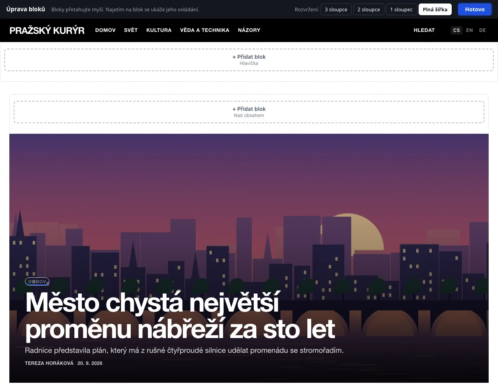

# Bloky a rozvržení

Blok je samostatný prvek stránky mimo hlavní obsah: seznam rubrik, nejčtenější články, vyhledávání, formulář newsletteru, reklama nebo vlastní text. Bloky se skládají do zón kolem obsahu a upravují se přímo na živé stránce webu.

Přístup má administrátor a redaktor (pokud mu administrátor sekci neodebral, viz [Role a oprávnění](../redakce/role-a-opravneni.md)).

## Otevření editoru

V hlavní nabídce klepněte na **Vzhled → Bloky a rozvržení**. Otevře se hlavní stránka webu v režimu úprav: nahoře je lišta **Úprava bloků**, zóny jsou ohraničené a v každé je tlačítko **+ Přidat blok**.

Odkazy na webu zůstávají v režimu úprav. Klepnutím na článek nebo rubriku tedy přejdete na jejich stránku a vidíte, jak tam bloky vypadají – hodí se to u bloků, které se zobrazují jen v některé rubrice. Úpravy ukončíte tlačítkem **Hotovo**, které vás vrátí do administrace.

Čtenáři režim úprav nevidí. Každá změna se ale ukládá hned a na webu platí okamžitě.

## Zóny

| Zóna | Kde je |
|---|---|
| **Hlavička** | pod záhlavím webu, přes celou šířku |
| **Levý sloupec** | vlevo od obsahu (jen rozvržení 3 sloupce) |
| **Nad obsahem** | nad výpisem článků nebo nad článkem |
| **Pod obsahem** | pod výpisem článků nebo pod článkem |
| **Pravý sloupec** | vpravo od obsahu (rozvržení 3 a 2 sloupce) |
| **Patička** | dole nad zápatím webu |

Které zóny existují, určuje rozvržení stránky. Změníte ho tlačítky **3 sloupce**, **2 sloupce**, **1 sloupec** a **Plná šířka** v horní liště u popisku **Rozvržení:**. Bloky ze zrušeného sloupce se přesunou samy; podrobnosti jsou na stránce [Šablony webu](sablony.md).

## Přidání bloku

1. V zóně, kam blok patří, klepněte na **+ Přidat blok**.
2. V okně **Co chcete přidat?** klepněte na kartu bloku.
3. Blok se přidá na konec zóny a otevře se jeho nastavení. Upravte ho a klepněte na **Uložit**.

### Katalog bloků

| Skupina | Blok | Co zobrazuje |
|---|---|---|
| Články | **Otvírák** | Velká upoutávka na připnutý nebo nejnovější článek. |
| Články | **Články z rubriky** | Seznam posledních článků z rubriky, kterou vyberete. |
| Články | **Nejčtenější** | Žebříček článků podle počtu přečtení. |
| Články | **Štítky** | Nejpoužívanější štítky jako odkazy. |
| Články | **Archiv** | Články po měsících. |
| Články | **Autoři** | Seznam autorů s počtem článků. |
| Navigace | **Rubriky** | Seznam rubrik webu. |
| Navigace | **Menu** | Vlastní odkazy – na stránky webu i jinam. |
| Navigace | **Stránky** | Odkazy na stránky jako O nás a Kontakt. |
| Navigace | **Vyhledávání** | Pole pro hledání v článcích. |
| Čtenáři a redakce | **Novinky** | Krátké zprávy redakce. |
| Čtenáři a redakce | **Anketa** | Aktuální anketa s hlasováním. |
| Čtenáři a redakce | **Newsletter** | Formulář pro přihlášení k odběru novinek e-mailem. |
| Čtenáři a redakce | **Podpořte nás** | Krátká výzva a tlačítko na platbu nebo stránku s číslem účtu. |
| Čtenáři a redakce | **Oznámení** | Tlačítko, kterým si čtenář zapne upozornění na nové články v prohlížeči. |
| Čtenáři a redakce | **Účet čtenáře** | Odkaz na přihlášení, registraci a účet čtenáře. |
| Čtenáři a redakce | **Sociální sítě** | Odkazy na profily vyplněné v Nastavení. |
| Čtenáři a redakce | **Kontakt** | E-mail redakce a text z patičky. |
| Vlastní | **Text** | Vlastní text, obrázek nebo vložený kód (video, mapa…). |
| Vlastní | **Reklama** | Pozice, na které se střídají bannery z Reklamního systému. |

Bloky **Novinky**, **Anketa**, **Newsletter**, **Oznámení**, **Účet čtenáře** a **Reklama** patří k rozšířením. V nabídce jsou, jen když je příslušné rozšíření ve **Správa → Rozšíření** zapnuté. Po vypnutí rozšíření blok z webu zmizí, jeho nastavení zůstane.

## Přesun, nastavení a smazání

- **Přesun:** blok chytněte myší a přetáhněte na nové místo, i do jiné zóny. Pořadí se uloží samo.
- Po najetí myší na blok se ukáže jeho ovládání: šipky **↑** a **↓** (**Posunout výš**, **Posunout níž**), **Nastavit** a **✕** (**Smazat blok**). Smazání se potvrzuje.

### Nastavení bloku

Každý blok má **Nadpis** a volbu **Zobrazit nadpis na webu**. Další pole se liší podle typu:

| Blok | Pole |
|---|---|
| Text | **Obsah** – malý editor |
| Menu | **Odkazy** – dvojice text a adresa (`/o-nas` nebo `https://…`), další řádek přidá **+ další odkaz** |
| Články z rubriky | **Rubrika** (nebo **Nejnovější ze všech rubrik**) a **Kolik položek** (1–20; vyšší číslo se uloží jako 20) |
| Nejčtenější, Štítky, Archiv, Autoři | **Kolik položek** (1–50) |
| Podpořte nás | **Výzva**, **Text tlačítka**, **Kam tlačítko vede** – viz [Podpora a příjmy](../ctenari-a-prijmy/podpora-a-prijmy.md) |
| Reklama | **Reklamní pozice** – viz [Reklama](../ctenari-a-prijmy/reklama.md) |

**Vzhled** bloku má čtyři podoby: **Běžný**, **Podbarvený**, **Zvýrazněný nadpis** a **V rámečku**. Jak přesně vypadají, určuje šablona.

### Kdy a kde blok zobrazit

Rozbalovací oddíl **Kdy a kde blok zobrazit** omezuje, komu se blok ukáže:

| Pole | Možnosti |
|---|---|
| **Stránky** | na všech stránkách · jen na hlavní stránce · všude kromě hlavní stránky |
| **Jen v rubrice** | blok se ukáže jen na stránce vybrané rubriky a u jejích článků |
| **Jazyková verze** | ve všech jazycích, nebo jen v jedné verzi (pole je vidět jen na vícejazyčném webu) |
| **Zařízení** | všude · jen na mobilu · jen na počítači a tabletu |
| **Blok dočasně skrýt** | blok zůstane uložený, čtenáři ho nevidí |

Hranice mezi mobilem a počítačem je šířka okna 760 px. Blok, který se na právě zobrazené stránce čtenářům neukáže, vidíte v editoru jako rámeček s názvem a důvodem, například **Teď se nezobrazuje: jen na hlavní stránce.** Blok bez obsahu (třeba Novinky bez jediné novinky) hlásí **Zatím nemá co zobrazit.** a čtenářům se nevypisuje.

## Blok s vlastním HTML

Blok **Text** slouží i pro vložený kód – video, mapu, widget.

1. Přidejte blok **Text** a otevřete jeho nastavení.
2. V editoru pole **Obsah** klepněte na tlačítko **HTML** (přepnutí na zdrojový kód).
3. Vložte kód a klepněte na **Uložit**.

Obsah bloků systém považuje za důvěryhodný a vypisuje ho beze změny. Vkládejte proto jen kód ze zdrojů, kterým věříte. Kód, který ukládá cookies nebo načítá cizí služby, může vyžadovat souhlas návštěvníka – viz [Měření a soukromí](../seo-a-ai/mereni-a-soukromi.md).

## Bloky pro jazykové verze

Na webu s více jazyky se systémové bloky přizpůsobí samy: Rubriky, Články z rubriky, Štítky, Archiv, Autoři, Stránky i Novinky vypisují obsah té jazykové verze, kterou čtenář právě čte. Nadpis bloku a obsah bloků Text a Menu se nepřekládá. Řešením je mít blok dvakrát – jednou pro každý jazyk – a polem **Jazyková verze** určit, kde se který ukáže. Více na stránce [Překlad obsahu](../jazykove-verze/preklad-obsahu.md).

## Seznam bloků bez vizuálního editoru

Záložní cestou je formulářový přehled na adrese `admin.php?modul=bloky&schema=1`. Funguje i bez JavaScriptu a hodí se, když se stránka webu kvůli chybnému vloženému kódu nedá ovládat.

- Přehled ukazuje schéma stránky se zónami. Přepínač **Rozvržení stránky:** je nahoře.
- Bloky přesunete přetažením nebo šipkami; **Upravit** otevře formulář, **Smazat** blok odstraní, **+ přidat blok** založí nový v dané zóně.
- Formulář má pole **Typ bloku**, **Nadpis bloku**, **Vlastní obsah (HTML)** a podle typu bloku **Odkazy menu**, **Rubrika**, **Počet položek** nebo **Reklamní pozice**. V oddílu **Umístění a zobrazení** následují **Umístění**, **Vzhled bloku**, **Na kterých stránkách**, **Jen v rubrice**, **Jazyková verze** (jen na webu s více jazyky), **Zařízení** a **Zobrazit blok**. U bloku Podpořte nás přibudou pole **Text tlačítka** a **Kam tlačítko vede**. Vzhled tu má navíc pátou volbu **Bez nadpisu**, která odpovídá vypnutému **Zobrazit nadpis na webu**.
- Zpět do vizuálního editoru vede **Otevřít vizuální editor**.

## Související

- [Šablony webu](sablony.md)
- [Úprava přímo na webu](uprava-na-webu.md)
- [Reklama](../ctenari-a-prijmy/reklama.md)
- [Newsletter](../ctenari-a-prijmy/newsletter.md)
