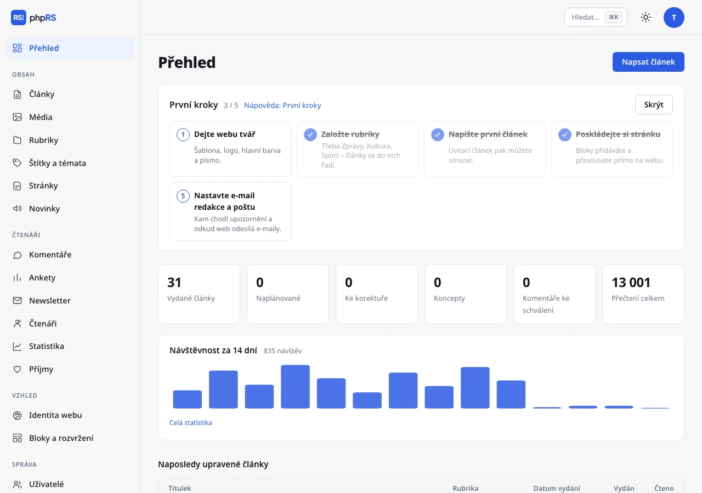
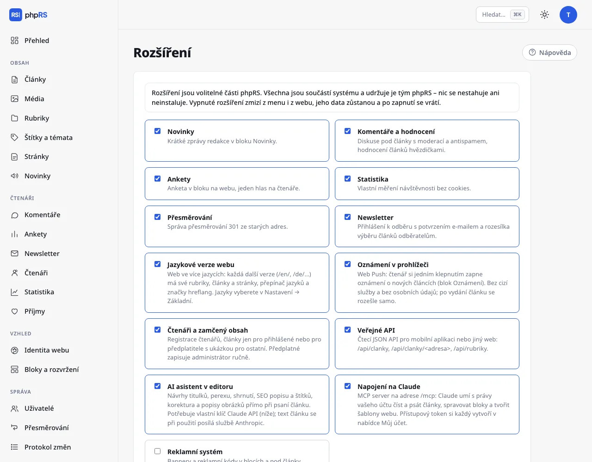

# První kroky

Po prvním přihlášení vás na **Přehledu** čeká průvodce **První kroky**. Má pět bodů, každý vede rovnou na správnou obrazovku a po splnění se odškrtne. Až ho nebudete potřebovat, tlačítkem **Skrýt** zmizí.

## 1. Dejte webu tvář

**Vzhled → Identita webu.** Vyberte šablonu, nahrajte logo a ikonu webu, zvolte hlavní barvu a písma titulků a textu. Změny vidíte hned v náhledu.
Tmavý režim pro čtenáře zapnete tamtéž – web se pak řídí nastavením jejich zařízení.

## 2. Založte rubriky

**Obsah → Rubriky.** Každý článek patří právě do jedné rubriky, bez rubriky článek uložit nejde. Instalace založila rubriku *Aktuality* (s ukázkovým obsahem pět rubrik smyšleného deníku); přejmenujte ji a přidejte další.
Rubriky mohou mít podrubriky. Pořadí v navigaci určuje pole **Pořadí**.

## 3. Napište první článek

**Obsah → Články → Nový článek.** Stačí titulek, perex, text a rubrika. V pravém sloupci v oddílu **Vydání** volíte **Stav**:

- **Koncept** – rozepsaný článek, vidí ho jen redakce,
- **Ke korektuře** – hotovo, prosím o kontrolu,
- **Schváleno – čeká na vydání** – zkontrolováno, čeká na svůj čas,
- **Vydaný** – článek je na webu; s datem v budoucnosti vyjde sám v daný čas.

Autor, který nesmí sám vydávat, má jen první dvě volby.

Uvítací článek z instalace můžete smazat. Pokud jste při instalaci nahráli ukázkový obsah, smažete ho celý najednou v **Nastavení → Základní → Ukázkový obsah** – vaše vlastní články a rubriky zůstanou.

## 4. Poskládejte si stránku

**Vzhled → Bloky a rozvržení.** Otevře se váš web v režimu úprav. Bloky – seznam rubrik, nejčtenější články, vyhledávání, vlastní text a další – přidáváte tlačítkem **+ Přidat blok** přímo v místě, kde mají být, a přetahujete myší. Nahoře volíte rozvržení: tři sloupce, dva, jeden nebo plnou šířku.

## 5. Nastavte e-mail redakce a poštu

E-mail redakce zkontrolujte v **Nastavení → Základní** (pole **E-mail redakce**), způsob odesílání v **Nastavení → Pošta**. Bod průvodce se odškrtne, když je e-mail redakce vyplněný a je nastavené SMTP nebo **Adresa odesílatele**. Web posílá potvrzení odběru newsletteru, registrace čtenářů, nová hesla a upozornění redakci. Výchozí odesílání přes server hostingu funguje, ale zprávy často končí ve spamu. Spolehlivější je vlastní SMTP – podrobně v kapitole [Provoz → Pošta](../provoz/posta.md).

## Co udělat hned potom

- **Dvoufázové přihlášení** u všech administrátorů (**Můj účet**).
- **Nastavení → Stav systému** – projděte položky s vykřičníkem. U každé je napsáno, co je špatně a kde to napravit.
- **Zálohy mimo server** (**Nastavení → Zálohy a aktualizace**) – záloha na stejném serveru jako web nepomůže, když o hosting přijdete.
- **Další lidé v redakci** – **Správa → Uživatelé**. Autor píše a posílá ke korektuře, redaktor vydává, administrátor spravuje celý web.

## Rozšíření

Řada funkcí je po instalaci vypnutá, aby administrace zůstala přehledná: novinky, ankety, newsletter, účty čtenářů a zamčený obsah, Web Push, jazykové verze, reklamní systém, veřejné API, AI asistent a napojení na Claude.
Zapínají se ve **Správa → Rozšíření**. Vypnuté rozšíření nemaže data – po zapnutí je vše tam, kde bylo.

## Rychlé ovládání

Klávesová zkratka **Ctrl+K** (na Macu **⌘K**) otevře paletu příkazů: napište název sekce, akce nebo článku a stiskněte Enter. Funguje i bez diakritiky.
