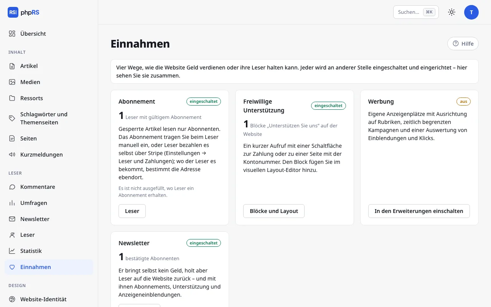

# Unterstützung und Einnahmen

Eine Website kann von Abonnements, von freiwilligen Beiträgen der Leser und von Werbung leben. Diese Seite beschreibt den Block **Unterstützen Sie uns** und den Bildschirm **Einnahmen**, der alle Quellen beisammen zeigt.

Freiwillige Beiträge nimmt phpRS nicht entgegen, verarbeitet sie nicht und sieht nicht, wer wie viel beigetragen hat. Der Block Unterstützen Sie uns ist ein Aufruf mit einer Schaltfläche, die den Leser dorthin führt, wo die Zahlung stattfindet. Anders ist es beim Abonnement: Das können die Leser mit Karte über den Dienst Stripe bezahlen und die Website schaltet es ihnen von selbst ein und verlängert es – siehe [Zahlungen mit Stripe](platby-stripe.md).

## Block Unterstützen Sie uns

Der Block gibt einen kurzen Aufruf und eine Schaltfläche mit Herz aus. Er braucht keine Erweiterung.

### Vorbereitung

Entscheiden Sie, wohin die Schaltfläche führen soll:

| Möglichkeit | Was Sie eingeben |
|---|---|
| Zahlungslink eines Dienstes (Stripe, Donio, Darujme, Ko-fi…) | eine Adresse, die mit `https://` beginnt |
| Eigene Seite mit Kontonummer und QR-Code | die Adresse einer Seite auf der Website, zum Beispiel `/podporte-nas` |

Die eigene Seite legen Sie unter **Inhalt → Seiten** an. Den QR-Code für die Zahlung fügen Sie dort als Bild aus den Medien ein.

### Block hinzufügen

1. Öffnen Sie **Design → Blöcke und Layout**.
2. Klicken Sie in der Zone, in der der Aufruf stehen soll, auf **+ Block hinzufügen** und wählen Sie in der Gruppe **Leser und Redaktion** den Block **Unterstützen Sie uns**.
3. Füllen Sie in den Einstellungen aus:
   - **Aufruf** – ein bis zwei Sätze. Ein leeres Feld bedeutet den Standardtext: „Wir machen unabhängigen Journalismus. Wenn Ihnen unsere Arbeit wichtig ist, unterstützen Sie sie.“
   - **Text der Schaltfläche** – höchstens 60 Zeichen. Leer bedeutet **Redaktion unterstützen**.
   - **Wohin die Schaltfläche führt** – Zahlungslink oder Adresse der Seite.
4. Klicken Sie auf **Speichern**.

Solange Sie das Feld **Wohin die Schaltfläche führt** nicht ausfüllen, zeigt der Block nur den Text des Aufrufs ohne Schaltfläche. Die Adresse muss mit `https://`, `http://` oder einem Schrägstrich beginnen; eine andere wird nicht gespeichert. Ein Link, der von der Website wegführt, öffnet sich für den Leser mit dem Schutz `noopener`.

### Wohin mit dem Block

- In die Zone **Unter dem Inhalt** – der Leser sieht ihn, wenn er den Artikel zu Ende gelesen hat.
- In die rechte Spalte als ständige Erinnerung.
- Mit dem Feld **Nur im Ressort** können Sie ihn auf ein Ressort beschränken, mit dem Feld **Seiten** etwa nur auf die Startseite.

Bearbeiten Sie den Block im visuellen Editor. Die Formularliste der Blöcke bietet **Text der Schaltfläche**, **Wohin die Schaltfläche führt** und auch den Text des Aufrufs an – siehe [Blöcke und Layout](../vzhled/bloky-a-rozvrzeni.md).

Auf einer mehrsprachigen Website halten Sie für jede Sprache einen eigenen Block und legen mit dem Feld **Sprachversion** fest, wo welcher angezeigt wird. Die Standardtexte werden von selbst übersetzt, Ihr eigener Aufruf nicht.

## Bildschirm Einnahmen

**Leser → Einnahmen** ist ein Wegweiser für den Administrator. Eingestellt wird dort nichts. Er zeigt vier Karten – vier Wege, wie die Website Geld verdienen oder Leser halten kann. Jede Karte hat das Etikett **eingeschaltet** oder **aus**, eine Hauptzahl und einen Link dorthin, wo die Sache verwaltet wird.

| Karte | Zahl | Wohin der Link führt |
|---|---|---|
| **Abonnement** | Leser mit gültigem Abonnement; mit Zahlungen über Stripe zusätzlich die Zahl der Zahlenden und die Summe der Zahlungen der letzten 30 Tage nach Währungen | **Leser** |
| **Freiwillige Unterstützung** | Blöcke „Unterstützen Sie uns“ auf der Website (nur angezeigte, keine ausgeblendeten) | **Blöcke und Layout** |
| **Werbung** | Einblendungen der aktiven Anzeigen; darunter die Zahl der aktiven Anzeigen und der Klicks | **Werbung** |
| **Newsletter** | bestätigte Empfänger | **Newsletter** |

Bei einer ausgeschalteten Erweiterung führt der Link **In den Erweiterungen einschalten** zu **Verwaltung → Erweiterungen**. Die Karte Freiwillige Unterstützung ist eingeschaltet, sobald auf der Website mindestens ein angezeigter Block Unterstützen Sie uns steht.

Die Karte Abonnement weist mit der Meldung **Es ist nicht ausgefüllt, wo Leser ein Abonnement erhalten.** darauf hin, wenn die Adresse unter **Einstellungen → Leser und Zahlungen** fehlt und auch die Zahlungen mit Stripe nicht eingeschaltet sind. Ohne sie sieht der Leser bei einem gesperrten Artikel die Schaltfläche **Abonnement abschließen** nicht. Das Vorgehen steht auf der Seite [Gesperrte Inhalte und Abonnement](zamceny-obsah.md).

Der Newsletter selbst bringt kein Geld. In der Übersicht steht er, weil er Leser auf die Website zurückbringt – und mit ihnen Abonnements, Unterstützung und Einblendungen von Anzeigen.

### Was die Übersicht nicht zeigt

Die einzigen Beträge in der Übersicht sind die über Stripe eingegangenen Abonnementzahlungen der letzten 30 Tage (vor Abzug der Stripe-Gebühren). Freiwillige Beiträge und Zahlungen per Überweisung sieht die Übersicht nicht – wie viel Sie eingenommen haben, erfahren Sie bei Ihrer Bank oder Ihrem Zahlungsdienst. Die Hauptzahl auf der Karte Abonnement ist die Zahl der Leser, deren Abonnement gerade gilt, gleich ob sie es über Stripe bezahlt haben oder Sie es von Hand eingetragen haben.

## Siehe auch

- [Gesperrte Inhalte und Abonnement](zamceny-obsah.md)
- [Zahlungen mit Stripe](platby-stripe.md)
- [Werbung](reklama.md)
- [Newsletter](newsletter.md)
- [Blöcke und Layout](../vzhled/bloky-a-rozvrzeni.md)
