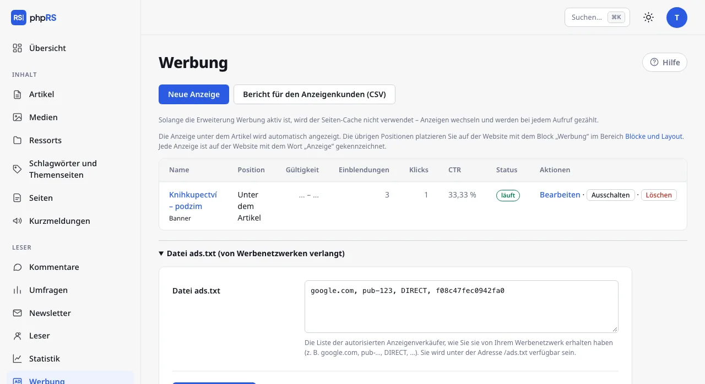

# Werbung

Das Anzeigensystem zeigt auf der Website eigene Banner und Codes von Werbenetzwerken. Eine Anzeige fügen Sie einmal hinzu und das System wechselt sie an der gewählten Position durch, zählt Einblendungen und Klicks, überwacht die Laufzeit der Kampagne und das Limit der Einblendungen. Jede Anzeige ist auf der Website mit dem Wort „Anzeige“ gekennzeichnet.

## Einschalten

Öffnen Sie **Verwaltung → Erweiterungen**, haken Sie **Anzeigensystem** an und speichern Sie. Im Menü kommt **Leser → Werbung** hinzu; Zugriff haben Administrator und Redakteur.

> Mit eingeschaltetem Anzeigensystem wird der Cache ganzer Seiten nicht verwendet. Anzeigen wechseln und werden bei jeder Einblendung gezählt, die Seite lässt sich also nicht aus dem Speicher ausliefern. Auf einem gewöhnlichen Hosting stört das nicht; bei einer Website mit hohen Besucherzahlen rechnen Sie damit.

## Positionen

| Position | Empfohlene Form | Wie sie auf die Website kommt |
|---|---|---|
| **In der Seitenleiste** (im Block **Spalte**) | Quadrat, z. B. 300×250 | mit dem Block **Werbung** |
| **In der Kopfzeile** (im Block **Kopfzeile**) | breiter Streifen, z. B. 970×210 | mit dem Block **Werbung** |
| **In der Fußzeile** (im Block **Fußzeile**) | breiter Streifen | mit dem Block **Werbung** |
| **Unter dem Artikel** | – | wird automatisch unter jedem Artikel angezeigt |

Die Positionen in der Spalte, der Kopfzeile und der Fußzeile platzieren Sie so auf der Website:

1. Öffnen Sie **Design → Blöcke und Layout**.
2. Klicken Sie in der Zone, in der die Anzeige stehen soll, auf **+ Block hinzufügen** und wählen Sie in der Gruppe **Eigener Inhalt** den Block **Werbung**.
3. Wählen Sie in den Einstellungen des Blocks die **Anzeigenposition** und speichern Sie.

Der Name der Position ist nur ein Anhaltspunkt. Einen Block mit der Position Spalte können Sie in jede beliebige Zone setzen und denselben Block können Sie mehrfach auf der Website haben. Ein Block, auf dessen Position gerade keine Anzeige läuft, wird den Lesern nicht ausgegeben. Den Block können Sie wie jeden anderen auf ein Ressort, ein Gerät oder eine Sprache beschränken – siehe [Blöcke und Layout](../vzhled/bloky-a-rozvrzeni.md).

## Neue Anzeige

1. Klicken Sie unter **Leser → Werbung** auf **Neue Anzeige**.
2. Füllen Sie den **Namen** aus – er ist nur für Sie, auf der Website erscheint er nicht. Bei einem Banner dient er auch als dessen Alternativtext.
3. Wählen Sie im Abschnitt **Was angezeigt werden soll** die Karte **Banner** oder **Code des Werbenetzwerks** und füllen Sie die Felder nach der Tabelle unten aus.
4. Wählen Sie im Abschnitt **Wo** die Karte der Position: **In der Seitenleiste**, **Unter dem Artikel**, **In der Kopfzeile** oder **In der Fußzeile**.
5. Klappen Sie bei Bedarf **Planung, Targeting und Limits** auf.
6. Klicken Sie auf **Speichern**. Nach dem Speichern ist die Anzeige aktiv; ausschalten lässt sie sich mit der Option **Anzeige ist aktiv** (Zeile **Status**) im aufgeklappten Abschnitt **Planung, Targeting und Limits**.

| Typ | Was Sie ausfüllen | Was gezählt wird |
|---|---|---|
| **Banner** | **Bild** (aus den Medien) und **Wohin das Banner führt** – eine Adresse, die mit `https://` beginnt | Einblendungen und Klicks |
| **Code des Werbenetzwerks** | den **Code**, den Ihnen das Netzwerk gegeben hat (Sklik, Google AdSense und ähnliche) | nur Einblendungen; die Klicks misst das Netzwerk |

Ein Banner öffnet sich in einem neuen Fenster und der Link trägt die Kennzeichnung `sponsored`. Der Klick führt über die Adresse der Website `/r/Nummer`, die ihn zählt und zum Ziel weiterleitet. Besuche von Bots werden nicht als Klicks gezählt.

Der Code eines Werbenetzwerks wird bei eingeschalteter Cookie-Leiste erst nach der Einwilligung des Besuchers in Marketing ausgeführt. Bei ausgeschalteter Leiste wird er sofort ausgeführt. Siehe [Webanalyse und Datenschutz](../seo-a-ai/mereni-a-soukromi.md).

## Planung, Targeting und Limits

| Feld | Bedeutung |
|---|---|
| **Anzeigen ab**, **Anzeigen bis** | Zeitlich begrenzte Kampagne. Ein leeres Feld bedeutet ohne Begrenzung. Die Anzeige startet und stoppt von selbst. |
| **Max. Einblendungen** | Nach Erreichen der Zahl schaltet sich die Anzeige von selbst aus. Leer = ohne Limit. |
| **Nur im Ressort** | Die Anzeige erscheint nur in der Artikelliste dieses Ressorts und bei dessen Artikeln. Standard **in allen**. |
| **Geräte** | **alle**, **nur Smartphones** oder **nur Computer und Tablets**. Die Grenze ist eine Fensterbreite von 760 px. |
| **Gewichtung** | 1–10. Wenn eine Position mehrere Anzeigen hat: Gewicht 2 = wird doppelt so oft angezeigt wie Gewicht 1. |

Wenn auf einer Position mehrere Anzeigen laufen, wird bei jeder Anzeige der Seite eine nach den Gewichten ausgelost. Das Targeting auf ein Ressort gilt genau für das gewählte Ressort; seine Unterressorts sind nicht eingeschlossen.

Das Targeting auf Geräte löst das Stylesheet der Seite: Die Anzeige wird in die Seite eingefügt und auf einem unpassenden Gerät ausgeblendet. Die Einblendung wird dabei auch dort gezählt, wo die Anzeige nicht zu sehen ist. Bei einer auf Geräte ausgerichteten Anzeige ist die Zahl der Einblendungen deshalb höher als die Zahl der Menschen, die sie tatsächlich gesehen haben; die Klicks sind genau.

## Übersicht und Bericht

Die Übersicht zeigt zu jeder Anzeige Position, Gültigkeit, **Einblendungen** (mit Limit, falls eines eingestellt ist), **Klicks**, **CTR** und Status. Den Status **läuft** hat eine Anzeige, die eingeschaltet ist, im Zeitraum liegt und das Limit nicht ausgeschöpft hat; sonst **läuft nicht**. Mit den Schaltflächen **Ausschalten** und **Einschalten** pausieren Sie eine Anzeige, ohne die Zahlen zu verlieren. **Löschen** entfernt die Anzeige samt ihren Zahlen.

**Bericht für den Anzeigenkunden (CSV)** lädt eine Datei mit allen Anzeigen herunter: Name, Position, ab, bis, Einblendungen, Klicks, Klickrate in Prozent und Status. Öffnen Sie sie in einem Tabellenprogramm.

Die Zahlen sind Gesamtzahlen. Das System erfasst nicht, wer eine Anzeige gesehen hat, und speichert ihretwegen keine Cookies. In der Vorschau eines Artikels aus der Administration werden Anzeigen weder angezeigt noch gezählt.

## Datei ads.txt

Werbenetzwerke verlangen die Datei `ads.txt` mit der Liste der autorisierten Verkäufer. Klappen Sie unter der Übersicht **Datei ads.txt (von Werbenetzwerken verlangt)** auf, fügen Sie die Zeilen ein, die Ihnen das Netzwerk geliefert hat (zum Beispiel `google.com, pub-…, DIRECT, …`), und klicken Sie auf **ads.txt speichern**. Die Datei ist dann unter der Adresse `/ads.txt` erreichbar.

## Siehe auch

- [Blöcke und Layout](../vzhled/bloky-a-rozvrzeni.md)
- [Unterstützung und Einnahmen](podpora-a-prijmy.md)
- [Webanalyse und Datenschutz](../seo-a-ai/mereni-a-soukromi.md)
