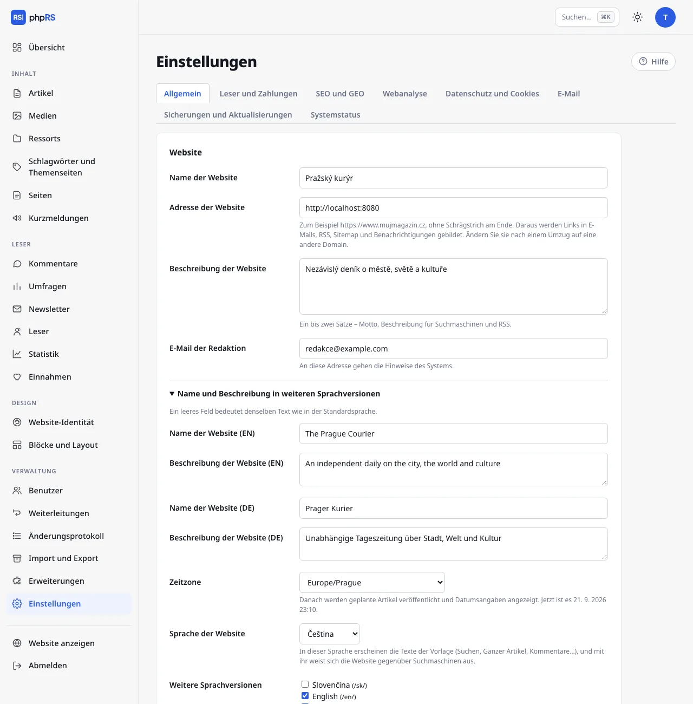

# Sprachen der Website

phpRS kann eine Website in einer Sprache betreiben und ebenso eine Website mit mehreren Sprachversionen nebeneinander. Diese Seite beschreibt, wie Sie Sprachen einschalten und was das System selbst übersetzt. Die Arbeit mit den Inhalten beschreibt die Seite [Inhalte übersetzen](preklad-obsahu.md).

Zur Verfügung stehen vier Sprachen: Tschechisch, Slowakisch, Englisch und Deutsch.

## Standardsprache

Jede Website hat eine Standardsprache. Sie wird unter **Einstellungen → Allgemein** im Feld **Sprache der Website** eingestellt; bei der Installation wird die Sprache übernommen, in der Sie installiert haben.

In dieser Sprache sind die Texte der Vorlage – Suchen, Weiterlesen, Kommentare, Texte der Formulare, E-Mails an die Leser – und mit ihr weist sich die Website gegenüber Suchmaschinen aus (Attribut `lang`, Open Graph, strukturierte Daten). Der Inhalt in der Standardsprache liegt unter Adressen ohne Präfix: `/clanek/…`, `/rubrika/…`.

Eine Website in einer einzigen Sprache braucht nichts weiter. Die Sprache der Administration hängt nicht mit der Sprache der Website zusammen; jeder Benutzer wählt sie im Menü **Mein Konto**.

> Wählen Sie die Standardsprache am Anfang und ändern Sie sie danach nicht. Der Inhalt der Standardsprache ist in der Datenbank nicht mit einem Sprachcode gekennzeichnet, sondern dadurch, dass er keinen Code hat. Nach einer Änderung der Standardsprache würde sich der gesamte bisherige Inhalt zur neuen Sprache bekennen.

## Weitere Sprachversionen

1. Öffnen Sie **Verwaltung → Erweiterungen**, haken Sie **Sprachversionen der Website** an und speichern Sie.
2. Unter **Einstellungen → Allgemein** erscheint unter dem Feld **Sprache der Website** die Option **Weitere Sprachversionen**. Haken Sie die Sprachen an, die Sie hinzufügen möchten, und speichern Sie.
3. Klappen Sie weiter unten **Name und Beschreibung in weiteren Sprachversionen** auf und füllen Sie **Name der Website** und **Beschreibung der Website** für jede Version aus. Ein leeres Feld bedeutet denselben Wert wie in der Standardsprache.
4. Legen Sie für jede Version mindestens ein Ressort in der jeweiligen Sprache an – siehe [Inhalte übersetzen](preklad-obsahu.md). Ohne Ressort hat die Version keinen Ort, an dem Artikel gespeichert werden können.

Jede weitere Version liegt unter einer Adresse mit Sprachpräfix: `/en/`, `/de/`, `/sk/`. Sie hat eine eigene Startseite, eigene Ressorts, Artikel, Seiten, Schlagwörter, ein eigenes Archiv, eine eigene Suche und eigene Feeds (`/en/rss.xml`, `/en/feed.json`). Dateien, Bilder in `media/`, Sitemap und API sind gemeinsam.

Nach dem Ausschalten der Erweiterung bleibt der Inhalt der weiteren Versionen in der Datenbank, ist aber auf der Website nicht mehr erreichbar. Nach dem erneuten Einschalten kehrt er zurück.

## Was sich von selbst übersetzt und was nicht

| Teil der Website | Wer übersetzt |
|---|---|
| Texte der Vorlage: Navigation, Schaltflächen, Beschriftungen der Formulare, Meldungen, Seitennummerierung, Seite 404 | das System – die Wörterbücher sind Teil von phpRS |
| E-Mails an die Leser: Bestätigung des Newsletter-Abonnements, Registrierung, Anmeldelink, Fußzeile des Newsletters | das System – in der Sprache der Version, auf der der Leser die Aktion ausgeführt hat |
| Standardtexte der Blöcke (Aufruf des Blocks Benachrichtigungen, Unterstützen Sie uns, Leserkonto) | das System |
| Cookie-Leiste – Schaltflächen | das System |
| Datumsformat | das System, siehe unten |
| **Name und Beschreibung der Website** | Sie, unter **Einstellungen → Allgemein** |
| Ressorts, Artikel, Seiten | die Redaktion – jede Version hat ihre eigenen |
| Kurzmeldungen und Umfragen | die Redaktion – bei jedem Eintrag wird die **Sprachversion** gewählt |
| Überschriften der Blöcke, Blöcke Text und Menü | die Redaktion – ein eigener Block für jede Sprache |
| Text der Cookie-Leiste, Text der Aufforderung unter einem gesperrten Artikel, Text des Wartungsmodus | wird nicht übersetzt – ein Wortlaut für die ganze Website |

Texte, die Sie in den Einstellungen eingeben und die kein Feld für weitere Sprachen haben, erscheinen in allen Versionen gleich. Schreiben Sie sie bei einer zweisprachigen Website deshalb knapp, gegebenenfalls zweisprachig.

Fehlt ein Text im Wörterbuch, bleibt er tschechisch. Die Website geht davon nicht kaputt.

## Sprachumschalter

Alle drei eingebauten Vorlagen geben im Kopf einen Sprachumschalter aus – die Sprachcodes (CS, EN, DE…) als Links. Die aktuelle Sprache ist hervorgehoben. Auf einer Website mit einer einzigen Sprache wird der Umschalter nicht ausgegeben.

Wohin der Umschalter führt:

- bei einem **Artikel**, einem **Ressort** und einer **Seite**, die eine verknüpfte Übersetzung haben, direkt zum Gegenstück in der anderen Sprache,
- sonst zur Startseite der jeweiligen Sprachversion.

Die Verknüpfung von Übersetzungen beschreibt die Seite [Inhalte übersetzen](preklad-obsahu.md). Der Umschalter bietet nur veröffentlichte Artikel und angezeigte Ressorts und Seiten an.

Ein Leser, der die Adresse eines Artikels in der falschen Version öffnet (zum Beispiel `/clanek/…` bei einem englischen Artikel), wird auf die richtige Adresse mit Präfix weitergeleitet.

## hreflang-Tags

Die Tags `hreflang` sagen den Suchmaschinen, dass zwei Adressen Sprachversionen desselben Inhalts sind. Das System fügt sie selbst ein:

- auf der **Startseite** verweisen sie auf die Startseiten aller Versionen,
- bei **Artikel, Ressort und Seite** nur auf vorhandene verknüpfte Übersetzungen.

Inhalt ohne verknüpfte Übersetzung hat keine Tags – die Suchmaschine bekäme sonst einen Link auf eine Seite, die nichts damit zu tun hat. Jede Version weist sich außerdem mit eigenem `lang` und `og:locale` aus (`cs_CZ`, `sk_SK`, `en_US`, `de_DE`).

## Datum in den Sprachversionen

| Sprache | Datum beim Artikel | Datum in Worten im Kopf |
|---|---|---|
| Tschechisch, Slowakisch | 18. 9. 2026 | Namen der Tage und Monate in der jeweiligen Sprache |
| Englisch | 18 Sep 2026 | englisch |
| Deutsch | 18.09.2026 | deutsch |

Dezimalzahlen (zum Beispiel die Bewertung einer Rezension) haben im Englischen einen Punkt, in den übrigen Sprachen ein Komma. Die Zeitzone ist für die ganze Website dieselbe – **Einstellungen → Allgemein → Zeitzone**.

## Was allen Versionen gemeinsam ist

- Vorlage, Layout und [Website-Identität](../vzhled/identita-webu.md),
- die Benutzer der Administration und ihre Berechtigungen,
- Medien,
- Leserkonten und Abonnements,
- die Einstellungen für SEO, Webanalyse und Cookies,
- der Bildschirm **Titelseite** – die manuelle Reihenfolge stellt nur die Startseite der Standardsprache zusammen; in den übrigen Versionen werden die Artikel nach Anheftung und Datum geordnet.

## Siehe auch

- [Inhalte übersetzen](preklad-obsahu.md)
- [KI-Assistent](../psani/ai-asistent.md)
- [Blöcke und Layout](../vzhled/bloky-a-rozvrzeni.md)
- [SEO](../seo-a-ai/seo.md)
