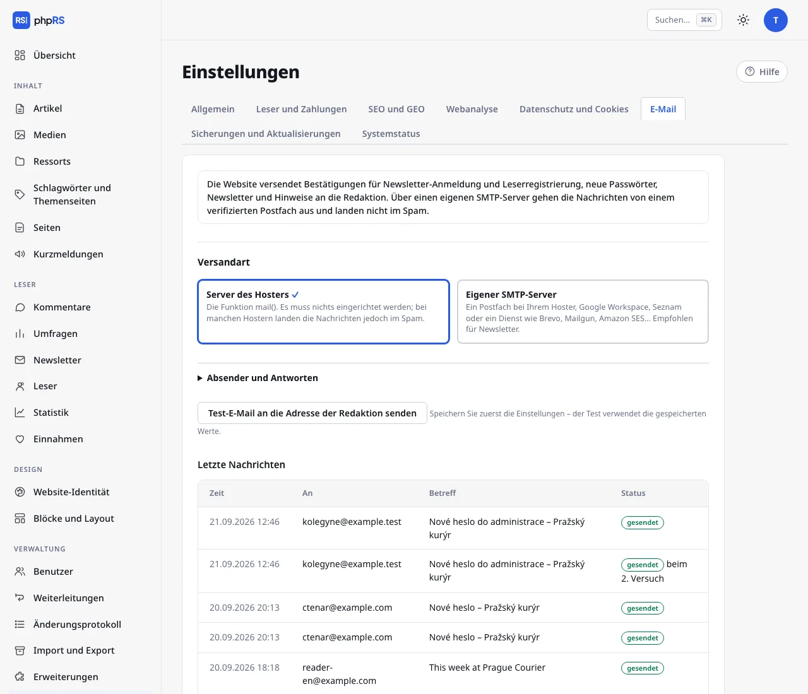

# E-Mail

Die Website verschickt Bestätigungen des Newsletter-Abonnements und der Leserregistrierung, Links zum Festlegen des Passworts, Newsletter, Hinweise auf Kommentare und Hinweise an die Redaktion. Alles wird unter **Einstellungen → E-Mail** eingerichtet.

## Versandart

| Art | Wann sie sich eignet |
| --- | --- |
| **Server des Hosters** | Funktioniert sofort, es ist nichts einzurichten. Bei vielen Hostern landen die Nachrichten aber im Spam. Genügt für eine kleine Website ohne Newsletter. |
| **Eigener SMTP-Server** | Die Nachrichten gehen von einem verifizierten Postfach aus. Immer empfohlen, wenn Sie einen Newsletter verschicken oder Leser registrieren. |

## SMTP einrichten

Die Daten finden Sie beim Anbieter des Postfachs – beim Hosting, bei Google Workspace oder bei einem Dienst für Massenversand (Brevo, Mailgun, Amazon SES…).

Füllen Sie im Abschnitt **SMTP-Server** aus:

- **Serveradresse** – zum Beispiel `smtp.example.de`.
- **Sicherheit** – **STARTTLS, Port 587** ist am häufigsten; **SSL/TLS, Port 465** bei älteren Diensten. Die Option „keine“ verwenden Sie nur für einen Server im eigenen Netz.
- **Port** – Standard 587. Die Wahl der Sicherheit ändert ihn nicht von selbst: Bei **SSL/TLS** überschreiben Sie ihn mit 465.
- **Benutzername** (meist die vollständige E-Mail-Adresse des Postfachs) und **Passwort** – bei Gmail und ähnlichen Anbietern geben Sie ein „App-Passwort“ ein, nicht das Passwort des Kontos. Das Passwort wird nur auf Ihrer Website gespeichert und nie wieder im Formular ausgegeben; ein leeres Feld bedeutet „unverändert“.

Klicken Sie nach dem Speichern auf **Test-E-Mail an die Adresse der Redaktion senden**. Der Test verwendet die gespeicherten Werte, also zuerst speichern, dann testen.

## Absender und Antworten

Klappen Sie **Absender und Antworten** auf: **Absenderadresse** ist die Adresse, die bei den Nachrichten als Absender steht (leeres Feld = E-Mail der Redaktion), **Antworten senden an** ist die Adresse für Antworten.
Die Absenderadresse sollte zu einer Domain gehören, von der Ihr SMTP-Server senden darf – sonst landen die Nachrichten im Spam oder der Empfänger lehnt sie ab.

## Damit E-Mails nicht im Spam landen

Richten Sie für die Domain des Absenders im DNS die Einträge **SPF** und **DKIM** nach der Anleitung des E-Mail-Anbieters ein, idealerweise auch **DMARC**. Ohne sie schränken große Anbieter (Gmail, Outlook und andere) Massenversand ein oder lehnen ihn ab.

## Warteschlange und Wiederholung

Eine Nachricht, die sich nicht senden lässt, wird nicht verworfen: Das System versucht es erneut nach **5 Minuten, 30 Minuten, 2 Stunden und 12 Stunden**. Die Wiederholung übernehmen die [Hintergrundaufgaben](ulohy-na-pozadi.md).
Die Übersicht **Letzte Nachrichten** zeigt Zeit, Empfänger, Betreff und Status (*gesendet*, *wartet auf den nächsten Versuch*, *nicht gesendet*). Der Inhalt der Nachrichten wird nicht aufbewahrt, und die Einträge werden nach 30 Tagen gelöscht.

## Häufigste Probleme

- **Die Test-E-Mail ist nicht angekommen** – sehen Sie in die Übersicht Letzte Nachrichten. Der Status *nicht gesendet* bedeutet einen Fehler bei der Verbindung oder der Anmeldung; *gesendet* bedeutet, dass der Server die Nachricht übernommen hat und im Spam des Empfängers zu suchen ist.
- **Die Anmeldung am SMTP-Server schlägt fehl** – prüfen Sie, ob Sie ein App-Passwort und die richtige Kombination aus Port und Sicherheit verwenden.
- **Das Hosting blockiert ausgehende Verbindungen** – manche Shared-Hosting-Anbieter erlauben SMTP nur zu den eigenen Servern. Verwenden Sie ein Postfach beim selben Hoster.
