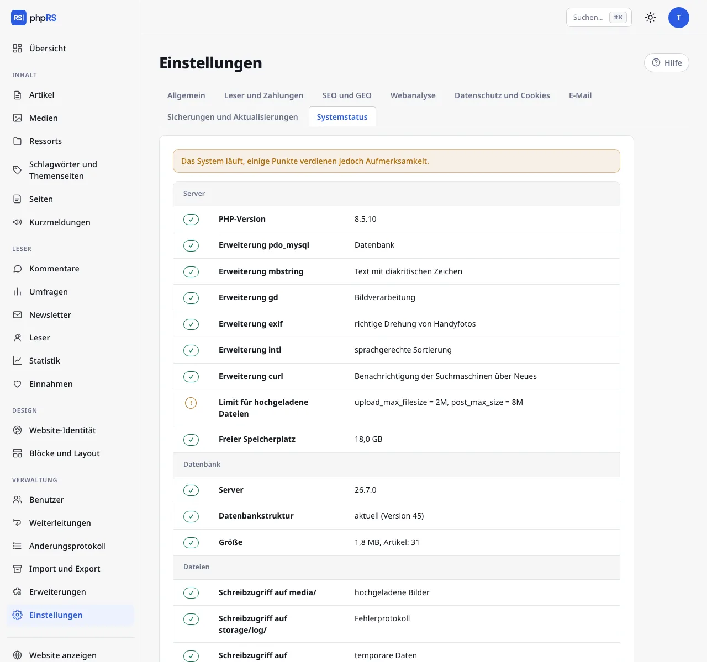

# Systemstatus

**Einstellungen → Systemstatus** ist die erste Stelle, an der Sie nach der Installation, nach einem Umzug der Website und immer dann nachsehen, wenn sich etwas seltsam verhält. Jede Zeile hat den Status *in Ordnung*, *Warnung* oder *Fehler* und eine Erklärung, was zu tun ist.



## Was geprüft wird

| Gruppe | Zeilen |
| --- | --- |
| **Server** | PHP-Version, erforderliche und empfohlene Erweiterungen, Limit für hochgeladene Dateien, freier Speicherplatz |
| **Datenbank** | Version des Servers, Struktur der Datenbank (ausstehende Anpassungen), Größe und Anzahl der Artikel |
| **Dateien** | Schreibzugriff auf die Ordner, die ihn brauchen (`media/`, `storage/`…) |
| **Sicherheit** | gelöschtes Installationsprogramm, HTTPS, ausgeschalteter Debug-Modus, Sicherheits-Header, Zwei-Faktor-Anmeldung der Administratoren, gesperrte Konten, Integrität der Kerndateien |
| **Betrieb** | Fehler der letzten 24 Stunden, Alter der letzten Sicherung, Sicherungen außerhalb des Servers, Indexierung durch Suchmaschinen, Größe der Medien, Hintergrundaufgaben, Aktualisierungen, E-Mail-Versand |

**Fehler** bedeutet, dass ein Teil des Systems nicht funktioniert. Eine **Warnung** ist eine Empfehlung – die Website läuft, aber etwas sollte noch erledigt werden (typischerweise fehlende 2FA, ausgeschaltete Sicherungen außerhalb des Servers, nicht eingerichteter Cron).

## Weitere Teile der Seite

- **E-Mail** – Versand einer Test-E-Mail an die Adresse der Redaktion.
- **Fehlerprotokoll** – die letzten 40 Einträge zu Fehlern, die das System aufgezeichnet hat. Ein Besucher sieht bei einem Fehler nur eine allgemeine Entschuldigung; die Einzelheiten stehen hier und in der Datei `storage/log/chyby.log`. Die Schaltfläche **Protokoll leeren** löscht es.
- **Hintergrundaufgaben (cron)** – die Adresse für den Cron, siehe [Hintergrundaufgaben](ulohy-na-pozadi.md).
- **Monitoring** – die Adresse mit dem Status im JSON-Format.

## Monitoring

Nach dem Erstellen eines Zugriffstokens (Schaltfläche **Token erstellen**) ist der Status unter dieser Adresse erreichbar:

```
https://www.example.de/stav.json?token=…
```

Die Antwort enthält den zusammengefassten `stav`, `verze`, `cas` und das Feld `kontroly` mit allen Zeilen. Ein Monitoring-Tool (UptimeRobot, Zabbix, Uptime Kuma…) muss nur so eingestellt werden, dass es den zusammengefassten Status überwacht. Ohne gültiges Token antwortet die Adresse mit dem Fehler 403.
