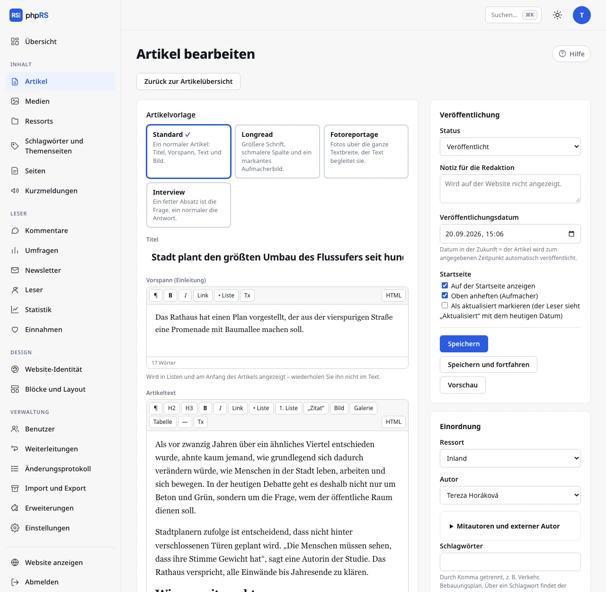

# Artikeleditor

Einen Artikel schreiben Sie unter **Inhalt → Artikel → Neuer Artikel**. Links stehen Titel, Vorspann und Text, rechts die Einstellungen: Veröffentlichung, Einordnung, Hauptbild und weitere Optionen. Auf einem schmalen Bildschirm rücken die Einstellungen unter den Text.

Zum Speichern genügen **Titel** und **Ressort**. Ohne Ressort lässt sich ein Artikel nicht speichern.

## Titel, Vorspann und Text

- **Titel** – höchstens 255 Zeichen. Der Abschnitt **Barrierefreiheitsprüfung** in der Spalte mit den Einstellungen weist darauf hin, wenn er mehr als 110 Zeichen hat oder in Großbuchstaben geschrieben ist.
- **Vorspann (Einleitung)** – der einleitende Absatz. Er erscheint in den Artikellisten und am Anfang des Artikels, wiederholen Sie ihn deshalb nicht im Text. Der Vorspann hat eine verkürzte Werkzeugleiste.
- **Artikeltext** – der eigentliche Inhalt mit der vollständigen Werkzeugleiste.

## Werkzeugleiste

| Schaltfläche | Was sie tut |
|---|---|
| **¶** | Absatz |
| **H2**, **H3** | Zwischenüberschrift und kleinere Zwischenüberschrift |
| **B**, **I** | fett (Strg+B) und kursiv (Strg+I) |
| **Link** | fügt einen Link ein oder bearbeitet ihn (Strg+K) |
| **• Liste**, **1. Liste** | Aufzählung und nummerierte Liste |
| **„Zitat“** | Zitat |
| **Bild** | fügt ein Bild oder einen Anhang aus den Medien ein |
| **Galerie** | fügt eine Fotogalerie ein |
| **Tabelle** | fügt eine Tabelle 3 × 3 mit Kopfzeile ein |
| **—** | Trennlinie |
| **Tx** | entfernt Formatierung und Link |
| **HTML** | wechselt zum Quelltext und zurück |

Bildern, Galerien und Anhängen widmet sich die Seite [Bilder, Galerien und Anhänge](obrazky-a-galerie.md).

### Links

1. Markieren Sie den Text und klicken Sie auf **Link**.
2. Schreiben Sie in das Feld **Adresse** die Adresse (`https://…` oder eine lokale, zum Beispiel `/ueber-uns`). Einen eigenen Artikel finden Sie über das Feld **…oder einen eigenen Artikel suchen** – es genügt ein Teil des Titels; bei noch nicht veröffentlichten Artikeln steht der Hinweis *nicht veröffentlicht*.
3. Setzen Sie bei Bedarf das Häkchen bei **in neuem Fenster öffnen** und bestätigen Sie mit der Schaltfläche **Link einfügen**.

Einen vorhandenen Link bearbeiten Sie genauso: Setzen Sie den Cursor hinein und klicken Sie auf **Link**. Die Schaltfläche **Link entfernen** löscht ihn.

### Tabellen

Wenn der Cursor in einer Tabelle steht, erscheint über dem Text eine zweite Leiste: **+ Zeile**, **+ Spalte**, **− Zeile**, **− Spalte** und **Tabelle löschen**. Die erste Zeile ist die Kopfzeile. Eine Tabelle ohne Kopfzeile meldet die Barrierefreiheitsprüfung.

### Einfügen aus Word und aus dem Web

Eingefügten Text bereinigt der Editor selbst. Es bleiben Absätze, Zwischenüberschriften, Listen, Links, Tabellen und Bilder; fremde Formatvorlagen, Schriften und Farben verschwinden. Eine Überschrift der ersten Ebene wird zur Zwischenüberschrift H2.

### HTML-Modus

Die Schaltfläche **HTML** zeigt den Quelltext des Artikels. Solange sie eingeschaltet ist, reagieren die übrigen Schaltflächen der Leiste nicht. Mit einem zweiten Klick kehren Sie zur normalen Ansicht zurück.

## Wortzahl

Unter dem Editor sehen Sie die Zahl der Wörter und beim Artikeltext auch die geschätzte Lesezeit (200 Wörter pro Minute).

## Automatisches Speichern des Zwischenstands

Das Formular in Arbeit wird laufend gesichert, damit weder ein Absturz des Browsers noch ein Verbindungsausfall Sie darum bringt:

- im **Browser** etwa 1,5 Sekunden nach der letzten Änderung – unter dem Editor erscheint *Zwischenstand im Browser gespeichert um* und die Uhrzeit,
- auf dem **Server** höchstens einmal in 15 Sekunden – *Zwischenstand auch auf dem Server gespeichert um*. So können Sie auf einem anderen Gerät weiterarbeiten.

Ein Zwischenstand ist kein gespeicherter Artikel. Weder auf der Website noch in der Artikelliste ändert sich etwas, solange Sie nicht auf **Speichern** klicken.

Wenn Sie das Formular erneut öffnen und ein neuerer Zwischenstand vorliegt, erscheint über dem Formular ein Hinweis mit den Schaltflächen **Wiederherstellen** und **Verwerfen**. Angeboten wird die neuere der beiden Kopien. Stände, die älter als 14 Tage sind, werden nicht angeboten. Mit dem Speichern des Artikels erlischt der Zwischenstand.

## Sperre gegen gleichzeitiges Bearbeiten

Mit dem Öffnen sperren Sie den Artikel für sich. Die Sperre gilt drei Minuten und der geöffnete Editor verlängert sie jede Minute. Ein Kollege, der den Artikel zur selben Zeit öffnet, sieht den Hinweis, dass Sie ihn geöffnet haben und dass Sie sich beim Speichern gegenseitig die Änderungen überschreiben. Der Editor bleibt für ihn trotzdem zugänglich – sprechen Sie ab, wer weitermacht. Mit dem Speichern wird der Artikel freigegeben.

## Barrierefreiheitsprüfung

Der Abschnitt **Barrierefreiheitsprüfung** in der Spalte mit den Einstellungen läuft während des Schreibens und meldet:

- ein Bild ohne Beschreibung – die Beschreibung ergänzen Sie direkt in der Prüfung und bestätigen mit Enter,
- eine Zwischenüberschrift, die eine Ebene überspringt (H3 ohne H2 darüber), und eine leere Zwischenüberschrift,
- einen Link, dessen Text nicht sagt, wohin er führt („hier“, „mehr“, eine nackte Adresse),
- eine Tabelle ohne Kopfzeile,
- einen eingebetteten Frame ohne Titel,
- einen zu langen Titel, einen Titel in Großbuchstaben und einen fehlenden Vorspann.

Wenn alles in Ordnung ist, erscheint *✓ Die Bilder haben Beschreibungen, Überschriften und Links sind in Ordnung.* Die Prüfung verhindert das Speichern nicht.

## Speichern und Vorschau

- **Speichern** – speichert und bringt Sie zurück zur Artikelübersicht.
- **Speichern und fortfahren** – speichert und bleibt im Editor.
- **Vorschau** – öffnet den gespeicherten Artikel in der Website-Vorlage in einem neuen Fenster. Das funktioniert auch bei einem Entwurf, aber nur für in der Administration Angemeldete. Sie zeigt die zuletzt gespeicherte Version, nicht den Zwischenstand. Kommentare und Bewertungen werden in der Vorschau nicht angezeigt.

Die Status eines Artikels und die geplante Veröffentlichung beschreibt die Seite [Planung und Versionen](planovani-a-revize.md).

## Weitere Felder des Formulars

- **Mitautoren und externer Autor** (aufklappbare Zeile im Abschnitt **Einordnung**) – weitere Mitglieder der Redaktion oder ein Gast bzw. eine Agentur ohne Konto. Ein externer Autor wird auf der Website anstelle des Autors aus der Redaktion genannt.
- **Adresse des Artikels** (in **Weitere Einstellungen**) – der Teil der Adresse nach `/clanek/`. Sie entsteht aus dem Titel; wenn Sie sie bei einem veröffentlichten Artikel ändern, wird die alte Adresse von selbst auf die neue weitergeleitet.
- **Schlüsselwörter** (in **Weitere Einstellungen**) – helfen der Suche auf der Website.
- **Quelle** (in **Weitere Einstellungen**) – bei übernommenen Texten.

## Siehe auch

- [Einbetten von Videos und Beiträgen aus sozialen Netzwerken](vkladani-obsahu.md)
- [Inhaltstypen](typy-obsahu.md)
- [KI-Assistent](ai-asistent.md)
