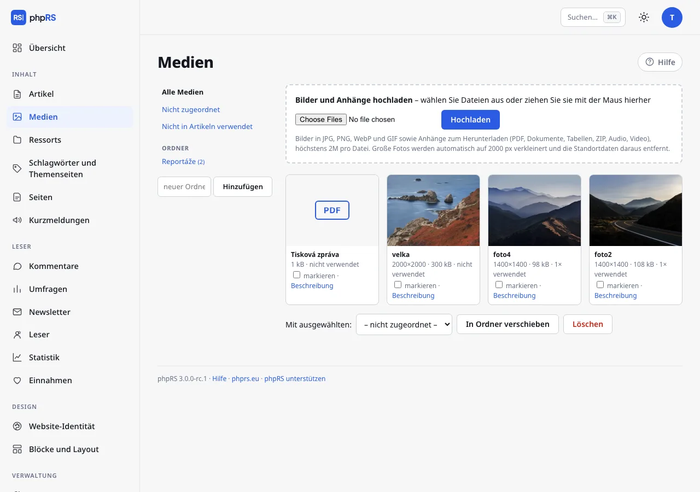

# Bilder, Galerien und Anhänge

Alle hochgeladenen Dateien liegen an einem Ort: **Inhalt → Medien**. Zugriff auf die Medien hat jeder, der sich in der Administration anmeldet. Die Beschreibung ändern und eine Datei löschen darf aber nur, wer sie hochgeladen hat, und der Administrator.

## Hochladen

Dateien laden Sie auf drei Wegen hoch:

- in den **Medien** über das Formular **Bilder und Anhänge hochladen** – wählen Sie die Dateien aus oder ziehen Sie sie mit der Maus in das Formular,
- im Editor im Fenster **Medien** mit der Schaltfläche **Neues hochladen** oder durch Ziehen der Dateien in das Fenster; auf Telefon und Tablet gibt es dort auch die Schaltfläche **Foto aufnehmen**,
- ein Bild ziehen Sie direkt in den Artikeltext oder fügen es aus der Zwischenablage ein – es wird hochgeladen und an der Stelle des Cursors eingefügt.

Auf einmal lassen sich höchstens 30 Dateien hochladen.

Mit demselben Formular laden Sie auch Anhänge hoch (PDF, Dokumente, Audio…); im Editor dient dazu die Schaltfläche **Neues hochladen**.

### Formate und Limits

| Was | Limit |
|---|---|
| Bilder | JPG, PNG, WebP und GIF; höchstens 20 MB und 50 Megapixel |
| Anhänge | höchstens 200 MB |
| Jede Datei | höchstens so viel, wie der Server erlaubt – den Wert zeigt der Hinweis unter dem Formular in den Medien |

Erlaubte Anhänge: `pdf`, `doc`, `docx`, `xls`, `xlsx`, `ppt`, `pptx`, `odt`, `ods`, `odp`, `rtf`, `txt`, `csv`, `zip`, `epub`, `gpx`, `ics`, `mp3`, `m4a`, `ogg`, `wav`, `mp4`, `webm`. HTML, SVG und Skripte lassen sich nicht hochladen.

### Was mit dem Bild geschieht

- Ein Foto, das größer als 2000 px ist, wird von selbst auf 2000 px an der längeren Seite verkleinert.
- Das Bild wird neu gespeichert, sodass die Angaben der Kamera einschließlich des Standorts daraus verschwinden. Ein Foto vom Telefon wird dabei richtig gedreht.
- Es entstehen eine mittlere Variante (1200 px) und ein Vorschaubild (640 px). Die Website schickt dem Leser dann die Größe, die zu seinem Bildschirm passt.
- Zu jeder Variante entsteht eine Kopie im Format WebP. Browsern, die WebP beherrschen, liefert der Server sie von selbst aus – im Artikel ändert sich nichts.
- Eine GIF-Datei wird unverändert gespeichert, damit die Animation erhalten bleibt.

Der Name des Bildes wird aus dem Dateinamen übernommen. Benennen Sie die Dateien deshalb schon vor dem Hochladen verständlich.

## Ordner

In der linken Spalte der Medien stehen die Filter **Alle Medien**, **Nicht zugeordnet** und **Nicht in Artikeln verwendet** und darunter die Ordner.

1. Einen neuen Ordner legen Sie über das Feld **neuer Ordner** und die Schaltfläche **Hinzufügen** an.
2. Nach dem Öffnen eines Ordners werden Dateien direkt in ihn hochgeladen. Einen Ordner können Sie **Umbenennen**; **Ordner löschen** darf der Administrator.
3. Dateien verschieben Sie, indem Sie sie markieren, unten den Zielordner wählen und auf **In Ordner verschieben** klicken.

Mit dem Löschen eines Ordners werden die Dateien nicht gelöscht – sie wandern zu den nicht zugeordneten.

## Beschreibung des Bildes (Alternativtext)

Klicken Sie beim Bild auf **Beschreibung**. Es öffnet sich ein Formular mit zwei Feldern:

- **Name (Alternativtext)** – was auf dem Bild zu sehen ist. Ihn lesen Screenreader und Suchmaschinen. Beim Einfügen in einen Artikel wird er zum Alternativtext.
- **Bildunterschrift** – sie erscheint beim Einfügen in einen Artikel unter dem Bild.

Beide Angaben werden im Moment des Einfügens in den Artikel übernommen. Eine spätere Änderung in den Medien ändert bereits eingefügte Bilder nicht mehr. Einen fehlenden Alternativtext ergänzen Sie direkt im Editor im Abschnitt **Barrierefreiheitsprüfung**.

## Ein Bild in den Artikel einfügen

1. Setzen Sie den Cursor an die Stelle, an die das Bild gehört.
2. Klicken Sie in der Leiste auf **Bild**. Es öffnet sich das Fenster **Medien**.
3. Wählen Sie oben **Alle Medien**, **In diesem Artikel**, **Nicht zugeordnet** oder einen der Ordner. Das Fenster lädt die 60 neuesten Dateien der gewählten Auswahl; weitere fügt die Schaltfläche **Weitere laden** unter dem Raster hinzu. Das Feld **Medien durchsuchen…** neben der Auswahl findet Dateien nach Titel, Bildunterschrift oder Dateinamen.
4. Klicken Sie auf das Bild – es wird samt Bildunterschrift eingefügt.

Der Leser vergrößert ein Bild im Artikel mit einem Klick.

## Hauptbild

Klicken Sie im Abschnitt **Hauptbild** auf **Aus den Medien wählen** oder fügen Sie die Adresse eines Bildes in das Feld ein. Das Hauptbild wird in den Artikellisten und beim Teilen in sozialen Netzwerken verwendet. Der Link **Im Artikel verwendete Medien** unter dem Feld öffnet die Medien nur mit den Dateien dieses Artikels.

## Fotogalerie

1. Klicken Sie in der Leiste auf **Galerie**.
2. Markieren Sie die Fotos per Klick in der Reihenfolge, in der sie aufeinander folgen sollen. Sie brauchen mindestens zwei.
3. Bestätigen Sie mit der Schaltfläche **Galerie einfügen**.

Im Artikel erscheint die Galerie als Raster. Der Leser blättert die Fotos im Vollbild durch.

## Anhänge zum Herunterladen

Einen Anhang fügen Sie genauso ein wie ein Bild – mit der Schaltfläche **Bild**. Dateien sind im Fenster Medien mit ihrer Endung gekennzeichnet. In den Text wird ein Link mit Dateiname, Typ und Größe eingefügt, zum Beispiel *(PDF, 1,2 MB)*.

Dokumente, Tabellen, Präsentationen, ZIP-Archive und die Dateien EPUB, GPX und ICS bietet der Browser dem Leser zum Herunterladen an. PDF, Audio und Video öffnen sich in der Regel direkt im Browser. Dateien im Ordner `media/` werden auf dem Server nie ausgeführt.

## Löschen

Markieren Sie die Dateien und klicken Sie auf **Löschen**. Bei jeder Datei sehen Sie, wie oft sie verwendet wird (*2× verwendet* / *nicht verwendet*).

> Mit dem Löschen verschwindet die Datei samt allen Varianten vom Server. In Artikeln, in die sie eingefügt war, bleibt eine leere Stelle zurück. Rufen Sie deshalb vor dem Aufräumen den Filter **Nicht in Artikeln verwendet** auf.

## Siehe auch

- [Artikeleditor](editor.md)
- [Inhaltstypen](typy-obsahu.md) – Vorlage Fotoreportage, Podcast und Video
