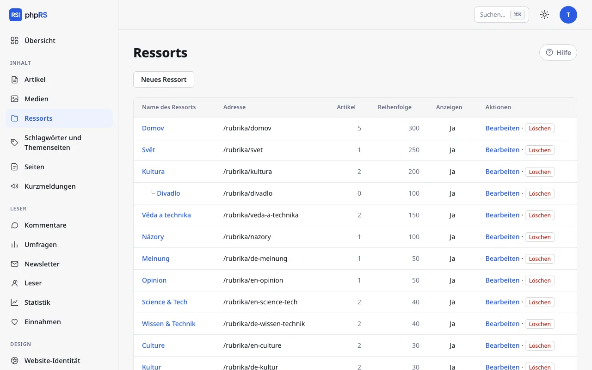

# Ressorts, Schlagwörter und Serien

Die Inhalte der Website werden auf drei Arten geordnet. Das **Ressort** ist die feste Einordnung – jeder Artikel hat genau eines. **Schlagwörter** beschreiben, wovon ein Artikel handelt, und er kann mehrere haben. Eine **Serie** verbindet Teile, die aufeinander aufbauen.

## Ressorts

Ressorts verwalten Sie unter **Inhalt → Ressorts**. Ohne Ressort lässt sich ein Artikel nicht speichern, legen Sie das erste Ressort deshalb vor dem ersten Artikel an.

### Neues Ressort

1. Klicken Sie auf **Neues Ressort**.
2. Füllen Sie **Name des Ressorts** aus. Die **Adresse des Ressorts** entsteht von selbst aus dem Namen; das Ressort ist dann auf der Website unter der Adresse `/rubrika/<adresse>` zu finden.
3. Ergänzen Sie bei Bedarf die **Beschreibung** – sie erscheint über der Artikelliste des Ressorts und wird als Beschreibung für Suchmaschinen verwendet.
4. Speichern Sie.

| Feld | Wozu es dient |
|---|---|
| **Übergeordnetes Ressort** | macht aus dem Ressort ein Unterressort |
| **Bild (Icon) des Ressorts** | optionale Adresse eines Bildes |
| **Reihenfolge** | eine höhere Zahl bedeutet weiter oben in der Ressortliste; ein neues Ressort hat 100 |
| **Anzeigen** | ohne Häkchen erscheint das Ressort nicht in der Ressortliste auf der Website |

### Unterressorts

Ein Unterressort entsteht mit der Option **Übergeordnetes Ressort**. In der Übersicht der Ressorts und in der Ressortauswahl im Artikelformular ist es unter seinem übergeordneten Ressort eingerückt. Ein Ressort lässt sich weder sich selbst noch einem eigenen Unterressort unterordnen.

Die Beschränkung eines Benutzers auf ausgewählte Ressorts gilt auch für deren Unterressorts – siehe [Rollen und Berechtigungen](../redakce/role-a-opravneni.md).

### Löschen und Verschieben

Ein Ressort, das Artikel enthält, lässt sich nicht löschen. Verschieben Sie die Artikel zuerst an einen anderen Ort: Markieren Sie sie in der Artikelübersicht und wählen Sie **in Ressort verschieben…** (siehe [Titelseite und Kalender](../redakce/titulni-strana-a-kalendar.md)). Die Unterressorts eines gelöschten Ressorts rücken eine Ebene nach oben.

## Schlagwörter und Themenseiten

Schlagwörter schreiben Sie im Artikelformular in das Feld **Schlagwörter**, durch Kommas getrennt – zum Beispiel `Verkehr, Bebauungsplan`. Das Feld schlägt Schlagwörter vor, die es auf der Website schon gibt. Ein unbekanntes Schlagwort wird beim Speichern des Artikels von selbst angelegt. Ein Artikel kann höchstens 20 Schlagwörter haben.

Auf der Website stehen die Schlagwörter unter dem Artikeltext. Mit einem Klick auf ein Schlagwort ruft der Leser alle Artikel auf, die es tragen (`/stitek/<adresse>`). Nach gemeinsamen Schlagwörtern werden auch die verwandten Artikel ausgewählt.

### Themenseite

Die Übersicht der Schlagwörter finden Sie unter **Inhalt → Schlagwörter und Themenseiten**. Bei jedem Schlagwort sehen Sie die Zahl der Artikel.

1. Klicken Sie beim Schlagwort auf **Bearbeiten**.
2. Füllen Sie **Einleitung der Themenseite** aus und wählen Sie ein **Bild der Themenseite**.
3. Speichern Sie.

Ein Schlagwort mit Einleitung verhält sich auf der Website wie eine Themenseite: oben die Einführung zu einer Affäre, einer Wahl oder einem Festival, darunter alle Artikel. In der Übersicht trägt ein solches Schlagwort die Markierung *hat Einleitung* und wird oben einsortiert.

### Zusammenführen und Löschen

Tippfehler und doppelte Schreibweisen (`Straßenbau` und `strassenbau`) beheben Sie durch Zusammenführen: **Bearbeiten → Mit anderem Schlagwort zusammenführen → Zusammenführen mit**. Die Artikel erhalten das gewählte Schlagwort, das ursprüngliche erlischt und seine Adresse wird auf das neue weitergeleitet.

**Löschen** entfernt nur das Schlagwort. Die Artikel bleiben, sie tragen es nur nicht mehr.

Ein Schlagwort lässt sich auch mehreren Artikeln auf einmal hinzufügen – mit der Sammelaktion **Schlagwort hinzufügen…** in der Artikelübersicht.

## Serien

Eine Serie ist eine Gruppe von Artikeln, die zusammengehören: Teile einer Reportage, eine regelmäßige Kolumne, ein Reisebericht in Fortsetzungen.

1. Klappen Sie im Artikelformular **Weitere Einstellungen** auf; das erste Feld ist **Serie**.
2. Wählen Sie eine vorhandene Serie oder schreiben Sie den Namen in das Feld **…oder Name einer neuen Serie**. Die neue Serie wird beim Speichern des Artikels angelegt.
3. Bei weiteren Teilen wählen Sie die Serie nur noch aus der Liste.

Auf der Website erscheint unter dem Artikel der Abschnitt **Verwandte Artikel** mit Links zu den übrigen veröffentlichten Teilen der Serie, nach Datum sortiert. Ein Artikel darf nur zu einer Serie gehören. Aus der Serie nehmen Sie ihn mit der Option **– Artikel gehört zu keiner Serie –**.

Bei einem Artikel, der zu keiner Serie gehört, werden die verwandten Artikel von selbst nach Schlagwörtern und Ressort ausgewählt. Der Administrator kann das unter **Einstellungen → Allgemein → Weitere Optionen → Verwandte Artikel automatisch** ausschalten.

## Siehe auch

- [Artikeleditor](editor.md)
- [Inhaltstypen](typy-obsahu.md)
