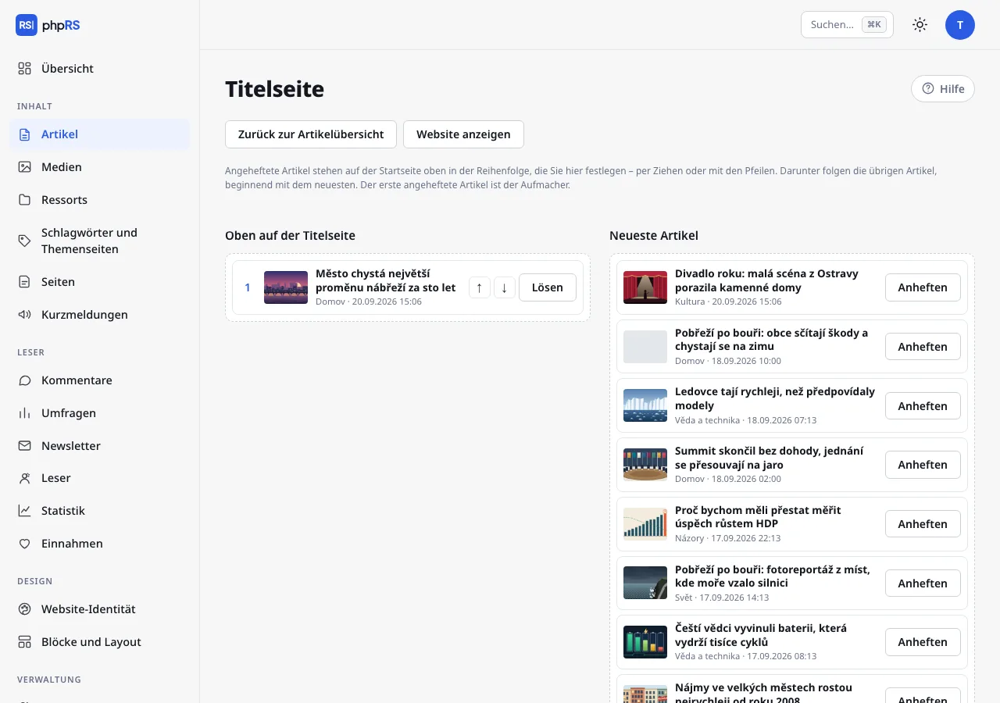
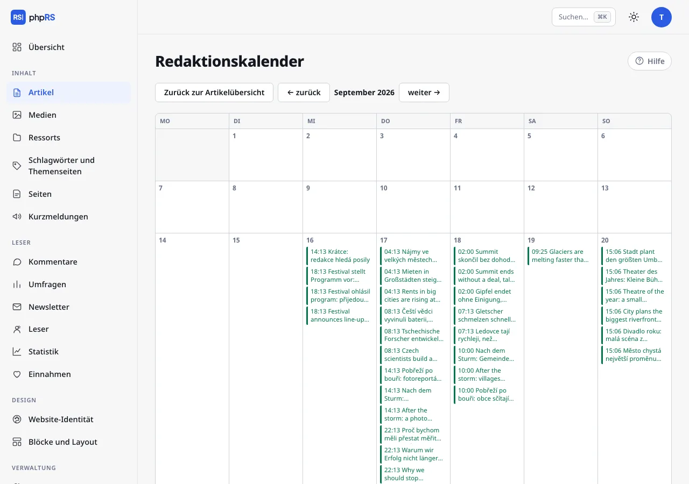
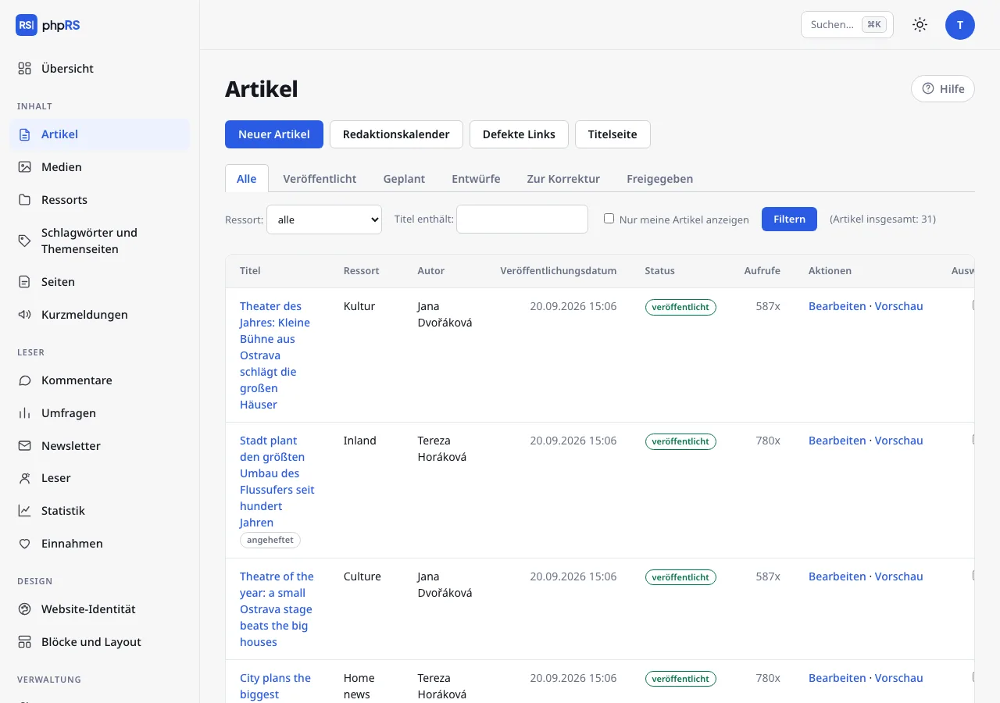

# Titelseite und Kalender

Diese Seite beschreibt die Werkzeuge, mit denen die Redaktion steuert, was auf der Website oben steht, was wann erscheint und wie sich schnell eine Sammeländerung durchführen lässt. Alle finden Sie unter **Inhalt → Artikel** in der Reihe von Links über der Liste.

## Titelseite

Die Startseite der Website ordnet die Artikel vom neuesten an. Angeheftete Artikel stehen darüber in der Reihenfolge, die die Redaktion festlegt. Über die Titelseite entscheidet nur, wer veröffentlichen darf; die anderen sehen den Link **Titelseite** nicht.

### Die Titelseite zusammenstellen

1. Öffnen Sie **Inhalt → Artikel → Titelseite**.
2. Links steht die Spalte **Oben auf der Titelseite** mit den angehefteten Artikeln, rechts **Neueste Artikel** – die letzten 30 veröffentlichten Artikel, die auf der Startseite angezeigt werden. Auf einer Website mit Sprachversionen stellt der Bildschirm nur die Standardsprache zusammen; in den übrigen Sprachen heften Sie mit der Option **Oben anheften (Aufmacher)** direkt am Artikel an.
3. Einen Artikel heften Sie mit der Schaltfläche **Anheften** an oder ziehen ihn in die linke Spalte. **Lösen** stellt ihn zurück zu den übrigen.
4. Die Reihenfolge der angehefteten Artikel ändern Sie per Ziehen oder mit den Pfeilen **↑** und **↓**.
5. Klicken Sie auf **Titelseite speichern**. Über den Link **Website anzeigen** prüfen Sie das Ergebnis.

Der erste angeheftete Artikel ist der Aufmacher. Anheften lassen sich höchstens 30 Artikel. Unter den angehefteten folgen die übrigen Artikel, beginnend mit dem neuesten.

### Optionen direkt beim Artikel

Dasselbe im Kleinen lässt sich im Artikelformular im Abschnitt **Veröffentlichung → Startseite** einstellen:

- **Auf der Startseite anzeigen** – ohne Häkchen steht der Artikel nur in seinem Ressort, in der Suche und auf den Seiten der Schlagwörter. Bei einem neuen Artikel ist die Option eingeschaltet.
- **Oben anheften (Aufmacher)** – heftet den Artikel an, ohne die Titelseite zu öffnen. Ein so angehefteter Artikel wird unter den Artikeln eingeordnet, die auf der Titelseite von Hand sortiert wurden.

Ein angehefteter Artikel trägt in der Artikelliste die Markierung *angeheftet*. Das Anheften endet nicht von selbst – lösen Sie den Artikel, wenn die Nachricht veraltet ist. Das Datum, nach dem ein Artikel ganz von der Startseite verschwinden soll, stellen Sie im Feld **Von der Startseite nehmen** ein (siehe [Planung und Versionen](../psani/planovani-a-revize.md)).

Wie viele Artikel auf die Startseite passen, bestimmt der Administrator unter **Einstellungen → Allgemein → Artikel pro Seite**.

## Redaktionskalender

**Inhalt → Artikel → Redaktionskalender** zeigt ein Monatsraster der Artikel nach Veröffentlichungsdatum.

- Jeder Artikel steht im Kalender mit Uhrzeit und Titel. Mit einem Klick öffnen Sie seinen Editor.
- Farben: grün veröffentlichte, blau geplante, orange Entwürfe, violett Artikel zur Korrektur (gestrichelte Linie) und freigegebene Artikel, die auf die Veröffentlichung warten (durchgezogene Linie).
- Der heutige Tag ist hervorgehoben. Zwischen den Monaten blättern Sie mit den Links **← zurück** und **weiter →**.
- Das Datum eines Artikels lässt sich im Kalender nicht verschieben – Sie ändern es beim Bearbeiten des Artikels im Feld **Veröffentlichungsdatum**.

Ein Autor sieht im Kalender nur seine Artikel, ein auf Ressorts beschränkter Benutzer nur Artikel aus seinen Ressorts.

Der Kalender eignet sich auch für die Vorausplanung: Legen Sie einen Entwurf mit einem Arbeitstitel und einem künftigen Datum an. Im Kalender ist er orange zu sehen und auf der Website erscheint er nicht, solange ihn niemand veröffentlicht.

## Artikelliste und Sammelaktionen

Die Liste zeigt 20 Artikel pro Seite. Sie grenzen sie ein mit den Reitern für den Status (**Alle**, **Veröffentlicht**, **Geplant**, **Entwürfe**, **Zur Korrektur**, **Freigegeben**), dem Feld **Ressort:**, auf einer Website mit Sprachversionen dem Feld **Sprache:**, dem Feld **Titel enthält:** und der Option **Nur meine Artikel anzeigen**; bestätigen Sie mit der Schaltfläche **Filtern**.

Eine Sammelaktion:

1. Haken Sie in der Spalte **Auswählen** die Artikel an.
2. Wählen Sie unter der Tabelle in der Auswahl **Mit ausgewählten:** eine Aktion und ergänzen Sie, was sie verlangt (Ressort oder Schlagwort).
3. Klicken Sie auf **Ausführen**.

| Aktion | Was sie tut |
|---|---|
| **in Ressort verschieben…** | verschiebt die Artikel in das gewählte Ressort; ein auf Ressorts beschränkter Benutzer nur in seine |
| **Schlagwort hinzufügen…** | fügt den Artikeln ein Schlagwort hinzu; ein unbekanntes Schlagwort wird angelegt |
| **für angemeldete Leser sperren** | den Artikel lesen nur angemeldete Leser |
| **für alle freigeben** | hebt die Sperre auf |

Das Sperren wird nur mit eingeschalteter Erweiterung **Leser und gesperrter Inhalt** angeboten (**Verwaltung → Erweiterungen**).

Die Schaltfläche **Ausgewählte löschen** löscht die Artikel nach einer Bestätigung. Das Löschen lässt sich nicht rückgängig machen. Wer das Recht zum Veröffentlichen nicht hat, kann veröffentlichte Artikel per Sammelaktion weder ändern noch löschen – das System überspringt sie und nennt in der Meldung die Zahl der tatsächlich geänderten.

## Defekte Links

**Inhalt → Artikel → Defekte Links.** Das System geht im Hintergrund die veröffentlichten Artikel durch – einen in fünf Minuten, jeden einmal im Monat – und prüft, ob die Links darin noch funktionieren. Der Bildschirm zeigt den Artikel, den Link, das Problem (zum Beispiel *Seite existiert nicht (404)*) und das Datum der Feststellung. Klicken Sie nach der Korrektur des Links auf **Erneut prüfen**. Die Prüfung lässt sich unter **Einstellungen → Allgemein → Weitere Optionen → Nach defekten Links suchen** ausschalten.

## Befehlspalette

Das Tastenkürzel **Strg+K** (auf dem Mac **⌘K**) oder das Feld **Suchen…** oben rechts öffnet die Befehlspalette. Steht der Cursor im Artikeltext, fügt Strg+K einen Link ein – die Palette öffnen Sie dann über das Feld **Suchen…**.

- Tippen Sie den Namen eines Bereichs (*Ressorts*), einer Aktion (*Neuer Artikel*, *Redaktionskalender*, *Titelseite*) oder einen Teil eines Artikeltitels.
- Wählen Sie mit den Pfeilen **↑** **↓** aus, **Enter** öffnet, **Esc** schließt.
- Die Suche funktioniert auch ohne Umlaute und Sonderzeichen.
- Ein gefundener Artikel öffnet sich direkt im Editor.

Die Palette bietet nur an, wohin Sie dürfen: Bereiche nach Ihren Berechtigungen und Artikel, die Sie bearbeiten dürfen. Der Administrator findet darin auch die einzelnen Reiter der Einstellungen.

## Siehe auch

- [Übergabe und Korrektur](predavka-a-korektura.md)
- [Ressorts, Schlagwörter und Serien](../psani/rubriky-stitky-serialy.md)
