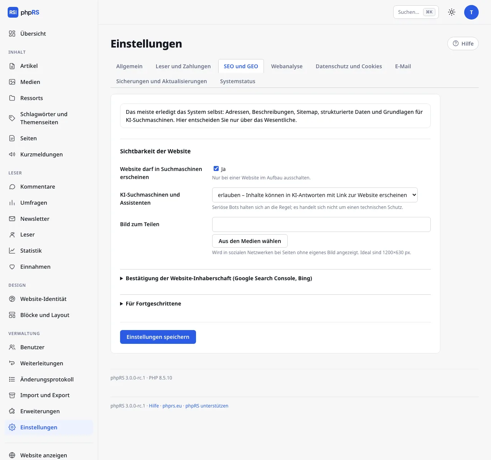

# SEO

Den größten Teil der Arbeit für Suchmaschinen erledigt das System selbst: lesbare Adressen, Beschreibungen, kanonische Adressen, Sitemap, strukturierte Daten und Feeds. Unter **Einstellungen → SEO und GEO** entscheiden Sie nur über das Wesentliche. Diese Seite beschreibt die Einstellungen der Website, die Optionen beim Artikel und Weiterleitungen. Die Optionen für KI-Suchmaschinen aus demselben Reiter haben eine eigene Seite: [KI-Suchmaschinen](ai-vyhledavace.md).

## Sichtbarkeit der Website

| Feld | Bedeutung | Standard |
|---|---|---|
| **Website darf in Suchmaschinen erscheinen** | Hauptschalter für die Indexierung. Schalten Sie ihn nur bei einer Website im Aufbau aus. | eingeschaltet |
| **KI-Suchmaschinen und Assistenten** | siehe [KI-Suchmaschinen](ai-vyhledavace.md) | erlauben |
| **Bild zum Teilen** | Erscheint in sozialen Netzwerken bei Seiten ohne eigenes Bild. Ideal sind 1200×630 px. | leer |

Wenn Sie **Website darf in Suchmaschinen erscheinen** ausschalten, verbietet die Datei `robots.txt` das Durchsuchen der ganzen Website und alle Seiten bekommen das Tag `noindex`. Es wird auch keine Benachrichtigung über IndexNow gesendet. Vergessen Sie nicht, die Option vor dem Start der Website einzuschalten.

## Bestätigung der Website-Inhaberschaft

Klappen Sie **Bestätigung der Website-Inhaberschaft (Google Search Console, Bing)** auf:

1. Wählen Sie in der Google Search Console die Bestätigung per HTML-Tag und kopieren Sie den Wert `content` aus dem Meta-Tag `google-site-verification`. Fügen Sie ihn in das Feld **Google** ein.
2. Für die Bing Webmaster Tools fügen Sie in das Feld **Bing** den Wert `content` aus dem Meta-Tag `msvalidate.01` ein.
3. Speichern Sie und schließen Sie die Bestätigung im Dienst ab.
4. Tragen Sie im Dienst danach die Adresse der Sitemap ein – sie steht unter den Feldern, zum Beispiel `https://www.example.cz/sitemap.xml`.

## Was das System erzeugt

Links zu diesen Dateien (außer `/podcast.xml`) stehen am Ende des aufklappbaren Abschnitts **Für Fortgeschrittene**.

| Adresse | Inhalt |
|---|---|
| `/robots.txt` | Regeln für Bots und ein Verweis auf die Sitemap. Verbietet immer `/admin.php`, die Suche und Artikelvorschauen. |
| `/sitemap.xml` | Sitemap: die Startseiten aller Sprachversionen, Ressorts, Seiten und bis zu 45 000 Artikel mit dem Datum der letzten Änderung. Es gibt eine für alle Sprachen. |
| `/sitemap-news.xml` | Sitemap für Google News: Artikel der letzten zwei Tage. |
| `/rss.xml` | RSS-Feed: die 20 neuesten Artikel, Titel und Vorspann. |
| `/feed.json` | JSON Feed 1.1: die 20 neuesten Artikel einschließlich Text. |
| `/podcast.xml` | Podcast-Feed für Apple Podcasts, Spotify und weitere Apps: Artikel mit Audiodatei (mp3, m4a, ogg, oga, wav, aac), höchstens 300 Episoden. Gesperrte Artikel sind darin nicht enthalten. |

Kurze Meldungen und Artikel mit der Option noindex werden nicht in die Sitemaps aufgenommen. Auf einer mehrsprachigen Website haben RSS, JSON Feed, Podcast und die Sitemap für Google News eine eigene Version unter dem Sprachpräfix (`/en/rss.xml`).

Das Cover des Podcasts ist das **Bild zum Teilen**; wenn es fehlt, wird das Logo der Website verwendet. Wie aus einem Artikel eine Episode wird, beschreibt die Seite [Inhaltstypen](../psani/typy-obsahu.md).

## Für Fortgeschrittene

| Feld | Bedeutung | Standard |
|---|---|---|
| **Strukturierte Daten schema.org** | JSON-LD-Markup, anhand dessen Suchmaschinen den Inhalt verstehen. | eingeschaltet |
| **Neue Artikel an Suchmaschinen melden (IndexNow)** | Bing, Seznam und Yandex erfahren sofort von dem Artikel. | ausgeschaltet |
| **Datei llms.txt**, **Bereinigte Version der Artikel (.md)** | siehe [KI-Suchmaschinen](ai-vyhledavace.md) | eingeschaltet |
| **Eigene Regeln für robots.txt** | Zeilen, die in `robots.txt` hinter den Regeln des Systems angehängt werden. | leer |

### Strukturierte Daten

Mit eingeschalteter Option fügt das System ein:

- auf der ganzen Website Angaben zur Website und zum Herausgeber einschließlich Suchfeld,
- beim Artikel den Typ `NewsArticle` mit Titel, Datumsangaben, Autor, Bild und Herausgeber sowie die Brotkrumen-Navigation (Website → Ressort → Artikel),
- beim Liveticker den Typ `LiveBlogPosting` mit den einzelnen Einträgen,
- bei einem Artikel mit Fragen und Antworten `FAQPage`,
- bei einer Rezension die Bewertung und den rezensierten Gegenstand,
- bei einem Artikel mit Audio oder Video die Angabe zum Medium,
- bei einem gesperrten Artikel das Kennzeichen für bezahlten Inhalt (siehe [Gesperrte Inhalte und Abonnement](../ctenari-a-prijmy/zamceny-obsah.md)).

Nichts davon füllen Sie eigens aus – die Angaben werden aus dem Artikel genommen.

### IndexNow

Nach dem Einschalten erzeugt das System beim Speichern der Einstellungen einen Schlüssel und stellt ihn auf der Website als Textdatei bereit; sonst stellen Sie nichts ein. Die Meldung geht bei der Veröffentlichung eines Artikels (auch eines geplanten) und bei einer späteren Bearbeitung des veröffentlichten Artikels hinaus. Artikel mit der Option noindex werden nicht gemeldet. Unter der Adresse `localhost` und auf Domains `.test` wird nichts gesendet.

## Optionen beim Artikel

Im Artikelformular gibt es im aufklappbaren Abschnitt **Weitere Einstellungen** drei Felder für Suchmaschinen:

| Feld | Bedeutung |
|---|---|
| **Titel für Suchmaschinen** | Ein anderer Titel für die Suchergebnisse. Leer = Titel des Artikels. |
| **Beschreibung für Suchmaschinen** | Höchstens 320 Zeichen. Leer = Anfang des Vorspanns. Einen Vorschlag macht auch der [KI-Assistent](../psani/ai-asistent.md). |
| **Vor Suchmaschinen verbergen (noindex)** | Der Artikel bleibt auf der Website, bekommt aber das Tag `noindex`, fällt aus den Sitemaps und wird nicht gemeldet (IndexNow, Web Push, Webhook). Der automatische Newsletter nimmt ihn nicht auf. |

Die kanonische Adresse, die Open-Graph-Tags für das Teilen und bei Sprachversionen die hreflang-Tags ergänzt das System selbst. Beschreibung und Schlüsselwörter der ganzen Website stehen unter **Einstellungen → Allgemein**: **Beschreibung der Website** im Abschnitt **Website**, **Schlüsselwörter der Website** im aufklappbaren Abschnitt **Weitere Optionen**.

## Weiterleitungen

Die Erweiterung **Weiterleitungen** ist nach der Installation eingeschaltet. Sie verwaltet der Administrator unter **Verwaltung → Weiterleitungen**.

Den häufigsten Fall löst das System selbst: Wenn Sie die Adresse eines veröffentlichten Artikels ändern, entsteht eine Weiterleitung 301 von der alten Adresse auf die neue. Ketten entstehen nicht – ältere Weiterleitungen werden auf das neue Ziel umgeschrieben.

Weiterleitung von Hand:

1. Füllen Sie oben im Formular die **Alte Adresse** aus – einen Pfad auf dieser Website, der nicht mehr existiert, zum Beispiel `/stara-stranka.html`.
2. Geben Sie in **Weiterleiten nach** das Ziel ein: einen Pfad (`/clanek/nova-adresa`) oder eine vollständige Adresse `https://…`.
3. Klicken Sie auf **Weiterleitung hinzufügen**.

Eine Weiterleitung wird nur verwendet, wenn unter der alten Adresse nichts liegt. Eine bestehende Seite übersteuert sie nicht. Die Tabelle zeigt bei jedem Eintrag in der Spalte **Verwendet**, wie oft er benutzt wurde.

Darunter steht die Übersicht **Adressen, die Leser nicht gefunden haben (404)** – die 25 häufigsten der letzten 60 Tage mit Anzahl und Datum. Der Link **Weiterleiten** bei der Adresse füllt das Formular vor, eine fehlende Seite leiten Sie also mit zwei Klicks weiter. **Übersicht leeren** löscht die Liste.

## Siehe auch

- [KI-Suchmaschinen](ai-vyhledavace.md)
- [Webanalyse und Datenschutz](mereni-a-soukromi.md)
- [Sprachen der Website](../jazykove-verze/jazyky-webu.md)
- [Inhaltstypen](../psani/typy-obsahu.md)
