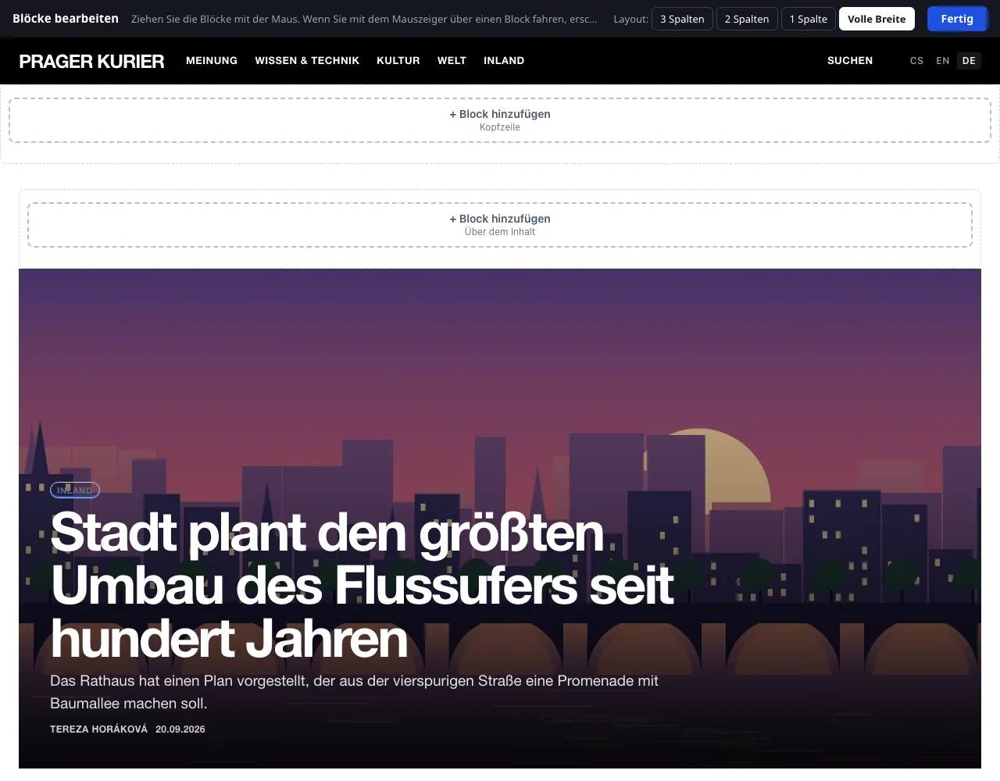

# Blöcke und Layout

Ein Block ist ein eigenständiges Element der Seite außerhalb des Hauptinhalts: Liste der Ressorts, meistgelesene Artikel, Suche, Newsletter-Formular, Werbung oder eigener Text. Blöcke werden in Zonen rund um den Inhalt angeordnet und direkt auf der laufenden Seite der Website bearbeitet.

Zugriff haben der Administrator und der Redakteur (sofern ihm der Administrator den Bereich nicht weggenommen hat, siehe [Rollen und Berechtigungen](../redakce/role-a-opravneni.md)).

## Editor öffnen

Klicken Sie im Hauptmenü auf **Design → Blöcke und Layout**. Es öffnet sich die Startseite der Website im Bearbeitungsmodus: Oben steht die Leiste **Blöcke bearbeiten**, die Zonen sind umrandet und in jeder ist die Schaltfläche **+ Block hinzufügen**.

Die Links auf der Website bleiben im Bearbeitungsmodus. Mit einem Klick auf einen Artikel oder ein Ressort gelangen Sie also auf deren Seite und sehen, wie die Blöcke dort aussehen – das ist praktisch bei Blöcken, die nur in einem bestimmten Ressort angezeigt werden. Die Bearbeitung beenden Sie mit der Schaltfläche **Fertig**, die Sie in die Administration zurückbringt.

Die Leser sehen den Bearbeitungsmodus nicht. Jede Änderung wird aber sofort gespeichert und gilt auf der Website unmittelbar.

## Zonen

| Zone | Wo sie ist |
|---|---|
| **Kopfzeile** | unter dem Kopf der Website, über die gesamte Breite |
| **Linke Spalte** | links vom Inhalt (nur Layout 3 Spalten) |
| **Über dem Inhalt** | über der Artikelliste oder über dem Artikel |
| **Unter dem Inhalt** | unter der Artikelliste oder unter dem Artikel |
| **Rechte Spalte** | rechts vom Inhalt (Layout 3 und 2 Spalten) |
| **Fußzeile** | unten über dem Fuß der Website |

Welche Zonen es gibt, bestimmt das Seitenlayout. Sie ändern es mit den Schaltflächen **3 Spalten**, **2 Spalten**, **1 Spalte** und **Volle Breite** in der oberen Leiste bei der Beschriftung **Layout:**. Blöcke aus einer aufgehobenen Spalte werden von selbst verschoben; Einzelheiten stehen auf der Seite [Website-Vorlagen](sablony.md).

## Block hinzufügen

1. Klicken Sie in der Zone, in die der Block gehört, auf **+ Block hinzufügen**.
2. Klicken Sie im Fenster **Was möchten Sie hinzufügen?** auf die Karte des Blocks.
3. Der Block wird am Ende der Zone hinzugefügt und seine Einstellungen öffnen sich. Passen Sie ihn an und klicken Sie auf **Speichern**.

### Katalog der Blöcke

| Gruppe | Block | Was er anzeigt |
|---|---|---|
| Artikel | **Aufmacher** | Großer Teaser für den angehefteten oder den neuesten Artikel. |
| Artikel | **Artikel aus einem Ressort** | Liste der neuesten Artikel aus dem Ressort, das Sie auswählen. |
| Artikel | **Meistgelesen** | Rangliste der Artikel nach Anzahl der Aufrufe. |
| Artikel | **Schlagwörter** | Die meistverwendeten Schlagwörter als Links. |
| Artikel | **Archiv** | Artikel nach Monaten. |
| Artikel | **Autoren** | Liste der Autoren mit der Anzahl ihrer Artikel. |
| Navigation | **Ressorts** | Liste der Ressorts der Website. |
| Navigation | **Menü** | Eigene Links – zu Seiten der Website oder anderswohin. |
| Navigation | **Seiten** | Links zu Seiten wie Über uns und Kontakt. |
| Navigation | **Suche** | Feld für die Suche in Artikeln. |
| Leser und Redaktion | **Kurzmeldungen** | Kurzmeldungen der Redaktion. |
| Leser und Redaktion | **Umfrage** | Die aktuelle Umfrage mit Abstimmung. |
| Leser und Redaktion | **Newsletter** | Anmeldeformular für Neuigkeiten per E-Mail. |
| Leser und Redaktion | **Unterstützen Sie uns** | Kurzer Aufruf und eine Schaltfläche zur Zahlung oder zu einer Seite mit der Kontonummer. |
| Leser und Redaktion | **Benachrichtigungen** | Schaltfläche, mit der der Leser Browser-Benachrichtigungen über neue Artikel einschaltet. |
| Leser und Redaktion | **Leserkonto** | Link zu Anmeldung, Registrierung und Leserkonto. |
| Leser und Redaktion | **Soziale Netzwerke** | Links zu den in den Einstellungen eingetragenen Profilen. |
| Leser und Redaktion | **Kontakt** | E-Mail-Adresse der Redaktion und Text aus der Fußzeile. |
| Eigener Inhalt | **Text** | Eigener Text, ein Bild oder eingebetteter Code (Video, Karte…). |
| Eigener Inhalt | **Werbung** | Position, an der die Banner aus dem Anzeigensystem wechseln. |

Die Blöcke **Kurzmeldungen**, **Umfrage**, **Newsletter**, **Benachrichtigungen**, **Leserkonto** und **Werbung** gehören zu Erweiterungen. Im Angebot stehen sie nur, wenn die jeweilige Erweiterung unter **Verwaltung → Erweiterungen** eingeschaltet ist. Nach dem Ausschalten der Erweiterung verschwindet der Block von der Website, seine Einstellungen bleiben erhalten.

## Verschieben, Einstellen und Löschen

- **Verschieben:** Fassen Sie den Block mit der Maus und ziehen Sie ihn an die neue Stelle, auch in eine andere Zone. Die Reihenfolge wird von selbst gespeichert.
- Wenn Sie mit der Maus über einen Block fahren, erscheinen seine Bedienelemente: die Pfeile **↑** und **↓** (**Nach oben verschieben**, **Nach unten verschieben**), **Einstellen** und **✕** (**Block löschen**). Das Löschen wird bestätigt.

### Einstellungen des Blocks

Jeder Block hat eine **Überschrift** und die Option **Überschrift auf der Website anzeigen**. Die weiteren Felder hängen vom Typ ab:

| Block | Felder |
|---|---|
| Text | **Inhalt** – ein kleiner Editor |
| Menü | **Links** – Paare aus Text und Adresse (`/o-nas` oder `https://…`), eine weitere Zeile fügt **+ weiterer Link** hinzu |
| Artikel aus einem Ressort | **Ressort** (oder **Neueste aus allen Ressorts**) und **Anzahl der Einträge** (1–20; eine höhere Zahl wird als 20 gespeichert) |
| Meistgelesen, Schlagwörter, Archiv, Autoren | **Anzahl der Einträge** (1–50) |
| Unterstützen Sie uns | **Aufruf**, **Text der Schaltfläche**, **Wohin die Schaltfläche führt** – siehe [Unterstützung und Einnahmen](../ctenari-a-prijmy/podpora-a-prijmy.md) |
| Werbung | **Anzeigenposition** – siehe [Werbung](../ctenari-a-prijmy/reklama.md) |

Das **Aussehen** des Blocks hat vier Formen: **Normal**, **Farbig hinterlegt**, **Hervorgehobene Überschrift** und **Mit Rahmen**. Wie sie genau aussehen, bestimmt die Vorlage.

### Wann und wo der Block angezeigt wird

Der aufklappbare Abschnitt **Wann und wo der Block angezeigt wird** schränkt ein, wem der Block gezeigt wird:

| Feld | Möglichkeiten |
|---|---|
| **Seiten** | auf allen Seiten · nur auf der Startseite · überall außer auf der Startseite |
| **Nur im Ressort** | der Block erscheint nur auf der Seite des gewählten Ressorts und bei dessen Artikeln |
| **Sprachversion** | in allen Sprachen oder nur in einer Version (das Feld ist nur auf einer mehrsprachigen Website sichtbar) |
| **Gerät** | überall · nur auf dem Smartphone · nur auf Computer und Tablet |
| **Block vorübergehend ausblenden** | der Block bleibt gespeichert, die Leser sehen ihn nicht |

Die Grenze zwischen Smartphone und Computer ist eine Fensterbreite von 760 px. Einen Block, der den Lesern auf der gerade angezeigten Seite nicht gezeigt wird, sehen Sie im Editor als Rahmen mit Namen und Grund, zum Beispiel **Wird gerade nicht angezeigt: nur auf der Startseite.** Ein Block ohne Inhalt (etwa Kurzmeldungen ohne eine einzige Kurzmeldung) meldet **Hat noch nichts anzuzeigen.** und wird den Lesern nicht ausgegeben.

## Block mit eigenem HTML

Der Block **Text** dient auch für eingebetteten Code – Video, Karte, Widget.

1. Fügen Sie einen Block **Text** hinzu und öffnen Sie seine Einstellungen.
2. Klicken Sie im Editor des Feldes **Inhalt** auf die Schaltfläche **HTML** (Wechsel zum Quelltext).
3. Fügen Sie den Code ein und klicken Sie auf **Speichern**.

Den Inhalt der Blöcke betrachtet das System als vertrauenswürdig und gibt ihn unverändert aus. Fügen Sie deshalb nur Code aus Quellen ein, denen Sie vertrauen. Code, der Cookies speichert oder fremde Dienste lädt, kann die Einwilligung des Besuchers erfordern – siehe [Webanalyse und Datenschutz](../seo-a-ai/mereni-a-soukromi.md).

## Blöcke für Sprachversionen

Auf einer Website mit mehreren Sprachen passen sich die Systemblöcke von selbst an: Ressorts, Artikel aus einem Ressort, Schlagwörter, Archiv, Autoren, Seiten und Kurzmeldungen geben den Inhalt der Sprachversion aus, die der Leser gerade liest. Die Überschrift des Blocks und der Inhalt der Blöcke Text und Menü werden nicht übersetzt. Die Lösung ist, den Block zweimal zu haben – einmal für jede Sprache – und mit dem Feld **Sprachversion** festzulegen, wo welcher erscheint. Mehr auf der Seite [Inhalte übersetzen](../jazykove-verze/preklad-obsahu.md).

## Liste der Blöcke ohne visuellen Editor

Der Ersatzweg ist eine Formularübersicht unter der Adresse `admin.php?modul=bloky&schema=1`. Sie funktioniert auch ohne JavaScript und hilft, wenn sich die Seite der Website wegen eines fehlerhaften eingebetteten Codes nicht bedienen lässt.

- Die Übersicht zeigt das Schema der Seite mit den Zonen. Der Umschalter **Seitenlayout:** steht oben.
- Blöcke verschieben Sie durch Ziehen oder mit den Pfeilen; **Bearbeiten** öffnet das Formular, **Löschen** entfernt den Block, **+ Block hinzufügen** legt in der jeweiligen Zone einen neuen an.
- Das Formular hat die Felder **Blocktyp**, **Überschrift des Blocks**, **Eigener Inhalt (HTML)** und je nach Blocktyp **Menü-Links**, **Ressort**, **Anzahl der Einträge** oder **Anzeigenposition**. Im Abschnitt **Platzierung und Anzeige** folgen **Platzierung**, **Aussehen des Blocks**, **Auf welchen Seiten**, **Nur im Ressort**, **Sprachversion** (nur auf einer Website mit mehreren Sprachen), **Geräte** und **Block anzeigen**. Beim Block Unterstützen Sie uns kommen die Felder **Text der Schaltfläche** und **Wohin die Schaltfläche führt** hinzu. Das Aussehen hat hier zusätzlich eine fünfte Option **Ohne Überschrift**, die dem ausgeschalteten **Überschrift auf der Website anzeigen** entspricht.
- Zurück in den visuellen Editor führt **Visuellen Editor öffnen**.

## Siehe auch

- [Website-Vorlagen](sablony.md)
- [Bearbeiten direkt auf der Website](uprava-na-webu.md)
- [Werbung](../ctenari-a-prijmy/reklama.md)
- [Newsletter](../ctenari-a-prijmy/newsletter.md)
