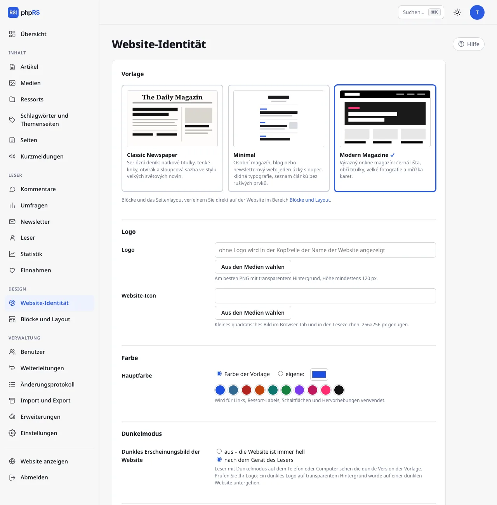

# Website-Identität

Der Bildschirm **Design → Website-Identität** fasst zusammen, wodurch sich Ihre Website von anderen Websites mit derselben Vorlage unterscheidet: Logo, Icon, Hauptfarbe, Schriften und Dunkelmodus. Die Einstellungen wirken in allen drei eingebauten Vorlagen und überdauern auch deren Wechsel. Zugriff hat nur der Administrator.

Das Formular hat die Abschnitte **Vorlage**, **Logo**, **Farbe**, **Dunkelmodus**, **Schrift** und **Vorschau**. Alles wird auf einmal mit der Schaltfläche **Speichern** gespeichert; der Link **Website anzeigen** daneben öffnet die Website in einem neuen Fenster. Die Auswahl der Vorlage beschreibt die Seite [Website-Vorlagen](sablony.md).

## Logo und Icon

| Feld | Wozu es dient |
|---|---|
| **Logo** | Bild im Kopf der Website anstelle des Namens als Text. Ohne Logo steht im Kopf der Name der Website. |
| **Website-Icon** | Kleines quadratisches Bild auf dem Browser-Tab und in den Lesezeichen. |

Das Vorgehen ist bei beiden Feldern gleich:

1. Klicken Sie auf **Aus den Medien wählen** und wählen Sie ein Bild. Wenn Sie es in den Medien noch nicht haben, laden Sie es zuerst dort hoch.
2. Unter dem Feld erscheint eine Vorschau. Die Adresse des Bildes können Sie auch von Hand in das Feld schreiben.
3. Klicken Sie auf **Speichern**.

Für das Logo eignet sich am besten ein PNG mit transparentem Hintergrund und mindestens 120 px Höhe. Für das Icon genügt ein Quadrat von 256×256 px. Das Feld leeren Sie, indem Sie die Adresse löschen.

Den Namen der Website, der anstelle des Logos angezeigt wird und auch als sein Alternativtext dient, stellen Sie unter **Einstellungen → Allgemein** ein.

## Hauptfarbe

Die Hauptfarbe wird für Links, Ressort-Etiketten, Schaltflächen und Hervorhebungen verwendet.

| Option | Was sie bedeutet |
|---|---|
| **Farbe der Vorlage** | Ausgangszustand. Jede Vorlage verwendet ihre eigene Farbe. |
| **eigene:** | Die Farbe, die Sie auswählen. Sie gilt für alle Vorlagen. |

Eine eigene Farbe wählen Sie auf zwei Arten:

- mit einem Klick auf einen der zehn vorbereiteten Farbtöne (Blau, Zeitungsblau, Rot, Orange, Smaragdgrün, Grün, Violett, Purpur, Magazin-Pink, Schwarz),
- über das Farbwahlfeld, in dem Sie einen beliebigen Farbton mischen.

In beiden Fällen schaltet die Option von selbst auf **eigene:** um.

### Kontrastprüfung

Das Formular berechnet laufend den Kontrast der gewählten Farbe zum weißen Hintergrund. Liegt er unter 4,5 : 1, erscheint der Hinweis **Achtung: Diese Farbe ist auf weißem Hintergrund schlecht lesbar – wählen Sie eine dunklere.** Der Hinweis verhindert das Speichern nicht, aber Links in einer solchen Farbe sind für die Leser schlecht zu lesen. Das betrifft vor allem gelbe, hellgrüne und hellblaue Farbtöne.

## Schrift

Überschriften und Artikeltext haben je eine eigene Auswahl.

**Überschriften:**

| Option | Charakter |
|---|---|
| **Wie in der Vorlage** | die Schrift, mit der die Vorlage kommt |
| **Elegante Serifenschrift** | Bodoni, Didot – Zeitungen und Mode |
| **Klassische Serifenschrift** | Georgia – seriös und gut lesbar |
| **Buchschrift** | Charter, Cambria – ruhig und literarisch |
| **Moderne Serifenlose** | Systemschrift des Geräts – klar und neutral |
| **Markante Grotesk** | Helvetica, Arial – Magazine und Plakate |
| **Abgerundet** | freundlich, für Lifestyle- und Familienseiten |
| **Schreibmaschine** | Technik, Fanzines, Tagebücher |

**Artikeltext:** **Wie in der Vorlage**, **Serifenschrift** (Georgia – angenehm für lange Texte), **Buchschrift** (Charter, Cambria), **Serifenlose** (Systemschrift des Geräts) und **Grotesk** (Helvetica, Arial).

Alle Schriften sind Systemschriften. Nichts wird von fremden Servern geladen, die Website bleibt also schnell und braucht wegen der Schriften keine Einwilligung des Besuchers. Das heißt auch, dass die genaue Form der Schrift auf verschiedenen Geräten leicht abweicht: Der Leser sieht die erste Schrift aus der Reihe, die auf seinem Gerät installiert ist. Eigene Schriftdateien lassen sich nicht hochladen.

## Dunkelmodus

| Option | Verhalten |
|---|---|
| **aus – die Website ist immer hell** | Ausgangszustand. |
| **nach dem Gerät des Lesers** | Ein Leser, der auf dem Telefon oder Computer den Dunkelmodus eingeschaltet hat, sieht die dunkle Version der Vorlage. Die anderen sehen die helle. |

Der Dunkelmodus ist automatisch. Auf der Website gibt es keinen Schalter, mit dem ihn der Leser selbst ein- oder ausschalten könnte – es entscheidet die Einstellung seines Geräts. Eine dunkle Gestalt haben alle drei eingebauten Vorlagen.

Prüfen Sie vor dem Einschalten das Logo. Ein dunkles Logo auf transparentem Hintergrund würde auf einer dunklen Website untergehen; verwenden Sie eine Variante, die auf hellem und auf dunklem Grund lesbar ist.

Diese Einstellung betrifft nur die Website. Das helle und dunkle Erscheinungsbild der Administration schaltet jeder Benutzer selbst rechts oben um.

## Vorschau

Der Abschnitt **Vorschau** zeigt ein Ressort-Etikett, eine Überschrift, einen Absatz mit Link und eine Schaltfläche in der gewählten Farbe und den gewählten Schriften. Er ändert sich sofort bei jeder Auswahl, noch vor dem Speichern. Er dient der Orientierung – das tatsächliche Ergebnis sehen Sie nach dem Speichern auf der Website.

## Siehe auch

- [Website-Vorlagen](sablony.md)
- [Blöcke und Layout](bloky-a-rozvrzeni.md)
- [Eigene Vorlage](vlastni-sablona.md)
- [Bilder, Galerien und Anhänge](../psani/obrazky-a-galerie.md)
