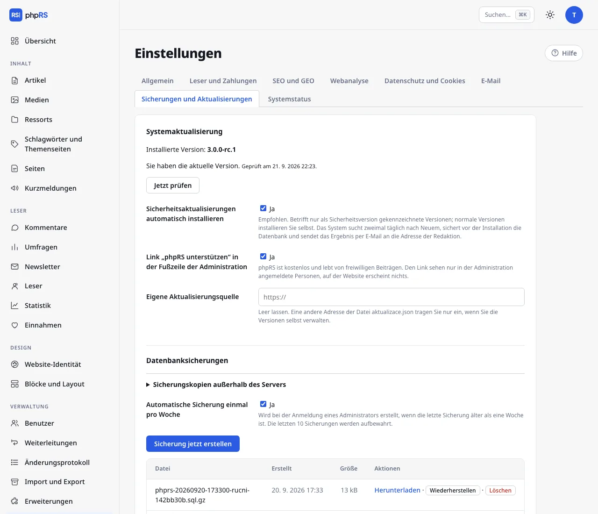

# Aktualisierungen

phpRS kann sich selbst aktualisieren. Jedes Paket ist vom Herausgeber signiert, und das System installiert nur ein Paket, dessen Signatur stimmt – ein gefälschtes oder beschädigtes Paket lehnt es ab.

## Wie es funktioniert

- Das System fragt zweimal täglich unter der Adresse `https://phprs.eu/aktualizace.json` nach, ob eine neue Version erschienen ist. Dabei sendet es nichts außer der Nummer seiner Version im Header der Anfrage.
- Eine **gewöhnliche Version** installieren Sie selbst mit einer Schaltfläche.
- Eine **Sicherheitsversion** installiert sich in der Standardeinstellung **von selbst**: Das System sichert zuerst die Datenbank, prüft Prüfsumme und Signatur des Pakets, überschreibt die Dateien und schickt eine E-Mail an die Redaktion. Wer das nicht möchte, schaltet die Option **Sicherheitsaktualisierungen automatisch installieren** aus – dann kommt nur eine E-Mail mit dem Hinweis.

## Aktualisierung mit einer Schaltfläche

**Einstellungen → Sicherungen und Aktualisierungen.** Wenn eine neue Version verfügbar ist, sehen Sie ihre Nummer, die Liste der Änderungen und die Schaltfläche **Auf … aktualisieren** mit der Nummer der Version. Nach der Bestätigung:

1. wird eine Sicherung der Datenbank erstellt,
2. wird das Paket heruntergeladen und seine Prüfsumme und Signatur werden geprüft,
3. antwortet die Website einige Sekunden lang mit einem Wartungshinweis,
4. werden die Dateien des Systems überschrieben, Dateien, die die neue Version nicht mehr enthält, gelöscht, und die Datenbank wird bei der ersten Anfrage an die neue Struktur angepasst.

**Nicht überschrieben** werden `config.php`, die Ordner `media/` und `storage/` und Ihre eigenen Vorlagen im Ordner `layout/`. Die eingebauten Vorlagen (`classic-newspaper`, `modern-magazine`, `minimal`) werden überschrieben – ändern Sie sie deshalb nicht; ein eigenes Design legen Sie als Kopie unter einem anderen Namen an.

Die ursprüngliche dreispaltige Vorlage `default` wurde aus dem System entfernt. Eine Website, die sie verwendet hat, stellt das Update selbst auf Classic Newspaper um; die Anordnung der Blöcke und alle Inhalte bleiben erhalten. Eigene Vorlagen (auch solche, die als ihre Kopie entstanden sind) sind davon nicht betroffen. Eine Ausnahme: Wenn Sie die Vorlage von Hand kopiert haben und ihre `base.php` das Stylesheet weiterhin aus `layout/default/style.css` lädt, kopieren Sie diese Datei vor dem Update in Ihren eigenen Ordner und korrigieren Sie den Verweis in `base.php` – nach dem Update existiert die ursprüngliche Datei nicht mehr.

Die Schaltfläche **Jetzt prüfen** fragt sofort nach einer neuen Version.

### Was die Aktualisierung braucht

Die PHP-Erweiterungen `zip` und `sodium` und Schreibzugriff auf den Ordner der Website. Wenn etwas davon fehlt, meldet das System es und bietet das manuelle Vorgehen an.

## Manuelle Aktualisierung

Sie funktioniert immer, auch wenn die automatische nicht möglich ist:

1. Klicken Sie unter **Einstellungen → Sicherungen und Aktualisierungen** auf **Sicherung jetzt erstellen** und laden Sie die Sicherung herunter.
2. Laden Sie die neue Version herunter und entpacken Sie sie.
3. **Überschreiben Sie per FTP alle Dateien außer** `config.php` und den Ordnern `media/` und `storage/`. Die Datei `install.php` aus dem Paket laden Sie nicht auf den Server.
4. Öffnen Sie die Website oder die Administration – die Datenbank passt sich von selbst an.

## Integritätsprüfung

Jede Version enthält eine signierte Liste der Kerndateien mit ihren Prüfsummen. **Einstellungen → Systemstatus** meldet danach in der Zeile **Kerndateien** geänderte, fehlende und hinzugefügte Dateien.
Eine Meldung nach einer eigenen Änderung am Kern ist nur dann in Ordnung, wenn Sie von ihr wissen; sonst ist sie ein Anzeichen für einen Angriff auf die Website – siehe [Betrieb → Sicherheit](../provoz/bezpecnost.md).
