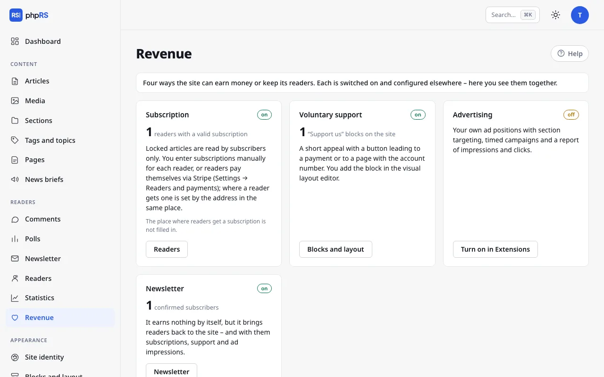

# Support and revenue

A site can live on subscriptions, on voluntary contributions from readers and on advertising. This page describes the **Support us** block and the **Revenue** screen, which shows all the sources together.

phpRS neither accepts nor processes voluntary contributions and does not see who contributed how much. The Support us block is an appeal with a button that takes the reader to where the payment takes place. Subscriptions are different: readers can pay for them by card through the Stripe service and the site turns them on and extends them by itself – see [Payments with Stripe](platby-stripe.md).

## The Support us block

The block outputs a short appeal and a button with a heart. It needs no extension.

### Preparation

Decide where the button will lead:

| Option | What you enter |
|---|---|
| A payment link of a service (Stripe, Donio, Darujme, Ko-fi…) | an address starting with `https://` |
| Your own page with an account number and a QR code | the address of a page on the site, for example `/podporte-nas` |

Create your own page in **Content → Pages**. Insert the QR code for the payment into it as an image from Media.

### Adding the block

1. Open **Appearance → Blocks and layout**.
2. In the zone where the appeal is to be, click **+ Add block** and choose **Support us** in the **Readers and newsroom** group.
3. In the settings fill in:
   - **Call to action** – one or two sentences. An empty field means the default text: “We do independent journalism. If our work matters to you, please support it.”
   - **Button text** – at most 60 characters. Empty means **Support the newsroom**.
   - **Where the button leads** – a payment link or the address of a page.
4. Click **Save**.

Until you fill in the **Where the button leads** field, the block shows only the text of the appeal without a button. The address must start with `https://`, `http://` or a slash; any other is not saved. A link leading off the site opens for the reader with `noopener` protection.

### Where to place the block

- In the **Below content** zone – the reader sees it after finishing the article.
- In the right column as a permanent reminder.
- With the **Only in section** field you can restrict it to a section, with the **Pages** field for instance to the home page only.

Edit the block in the visual editor. The form-based list of blocks offers **Button text**, **Where the button leads** and the call-to-action text – see [Blocks and layout](../vzhled/bloky-a-rozvrzeni.md).

On a multilingual site have a separate block for every language and use the **Language version** field to determine where each one is shown. The default texts are translated by themselves; your own appeal is not.

## The Revenue screen

**Readers → Revenue** is a signpost for the administrator. Nothing is set on it. It shows four cards – four ways in which a site can earn money or keep its readers. Every card has the label **on** or **off**, one main number and a link to where the thing is managed.

| Card | Number | Where the link leads |
|---|---|---|
| **Subscription** | readers with a valid subscription; with payments through Stripe also the number of paying readers and the sum of payments in the last 30 days by currency | **Readers** |
| **Voluntary support** | “Support us” blocks on the site (only those shown, not hidden ones) | **Blocks and layout** |
| **Advertising** | impressions of active ads; below it the number of active ads and clicks | **Advertising** |
| **Newsletter** | confirmed subscribers | **Newsletter** |

For an extension that is turned off, the link **Turn on in Extensions** leads to **Administration → Extensions**. The Voluntary support card is on as soon as there is at least one shown Support us block on the site.

The Subscription card points out with the message **The place where readers get a subscription is not filled in.** when the address in **Settings → Readers and payments** is missing and payments through Stripe are not turned on either. Without it a reader does not see the **Get a subscription** button on a locked article. The procedure is on the page [Locked content and subscriptions](zamceny-obsah.md).

The newsletter itself brings in no money. It is in the overview because it brings readers back to the site – and with them subscriptions, support and ad impressions.

### What the overview does not show

The only amounts in the overview are subscription payments received through Stripe in the last 30 days (before Stripe's fees are deducted). The overview does not see voluntary contributions and payments by bank transfer – you find out how much you have collected from your bank or payment service. The main number on the Subscription card is the count of readers whose subscription is valid right now, whether they paid for it through Stripe or you recorded it by hand.

## Related

- [Locked content and subscriptions](zamceny-obsah.md)
- [Payments with Stripe](platby-stripe.md)
- [Advertising](reklama.md)
- [Newsletter](newsletter.md)
- [Blocks and layout](../vzhled/bloky-a-rozvrzeni.md)
