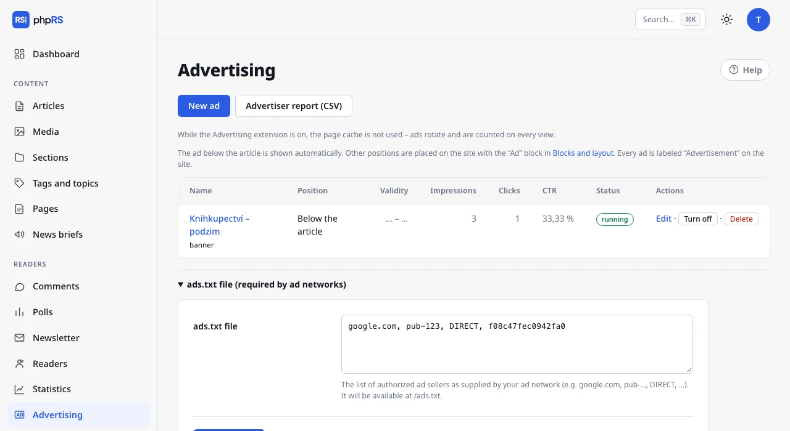

# Advertising

The advertising system shows your own banners and ad network codes on the site. You add an ad once and the system rotates it in the chosen position, counts impressions and clicks, and watches the campaign dates and the impression limit. Every ad on the site is marked with the word “Advertisement”.

## Turning it on

Open **Administration → Extensions**, tick **Advertising system** and save. **Readers → Advertising** is added to the menu; an administrator and an editor have access.

> With the advertising system turned on, the cache of whole pages is not used. Ads rotate and are counted on every view, so a page cannot be served from memory. On ordinary hosting this does not matter; for a site with high traffic, take it into account.

## Positions

| Position | Recommended shape | How it gets onto the site |
|---|---|---|
| **In the sidebar** (**Column** in the block) | square, e.g. 300×250 | through the **Advertising** block |
| **In the header** (**Header** in the block) | wide strip, e.g. 970×210 | through the **Advertising** block |
| **In the footer** (**Footer** in the block) | wide strip | through the **Advertising** block |
| **Below the article** | – | shown automatically below every article |

You place the column, header and footer positions on the site like this:

1. Open **Appearance → Blocks and layout**.
2. In the zone where the ad is to be, click **+ Add block** and choose **Advertising** in the **Custom** group.
3. In the block settings select the **Ad position** and save.

The name of a position is only a guide. You can put a block with the Column position into any zone, and you can have the same block on the site several times. A block in whose position no ad is running at the moment is not output for readers. You can restrict the block to a section, a device or a language like any other – see [Blocks and layout](../vzhled/bloky-a-rozvrzeni.md).

## New ad

1. In **Readers → Advertising** click **New ad**.
2. Fill in the **Name** – it is only for you and is not shown on the site. For a banner it also serves as its alternative text.
3. In the **What to show** section choose the **Banner** or **Ad network code** tab, and fill in the fields according to the table below.
4. In the **Where** section choose the position tab: **In the sidebar**, **Below the article**, **In the header** or **In the footer**.
5. Expand **Scheduling, targeting and limits** as needed.
6. Click **Save**. The ad is on once saved; you can turn it off with the option **ad is enabled** (the **Status** row) in the expanded **Scheduling, targeting and limits** section.

| Type | What you fill in | What is counted |
|---|---|---|
| **Banner** | **Image** (from Media) and **Where the banner leads** – an address starting with `https://` | impressions and clicks |
| **Ad network code** | the **Code** the network gave you (Sklik, Google AdSense and the like) | impressions only; clicks are measured by the network |

A banner opens in a new window and the link carries the `sponsored` mark. A click goes through the site address `/r/number`, which counts it and redirects to the target. Visits by robots are not counted as clicks.

With the cookie banner turned on, an ad network code runs only after the visitor consents to marketing. With the banner turned off it runs straight away. See [Analytics and privacy](../seo-a-ai/mereni-a-soukromi.md).

## Scheduling, targeting and limits

| Field | Meaning |
|---|---|
| **Show from**, **Show until** | A time-limited campaign. An empty field means no restriction. The ad starts and stops by itself. |
| **Max impressions** | After the number is reached, the ad turns itself off. Empty = no limit. |
| **Only in section** | The ad is shown only in the listing of this section and with its articles. The default is **in all**. |
| **Devices** | **all**, **phones only**, or **computers and tablets only**. The boundary is a window width of 760 px. |
| **Weight** | 1–10. When there are several ads in a position: weight 2 = shown twice as often as weight 1. |

When several ads are running in one position, one is drawn according to the weights on every page view. Targeting a section applies exactly to the chosen section; its subsections are not included.

Targeting by device is handled by the page stylesheet: the ad is inserted into the page and hidden on an unsuitable device. The impression is counted even where the ad is not visible. For an ad targeted by device the number of impressions is therefore higher than the number of people who actually saw it; clicks are exact.

## Overview and report

For every ad the overview shows the position, the validity, **Impressions** (with the limit, if one is set), **Clicks**, **CTR** and the status. An ad that is turned on, is within its dates and has not used up its limit has the status **running**; otherwise **not running**. With the **Turn off** and **Turn on** buttons you pause an ad without losing the counts. **Delete** removes the ad together with its counts.

**Advertiser report (CSV)** downloads a file with all ads: name, position, from, until, impressions, clicks, click-through rate in per cent and status. Open it in a spreadsheet program.

The numbers are aggregate. The system does not record who saw an ad and stores no cookies because of it. In an article preview from the administration ads are neither shown nor counted.

## The ads.txt file

Ad networks require an `ads.txt` file with a list of authorised sellers. Below the overview expand **ads.txt file (required by ad networks)**, paste the lines the network supplied (for example `google.com, pub-…, DIRECT, …`) and click **Save ads.txt**. The file will be available at the address `/ads.txt`.

## Related

- [Blocks and layout](../vzhled/bloky-a-rozvrzeni.md)
- [Support and revenue](podpora-a-prijmy.md)
- [Analytics and privacy](../seo-a-ai/mereni-a-soukromi.md)
