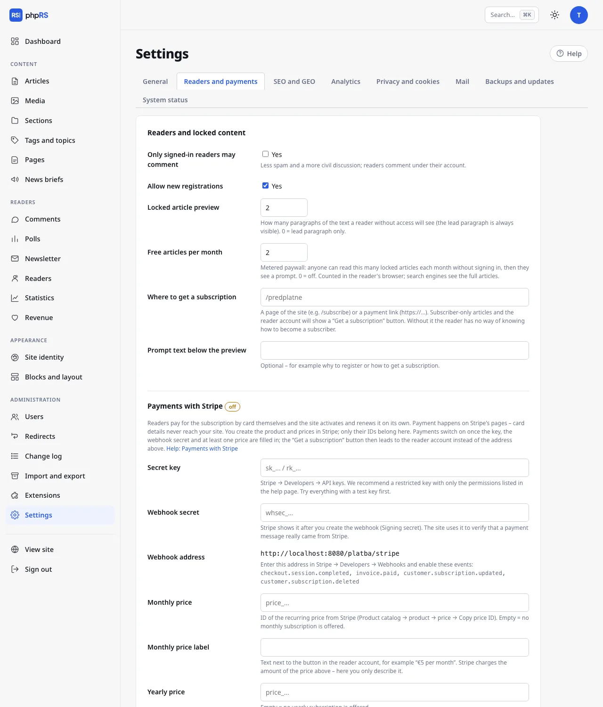

# Locked content and subscriptions

You can reserve an article for signed-in readers or for subscribers. Others see the headline, the standfirst, the beginning of the text and a prompt. A reader gets a subscription in one of two ways: they pay for it themselves by card through the Stripe service and the site turns it on and extends it by itself (see [Payments with Stripe](platby-stripe.md)), or you accept the payment your own way and record the subscription for them by hand. Both ways can be used at the same time.

Everything on this page requires the **Readers and locked content** extension (**Administration → Extensions**). Registration and accounts are described on the page [Reader accounts](ucty-ctenaru.md).

## Locking an article

With the extension turned on, the article form has, in the expandable **More settings** section, the field **Who can read**:

| Option | Who reads the whole article |
|---|---|
| **All** | anyone (the default) |
| **Signed-in readers only** | everyone who has a reader account and is signed in |
| **Paying subscribers only** | a signed-in reader with a valid subscription |

You can change the option at any time, even for a published article. A member of the editorial team signed in to the administration sees all articles in full.

## What a reader without access sees

- the headline, the standfirst and the featured image,
- a preview: the first few paragraphs of the text,
- a box with a prompt.

The prompt differs according to the lock:

| Lock | Prompt heading | Buttons |
|---|---|---|
| Signed-in readers only | **Sign in to continue reading** | **Sign in**, **Register** (if registrations are allowed) |
| Paying subscribers only | **This article is for subscribers** | **Get a subscription** and, for those not signed in, **I already subscribe – sign in** |

With payments through Stripe turned on, the **Get a subscription** button leads to the reader's account, where the subscription is paid for; otherwise to the address from the **Where to get a subscription** field.

After signing in, the reader returns to the article they came from. Questions and answers are not output from a locked article either.

### Settings

Open **Settings → Readers and payments**, section **Readers and locked content**:

| Field | Meaning | Default |
|---|---|---|
| **Locked article preview** | how many paragraphs of the text a reader without access sees; they always see the standfirst; 0 = the standfirst only; at most 10 | 2 |
| **Free articles per month** | a soft paywall, see below; 0 = off; at most 50 | 0 |
| **Where to get a subscription** | where the **Get a subscription** button leads, as long as payments through Stripe are not turned on | empty |
| **Prompt text below the preview** | your own sentence in the prompt, at most 300 characters; empty = the default text | empty |

The same tab has the **Payments with Stripe** section below it – it is described on a [separate page](platby-stripe.md).

## Where to get a subscription

With [payments through Stripe](platby-stripe.md) turned on, this field is not used: the **Get a subscription** button leads to the reader's account, where a signed-in reader chooses a monthly or yearly subscription and pays by card. Someone who is not signed in first signs in or registers.

Without payments through Stripe, enter one of these in the **Where to get a subscription** field:

- a page of your site, for example `/predplatne` – create it in **Content → Pages** and describe the price and the method of payment on it (account number, QR code),
- a payment link starting with `https://`.

Any other form of address is ignored. Until you fill in the field (and do not have payments through Stripe turned on), the **Get a subscription** button is not shown – neither on locked articles nor in the reader's account – and the reader does not know how to become a subscriber. The **Revenue** screen points this out with the message **The place where readers get a subscription is not filled in.**

## Recording a subscription by hand

You typically record a subscription by hand after receiving a payment to your bank account, or when you want to give it to someone as a gift. It works with payments through Stripe turned on too: a payment never shortens a date recorded by hand – the later of the two applies.

1. Open **Readers → Readers** and find the reader by e-mail.
2. In the **Subscription** column choose one of the options **+ 1 month**, **+ 3 months** or **+ 1 year** in the **change…** menu. The change is saved straight away.
3. A message confirms the new date: **The subscription is valid until …**

The extension is counted from the end of the running subscription; for a reader without a subscription, or with an expired one, from today. By choosing repeatedly you therefore add the periods up. The option **cancel** removes the subscription.

The label in the column shows the status: **until** with a date, **expired**, or **none**. For readers who pay through Stripe, the subscription status from Stripe is shown below it as well (for example **Stripe: paying**); for others with a valid subscription, the note **entered manually**. A subscription is valid until the end of the stated day. After it passes, the reader loses access to articles for subscribers without any further action; they keep their account. The reader must have an account before you record a subscription for them – ask them to register with the e-mail they paid from or gave with the payment.

## Soft paywall

The field **Free articles per month** lets every visitor read a few locked articles a month without signing in. Only then do they see the prompt.

- Only opened locked articles are counted, each once. Listings are not counted.
- Below an article read for free there is the note **This is article 2 of 5 you can read for free this month.** with a **Sign in** link.
- Once they are used up, the prompt adds: **You have read all 5 free articles this month.**
- A new month starts again from zero.

The counter is in the signed cookie `phprs_cteno` in the reader's browser. Whoever deletes cookies or opens the site in a private window starts again. With a soft paywall this is usual and intentional: the aim is to give loyal readers a friendly nudge, not to lock things airtight.

## Listings, feeds and search engines

| Place | What it contains for a locked article |
|---|---|
| Listings on the site (home page, section, tag, search) | the headline, standfirst and image as with other articles; they have no special lock mark |
| RSS | the headline and standfirst (the same as for all articles) |
| JSON Feed, the Markdown version of an article, the Public API | the standfirst and the preview, never the whole text; the API also returns the flag `zamceno` |
| Newsletter and notifications | the headline and standfirst with a link to the site |

The text of a locked article is cut in a single place before it reaches any template or feed. So it cannot be obtained by a roundabout route.

**Search engines.** The structured data of a locked article carries the value `isAccessibleForFree: False`. A search engine thus knows that this is paid content and not cloaked text. With a hard lock (soft paywall off) a robot sees the same as a reader who is not signed in: the standfirst and the preview. With the soft paywall on, it sees articles in full, because it does not send cookies and every article is its first of the month. If you want the full texts to be indexed, turn on the soft paywall with at least one article a month.

## Related

- [Reader accounts](ucty-ctenaru.md)
- [Payments with Stripe](platby-stripe.md)
- [Support and revenue](podpora-a-prijmy.md)
- [SEO](../seo-a-ai/seo.md)
- [Comments](../redakce/komentare.md)
