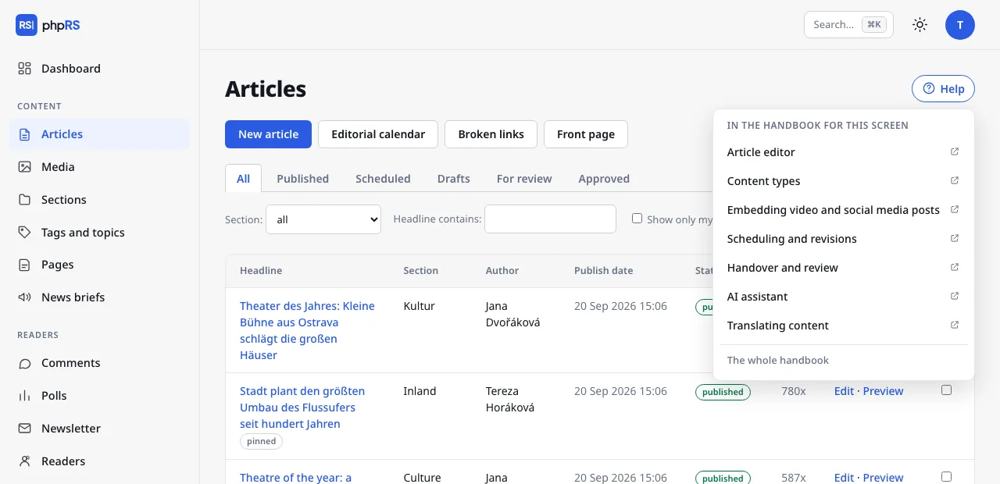

# phpRS manual

phpRS is a publishing system for online magazines, newspapers and blogs. This manual takes you from installation to day-to-day operation.

It is written for three kinds of readers. **The editorial team** – people who write, edit and publish – will find what they need in the chapters on writing and the newsroom.
**The site administrator and publisher** – the person who installed the system, looks after it and decides about appearance, readers and revenue – starts with the chapters Getting started and Operations
and continues with the chapters Appearance to SEO and AI. **A developer** will find a map of the code and the project rules in the chapter For developers.

## Chapters

- **Getting started** – hosting requirements, installation, first steps after installation, updates, moving the site elsewhere and the import from WordPress.
- **Writing** – the article editor, images, galleries and attachments, embedding video and social media posts, content types, sections, tags and series, scheduling and revisions, the AI assistant.
- **Newsroom** – roles and permissions, handover and review, the front page and the calendar, comments, account and sign-in.
- **Appearance** – site templates, Site identity, blocks and layout, editing text right on the site and a custom template.
- **Readers and revenue** – reader accounts, locked content and subscriptions, payments with Stripe, newsletter, browser notifications, advertising, support and the revenue overview.
- **Language versions** – site languages, the switcher and hreflang tags, translating articles, sections, pages and blocks.
- **SEO and AI** – settings for search engines, AI search engines, the Claude connection, analytics and privacy.
- **Operations** – mail, backups, background jobs, System status, nginx, security and troubleshooting.
- **For developers** – project structure, principles, tests and releases, how to contribute.

## How the manual is written

Names of screens and buttons are in **bold** and match the English administration interface. A path in the administration is written with arrows,
for example **Settings → Mail**. Addresses and file names look `like this`.

The manual describes the latest released version of the system. You will find your version number in the footer of every administration page
and in **Settings → Backups and updates** (the Installed version row).

On administration screens there is a **Help** button next to the heading. It opens a list of the pages of this manual that relate to that screen.

