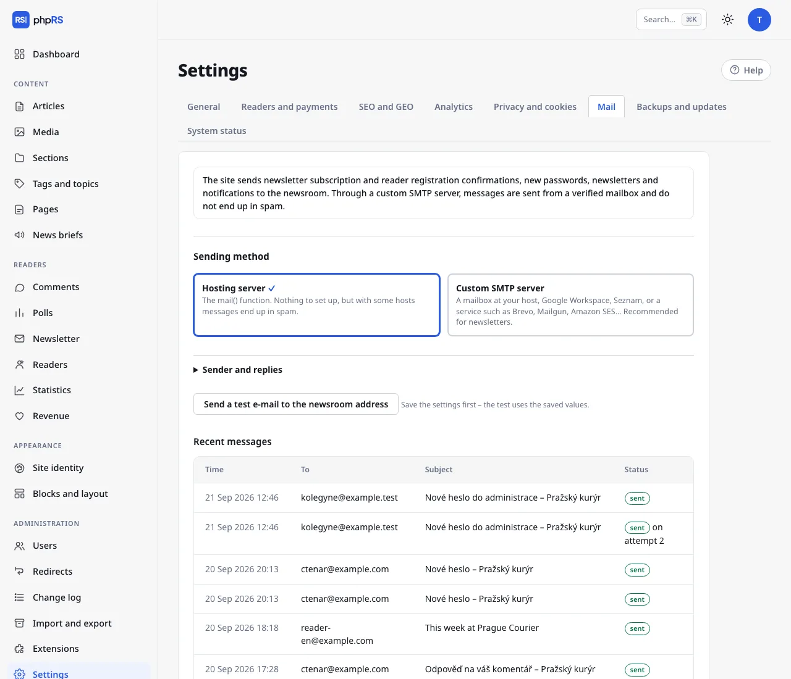

# Mail

The site sends newsletter subscription and reader registration confirmations, links for setting a password, newsletters, comment notifications and newsroom notifications. Everything is set in **Settings → Mail**.

## Sending method

| Method | When to use it |
| --- | --- |
| **Hosting server** | Works immediately, nothing to set up. On many hosting services, however, the messages end up in spam. Enough for a small site without a newsletter. |
| **Custom SMTP server** | Messages are sent from a verified mailbox. Recommended whenever you send a newsletter or register readers. |

## SMTP settings

You get the details from your mailbox provider – your hosting, Google Workspace, another e-mail provider or a bulk mail service (Brevo, Mailgun, Amazon SES…).

In the **SMTP server** section fill in:

- **Server address** – for example `smtp.example.com`.
- **Security** – **STARTTLS, port 587** is the most common; **SSL/TLS, port 465** with older services. Use the “none” option only for a server on your own network.
- **Port** – default 587. The security option does not change it by itself: with **SSL/TLS** overwrite it with 465.
- **User name** (usually the full e-mail address of the mailbox) and **Password** – with Gmail and similar providers enter an “app password”, not your account password. The password is stored only on your site and is never displayed in the form again; an empty field means “no change”.

After saving, click **Send a test e-mail to the newsroom address**. The test uses the saved values, so save first and test afterwards.

## Sender and replies

Expand **Sender and replies**: **Sender address** is the address shown as the sender of messages (an empty field = the newsroom e-mail), **Send replies to** is the address for replies.
The sender address should belong to a domain your SMTP server is allowed to send from – otherwise messages end up in spam or the recipient rejects them.

## Keeping mail out of spam

For the sender domain, set up **SPF** and **DKIM** records in DNS according to your mail provider's instructions, and ideally **DMARC** as well. Without them, large providers (Gmail, Outlook) limit or reject bulk mail.

## Queue and retries

A message that cannot be sent is not discarded: the system tries again after **5 minutes, 30 minutes, 2 hours and 12 hours**. The retries are handled by [background jobs](ulohy-na-pozadi.md).
The **Recent messages** overview shows the time, recipient, subject and status (*sent*, *waiting for the next attempt*, *not sent*). Message content is not kept and the records are deleted after 30 days.

## Most common problems

- **The test e-mail did not arrive** – look at the Recent messages overview. The status *not sent* means a connection or sign-in error; *sent* means the server accepted the message and you need to look in the recipient's spam folder.
- **Signing in to SMTP fails** – check that you are using an app password and the right combination of port and security.
- **The hosting blocks outgoing connections** – some shared hosting services allow SMTP only to their own servers. Use a mailbox at the same hosting.
