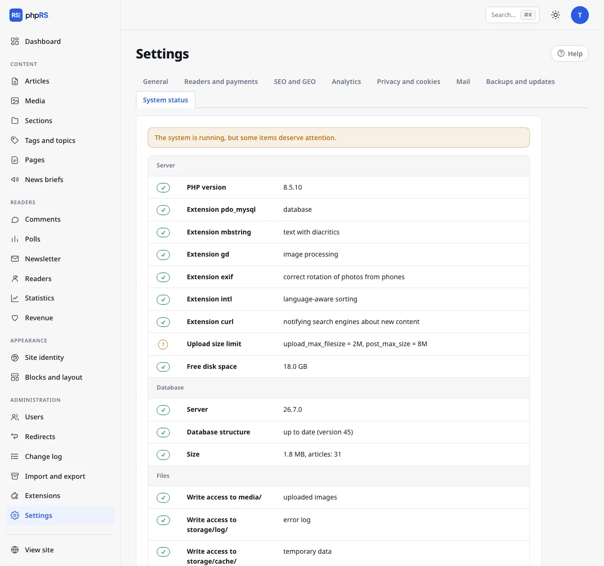

# System status

**Settings → System status** is the first place to look after installation, after moving the site and whenever something behaves strangely. Every row has a status – *OK*, *warning* or *error* – and an explanation of what to do about it.



## What is checked

| Group | Rows |
| --- | --- |
| **Server** | PHP version, required and recommended extensions, upload size limit, free disk space |
| **Database** | server version, database structure (pending changes), size and number of articles |
| **Files** | write access to the folders that need it (`media/`, `storage/`…) |
| **Security** | deleted installer, HTTPS, debug mode turned off, security headers, two-factor sign-in of administrators, blocked accounts, integrity of core files |
| **Operations** | errors in the last 24 hours, age of the last backup, off-site backups, indexing by search engines, media size, background tasks, updates, mail sending |

An **error** means that a part of the system does not work. A **warning** is a recommendation – the site runs, but something should be dealt with (typically missing 2FA, off-site backups turned off, cron not set up).

## Other parts of the page

- **Mail** – sends a test e-mail to the newsroom address.
- **Error log** – the last 40 error records the system caught. When an error occurs, a visitor sees only a general apology; the details are here and in the file `storage/log/chyby.log`. The **Clear the log** button deletes it.
- **Background jobs (cron)** – the address for cron, see [Background jobs](ulohy-na-pozadi.md).
- **Monitoring** – an address with the status in JSON format.

## Monitoring

After you create an access token (the **Create token** button), the status is available at

```
https://www.example.com/stav.json?token=…
```

The response contains the overall `stav`, `verze`, `cas` and the array `kontroly` with all the rows. It is enough to set a monitoring tool (UptimeRobot, Zabbix, Uptime Kuma…) to watch the overall status. Without a valid token the address responds with error 403.
