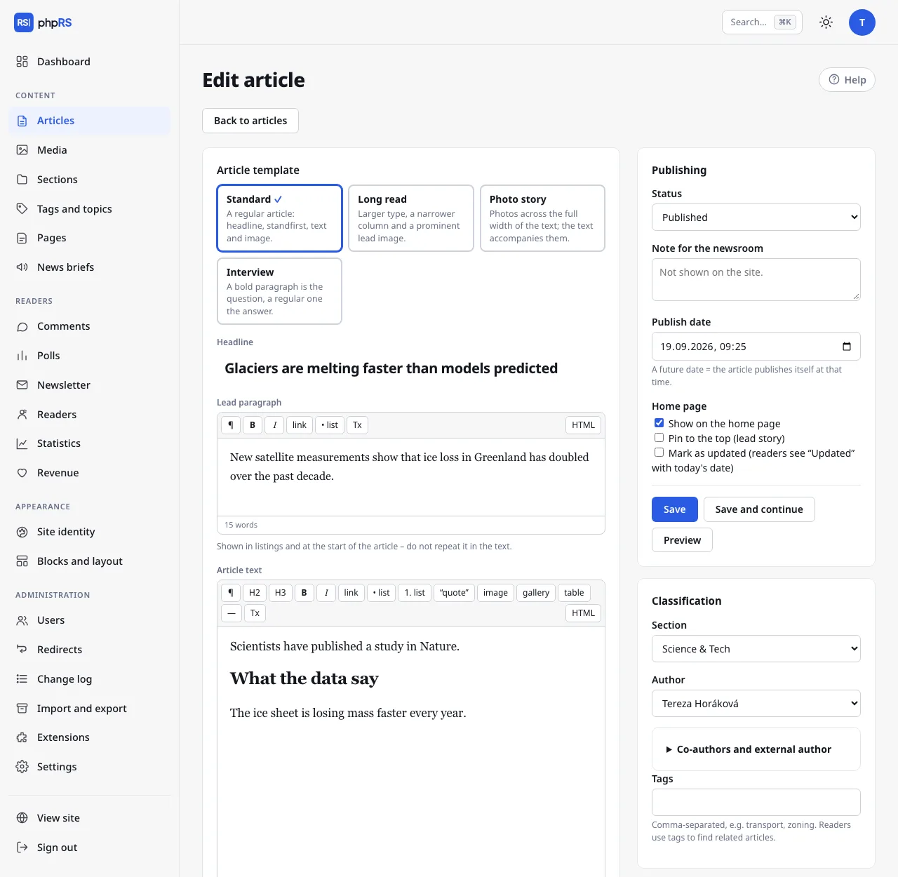

# Article editor

You write an article in **Content → Articles → New article**. The headline, standfirst and text are on the left; the settings are on the right: publishing, classification, featured image and other options. On a narrow screen the settings move below the text.

To save, you only need a **Headline** and a **Section**. An article cannot be saved without a section.

## Headline, standfirst and text

- **Headline** – at most 255 characters. The **Accessibility check** section in the settings column warns you when it is longer than 110 characters or written in capitals.
- **Lead paragraph** – the standfirst, the opening paragraph. It is shown in listings and at the beginning of the article, so do not repeat it in the text. The standfirst has a shortened toolbar.
- **Article text** – the content itself, with the full toolbar.

## Toolbar

| Button | What it does |
|---|---|
| **¶** | paragraph |
| **H2**, **H3** | subheading and smaller subheading |
| **B**, **I** | bold (Ctrl+B) and italics (Ctrl+I) |
| **link** | inserts or edits a link (Ctrl+K) |
| **• list**, **1. list** | bulleted and numbered list |
| **“quote”** | quotation |
| **image** | inserts an image or attachment from Media |
| **gallery** | inserts a photo gallery |
| **table** | inserts a 3 × 3 table with a header row |
| **—** | horizontal rule |
| **Tx** | removes formatting and the link |
| **HTML** | switches to the source code and back |

Images, galleries and attachments are covered on the page [Images, galleries and attachments](obrazky-a-galerie.md).

### Links

1. Select the text and click **link**.
2. Type the address into the **Address** field (`https://…` or a local one, for example `/about-us`). You find one of your own articles in the field **…or find one of your articles** – part of the headline is enough; articles that are not published yet carry the note *unpublished*.
3. Tick **open in a new window** if needed and confirm with the **Insert link** button.

You edit an existing link the same way: place the cursor inside it and click **link**. The **Remove link** button removes it.

### Tables

When the cursor is in a table, a second toolbar appears above the text: **+ row**, **+ column**, **− row**, **− column** and **delete table**. The first row is the header. The accessibility check reports a table without a header.

### Pasting from Word and from the web

The editor cleans pasted text by itself. Paragraphs, subheadings, lists, links, tables and images stay; foreign styles, fonts and colours disappear. A first-level heading is changed to an H2 subheading.

### HTML mode

The **HTML** button shows the source code of the article. While it is on, the other toolbar buttons do not respond. A second click takes you back to the normal view.

## Word count

Below the editor you see the word count and, for the article text, an estimated reading time (200 words per minute).

## Autosave of unsaved work

The form you are working on is saved continuously, so that a browser crash or a lost connection does not cost you your work:

- to the **browser** about 1.5 seconds after the last change – *draft saved in your browser at* and the time appear below the editor,
- to the **server** at most once every 15 seconds – *draft also saved on the server at*. This lets you continue on another device.

This unsaved copy is not a saved article. Nothing changes on the site or in the article list until you click **Save**.

When you open the form again and a newer unsaved copy exists, a notice with the buttons **Restore it** and **Discard** appears above the form. The newer of the two copies is offered. Copies older than 14 days are not offered. Saving the article removes the unsaved copy.

## Lock against simultaneous editing

Opening an article locks it for you. The lock lasts three minutes and an open editor extends it every minute. A colleague who opens the article at the same time sees a message that you have it open and that you would overwrite each other's changes by saving. The editor still stays available to them – agree on who will continue. Saving releases the article.

## Accessibility check

The **Accessibility check** panel in the settings column runs while you write and reports:

- an image without a description – you add the description right in the check and confirm it with Enter,
- a subheading that skips a level (H3 without an H2 above it) and an empty subheading,
- a link whose text does not say where it leads (“here”, “more”, a bare address),
- a table without a header,
- an embedded frame without a title,
- a headline that is too long, a headline in capitals and a missing standfirst.

When everything is fine, you see *✓ Images have descriptions; headings and links are fine.* The check does not prevent saving.

## Saving and preview

- **Save** – saves and takes you back to the article list.
- **Save and continue** – saves and stays in the editor.
- **Preview** – opens the saved article in the site template in a new window. It works for a draft too, but only for people signed in to the administration. It shows the last saved version, not unsaved work. Comments and ratings are not shown in the preview.

Article statuses and scheduled publishing are described on the page [Scheduling and revisions](planovani-a-revize.md).

## Other form fields

- **Co-authors and external author** (an expandable row in the **Classification** section) – other members of the newsroom, or a guest or agency without an account. An external author is credited on the site instead of the author from the newsroom.
- **Article URL** (in **More settings**) – the part of the address after `/clanek/`. It is created from the headline; if you change it for a published article, the old address redirects to the new one by itself.
- **Keywords** (in **More settings**) – help the search on the site.
- **Source** (in **More settings**) – for texts taken from elsewhere.

## Related

- [Embedding video and social media posts](vkladani-obsahu.md)
- [Content types](typy-obsahu.md)
- [AI assistant](ai-asistent.md)
