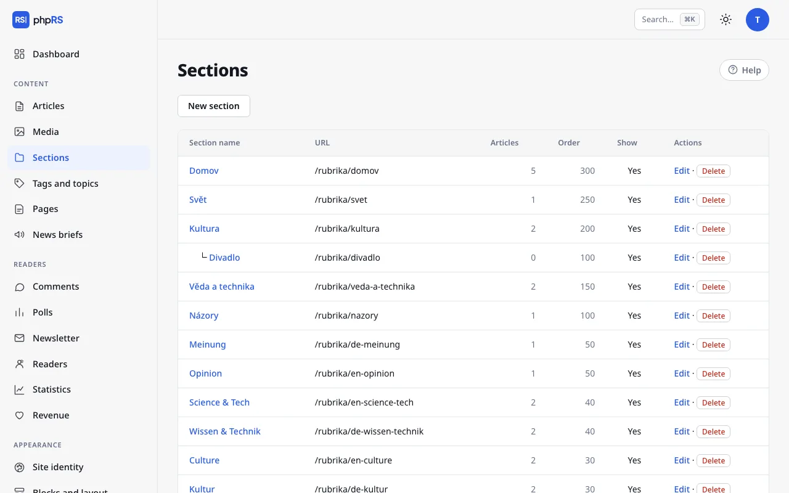

# Sections, tags and series

The content of the site is organised in three ways. A **section** is a fixed classification – every article has exactly one. **Tags** describe what the article is about, and an article can have several. A **series** links parts that follow on from each other.

## Sections

You manage sections in **Content → Sections**. An article cannot be saved without a section, so create the first section before the first article.

### New section

1. Click **New section**.
2. Fill in the **Section name**. The **Section URL** is created from the name by itself; the section is then found on the site at `/rubrika/<address>`.
3. Add a **Description** if needed – it is shown above the list of articles in the section and used as the description for search engines.
4. Save.

| Field | What it is for |
|---|---|
| **Parent section** | makes the section a subsection |
| **Section image (icon)** | an optional image address |
| **Order** | a higher number means higher up in the list of sections; a new section has 100 |
| **Show** | when not ticked, the section is not shown in the list of sections on the site |

### Subsections

A subsection is created by choosing a **Parent section**. In the list of sections and in the section menu of the article form it is indented below its parent section. A section cannot be placed under itself or under its own subsection.

Restricting a user to selected sections also applies to their subsections – see [Roles and permissions](../redakce/role-a-opravneni.md).

### Deleting and moving

A section that contains articles cannot be deleted. Move the articles elsewhere first: select them in the article list and choose **move to section…** (see [Front page and calendar](../redakce/titulni-strana-a-kalendar.md)). The subsections of a deleted section move one level up.

## Tags and topics

You type tags into the **Tags** field of the article form, separated by commas – for example `transport, town hall`. The field suggests tags that already exist on the site. An unknown tag is created by itself when the article is saved. An article can have at most 20 tags.

On the site the tags are below the article text. By clicking a tag, the reader displays all articles that have it (`/stitek/<address>`). Related articles are also selected by shared tags.

### Topic page

The overview of tags is in **Content → Tags and topics**. For every tag you see the number of articles.

1. Click **Edit** next to the tag.
2. Fill in the **Topic introduction** and choose a **Topic image**.
3. Save.

A tag with an introduction behaves as a topic page on the site: an introduction to the affair, elections or festival at the top, all the articles below it. In the overview such a tag has the mark *has an intro* and is sorted at the top.

### Merging and deleting

You fix typos and double spellings (`Town hall` and `townhall`) by merging: **Edit → Merge with another tag → Merge into**. The articles get the chosen tag, the original one ceases to exist and its address is redirected to the new one.

**Delete** removes only the tag. The articles stay; they just no longer have it.

A tag can also be added to several articles at once – with the bulk action **add a tag…** in the article list.

## Series

A series is a group of articles that belong together: the parts of a report, a regular column, a travelogue in instalments.

1. In the article form expand **More settings**; the first field is **Series**.
2. Choose an existing series, or type a name into the field **…or the name of a new series**. The new series is created when the article is saved.
3. For further parts, just choose the series from the menu.

On the site a **Related articles** section is shown below the article with links to the other published parts of the series, sorted by date. An article may be in one series only. You take it out of the series with the option **– not part of a series –**.

For an article that is not in any series, related articles are selected by themselves by tags and section. An administrator can turn this off in **Settings → General → More options → Automatic related articles**.

## Related

- [Article editor](editor.md)
- [Content types](typy-obsahu.md)
