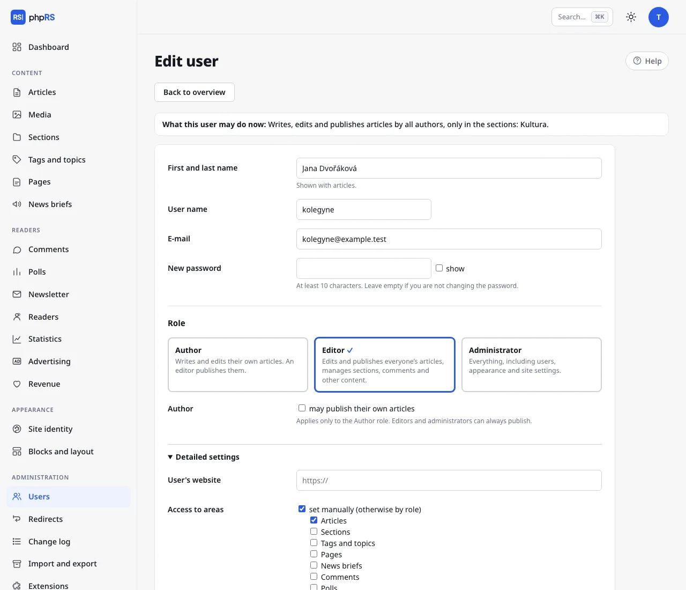

# Roles and permissions

Every member of the editorial team has their own account. Accounts are created and managed by an administrator in **Administration → Users**. What someone sees and may do in the administration is determined by their role and a few additional options.

## Three roles

| Role | What they do |
|---|---|
| **Author** | Writes and edits their own articles. An editor publishes them. |
| **Editor** | Edits and publishes everyone's articles, manages sections, comments and other content. |
| **Administrator** | Everything, including users, appearance and site settings. |

## What each role sees

The main menu shows only the areas the user has access to. Everyone has the **Dashboard**, **My account** and **Media**.

| Area | Author | Editor | Administrator |
|---|---|---|---|
| Articles | yes | yes | yes |
| Media | yes | yes | yes |
| Sections, Tags and topics, Pages | – | yes | yes |
| Comments, Statistics and other content extensions that are turned on | – | yes | yes |
| Blocks and layout | – | yes | yes |
| Site identity, Users, Redirects, Change log, Import and export, Extensions, Settings, Readers, Revenue | – | – | yes |

An area that belongs to an extension that is turned off is not shown to anyone.

In **Articles** an author sees only their own articles; an editor and an administrator see all of them. The same applies to the editorial calendar, the dashboard and the article search in the command palette. In **Media** everyone sees everything, but only the person who uploaded a file, and an administrator, may change its description or delete it.

## The right to publish

An editor and an administrator can always publish. An author may not publish unless an administrator ticks the option **may publish their own articles** for them.

Whoever does not have the right to publish:

- has only **Draft – in progress** and **For review – done, please check** in the **Status** field,
- cannot change or delete an article that is already published,
- does not decide about the home page (they do not see the options **Show on the home page** and **Pin to the top (lead story)**) and does not have the **Front page** screen.

How an article travels from the author to publication is described in [Handover and review](predavka-a-korektura.md).

## New user

1. **Administration → Users → New user.**
2. Fill in the **First and last name** (shown with articles), the **User name** and the **E-mail**. The user name has 2–40 characters: letters without accents, digits, full stop, hyphen and underscore. Without an e-mail the user does not receive notifications and cannot recover a forgotten password.
3. Enter a **Password** of at least 10 characters. The user then changes it under **My account**.
4. Choose the **Role** and click **Add user**.

## Detailed settings

The expandable **Detailed settings** panel in the user form refines what the role allows. Above the form of a saved account there is the sentence **What this user may do now:** – it sums up the role, publishing, sections and areas together. The user list shows the same sentence below the name.

### Access to areas

By default, access follows from the role. By ticking **set manually (otherwise by role)** you choose the areas one by one – you can, for instance, add Comments for an author or take Blocks and layout away from an editor. Areas reserved for an administrator are not in the list and cannot be added.

### Only these sections

Nothing ticked means the user may write into all sections. With something ticked, they see and edit only articles from the selected sections. The restriction is inherited by subsections, including those created later. They cannot save an article into another section or move articles there in bulk. An administrator cannot be restricted.

### Editing other people's articles

The option **May also edit authors' articles** is meant for the Author role – for example for a section head. By ticking colleagues you give them access to those colleagues' articles: they see them in the list, can edit them and can choose among these authors in the **Author** field. This does not give them the right to publish.

### Blocking an account

**Block account → user cannot sign in.** A blocked user is signed out immediately, even from work in progress. Their articles stay signed with their name. It suits a colleague who has left the editorial team. In the list of users a blocked account carries the note *blocked*.

**Delete**, by contrast, removes the account; the articles are kept, but without an author.

An administrator cannot block or delete their own account, or strip it of the administrator role.

### Two-factor sign-in

If a user has two-factor sign-in turned on, they have the mark **2FA** in the list. If they lose both their phone and their backup codes, an administrator turns it off for them with the option **turn off (the user lost both their phone and backup codes)**. This also deletes their passkeys. Details are on the page [Account and sign-in](ucet-a-prihlaseni.md).

## List of users

The table shows the user name, name, e-mail, role, the **Publishes** column (Yes/No), the number of articles and the last sign-in.

## Recommendations

- Every person has their own account. A shared account makes it impossible to find out who changed what.
- Give the least permissions needed and keep the number of administrators as low as possible.
- Further principles are summed up on the page [Security](../provoz/bezpecnost.md).
