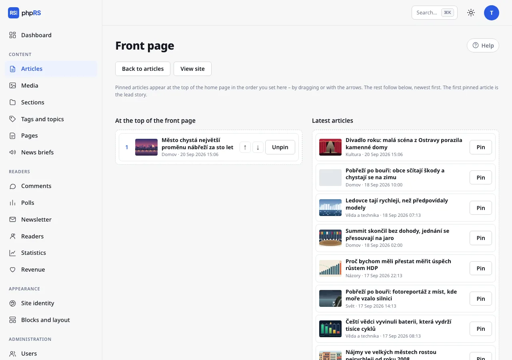
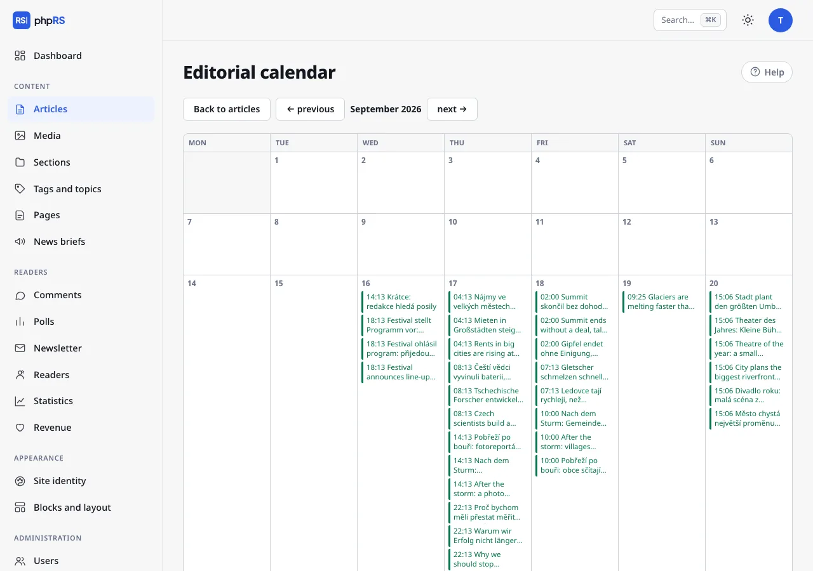
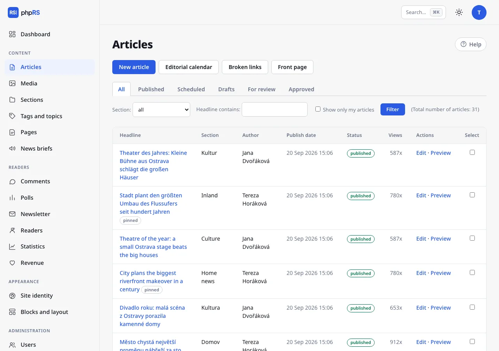

# Front page and calendar

This page describes the tools the editorial team uses to control what is at the top of the site, what is published when, and how to make a bulk change quickly. You find all of them in **Content → Articles**, in the row of links above the list.

## Front page

The home page of the site sorts articles from the newest. Pinned articles are above them, in the order set by the editorial team. Only someone who may publish decides about the front page; others do not see the **Front page** link.

### Arranging the front page

1. Open **Content → Articles → Front page**.
2. On the left is the column **At the top of the front page** with the pinned articles, on the right **Latest articles** – the last 30 published articles that are shown on the home page. On a site with language versions the screen arranges only the default language; in the other languages pin articles with the option **Pin to the top (lead story)** directly on the article.
3. You pin an article with the **Pin** button, or by dragging it into the left column. **Unpin** returns it among the others.
4. You change the order of the pinned articles by dragging or with the arrows **↑** and **↓**.
5. Click **Save the front page**. You check the result with the **View site** link.

The first pinned article is the lead story. At most 30 articles can be pinned. The other articles follow below the pinned ones, from the newest.

### Options right in the article

The same can be set on a smaller scale in the article form, in the **Publishing → Home page** panel:

- **Show on the home page** – when not ticked, the article is only in its section, in search and on tag pages. The option is on for a new article.
- **Pin to the top (lead story)** – pins the article without opening the Front page. An article pinned this way is placed below the articles ordered by hand on the Front page.

A pinned article has the mark *pinned* in the article list. Pinning does not end by itself – unpin the article once the story gets old. You set a date after which the article should disappear from the home page completely with the field **Remove from the home page on** (see [Scheduling and revisions](../psani/planovani-a-revize.md)).

How many articles fit on the home page is determined by an administrator in **Settings → General → Articles per page**.

## Editorial calendar

**Content → Articles → Editorial calendar** shows a monthly grid of articles by publish date.

- Every article is listed in the calendar with its time and headline. Clicking it opens its editor.
- Colours: published in green, scheduled in blue, drafts in orange, articles for review in purple (dashed line) and approved articles waiting to be published in purple (solid line).
- Today is highlighted. You move between months with the links **← previous** and **next →**.
- The date of an article cannot be moved in the calendar – you change it when editing the article, in the **Publish date** field.

An author sees only their own articles in the calendar; a user restricted to sections sees only articles from their sections.

The calendar is also useful for planning ahead: create a draft with a working headline and a future date. It will be visible in the calendar in orange and will not appear on the site until someone publishes it.

## Article list and bulk actions

The list shows 20 articles per page. You narrow it down with the status tabs (**All**, **Published**, **Scheduled**, **Drafts**, **For review**, **Approved**), the **Section:** field, on a site with language versions the **Language:** field, the **Headline contains:** field and the option **Show only my articles**; confirm with the **Filter** button.

A bulk action:

1. Tick the articles in the **Select** column.
2. Below the table, in the **With selected:** menu, choose an action and fill in what it asks for (a section or a tag).
3. Click **Apply**.

| Action | What it does |
|---|---|
| **move to section…** | moves the articles to the chosen section; a user restricted to sections can move them only to their own |
| **add a tag…** | adds a tag to the articles; creates an unknown tag |
| **lock for signed-in readers** | only signed-in readers can read the article |
| **unlock for everyone** | removes the lock |

Locking is offered only with the **Readers and locked content** extension turned on (**Administration → Extensions**).

The **Delete selected** button deletes the articles after confirmation. Deletion cannot be undone. Whoever does not have the right to publish cannot change or delete published articles in bulk – the system skips them and states the number of articles actually changed in its message.

## Broken links

**Content → Articles → Broken links.** In the background the system goes through published articles – one every five minutes, each once a month – and tests whether the links in them still work. The screen shows the article, the link, the problem (for example *page does not exist (404)*) and the date it was found. After fixing a link, click **Check again**. The check can be turned off in **Settings → General → More options → Look for broken links**.

## Command palette

The keyboard shortcut **Ctrl+K** (**⌘K** on a Mac) or the **Search…** field in the top right opens the command palette. When the cursor is in the article text, Ctrl+K inserts a link – open the palette with the **Search…** field then.

- Type the name of an area (*sections*), an action (*new article*, *editorial calendar*, *front page*) or a part of an article headline.
- Choose with the arrows **↑** **↓**; **Enter** opens, **Esc** closes.
- Search also works without accents.
- An article that is found opens straight in the editor.

The palette offers only what you may access: areas according to your permissions and articles you may edit. An administrator also finds the individual Settings tabs in it.

## Related

- [Handover and review](predavka-a-korektura.md)
- [Sections, tags and series](../psani/rubriky-stitky-serialy.md)
