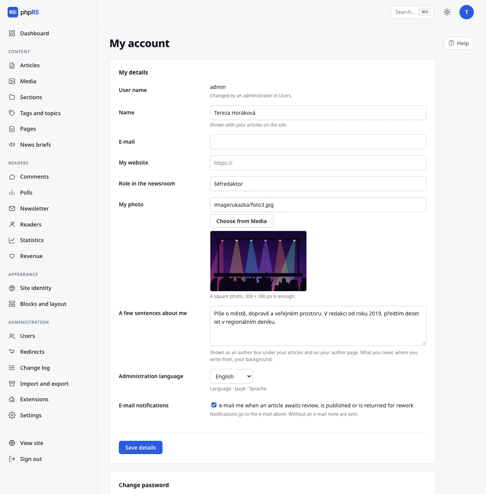

# Account and sign-in

Everyone manages their own account on the **My account** screen. You open it by clicking the avatar with your initial in the top right corner. Next to the avatar there is also the switch between the light and dark mode of the administration.

## My details

| Field | What it is for |
|---|---|
| **Name** | shown with your articles on the site |
| **E-mail** | newsroom notifications and the forgotten-password link are sent to it |
| **My website** | an optional address of your website |
| **Role in the newsroom** | for example *culture editor* |
| **My photo** | a square photo, 300 × 300 px is enough; you choose it from Media |
| **A few sentences about me** | at most 1,200 characters |
| **Administration language** | Čeština, Slovenčina, English or Deutsch |
| **E-mail notifications** | messages about review, publication and return of an article |

If **A few sentences about me** is filled in, an author box with your name, role, photo and this text is shown below your articles. The same details are on the author page.

The **Administration language** applies only to you – every member of the editorial team can work in a different language. Newsroom notifications also reach you in this language. It does not change the language of the site.

You cannot change your **User name**; an administrator changes it in the Users area. Confirm changes with the **Save details** button.

## Changing your password

1. Fill in the **Current password**.
2. Enter a **New password** (at least 10 characters) and once more in the **New password again** field.
3. Click **Change password**.

Changing the password ends all other sign-ins of your account – on another computer, on a phone, in a forgotten browser. The sign-in in which you change the password stays.

## Forgotten password

1. On the sign-in screen click **Forgotten your password?**
2. Enter the user name or e-mail of your account and click **Send link**.
3. Open the link from the e-mail, enter a new password twice and confirm with the **Set password** button.
4. Sign in with the new password.

The link is valid for one hour and can be used once. The screen always answers the same way, whether the account exists or not – so a stranger cannot find out who works in the newsroom. The e-mail arrives only for an account that has an address filled in and is not blocked. Two-factor sign-in stays on after a password recovery. If the e-mail does not arrive, an administrator sets a password for you in **Administration → Users**.

## Two-factor sign-in

With two-factor sign-in you enter, after the password, a six-digit code from an authenticator app on your phone. Whoever guesses or steals the password cannot sign in without your phone.

1. In the **Two-factor sign-in** panel click **Turn on two-factor sign-in**.
2. In an authenticator app (Google Authenticator, Microsoft Authenticator, 1Password, Aegis…) add a new account by entering the displayed key by hand. On a mobile it is enough to tap the link below the key – it opens the authenticator app.
3. Copy the code from the app into the **Code from the app** field and click **Confirm and turn on**.
4. Eight **backup codes** are displayed. Store them somewhere other than your phone – they will not be shown again.

Each backup code can be used once, in place of the code from the app. You see how many are left in the Two-factor sign-in panel. If the code does not match when turning it on, check the time on your phone.

Turning it off: enter the **Password to confirm** and click **Turn off two-factor sign-in**. If you lose both your phone and the backup codes, an administrator turns it off for you in your account in the Users area.

## Passkeys

A passkey replaces copying the code: you confirm the second step of sign-in with a fingerprint, Face ID, Windows Hello or a security key.

Conditions:

- a passkey can be added only to an account with two-factor sign-in turned on – the **Passkeys** panel is not shown until then,
- the site must run on HTTPS and the browser must support passkeys,
- a passkey is bound to the site's domain. It does not work at another address, so a fake sign-in page cannot obtain it either. After moving the site to another domain, passkeys have to be added again.

Adding a passkey:

1. In the **Device name** field write which device it is (for example *MacBook* or *phone*).
2. Click **Add a passkey from this device** and confirm the device's prompt.

Signing in: after entering your user name and password click **Sign in with fingerprint or passkey**. The code from the app and the backup codes keep working – for when you do not have the device with you.

The table of passkeys shows the device, the date it was added and the last use. The **Delete** button removes a passkey, for instance after losing the device. Turning off two-factor sign-in deletes all passkeys.

## Sign-in protection

After 10 failed attempts in a row the account is locked for 15 minutes. Wrong second-step codes are counted the same way, and a limit of 10 attempts per 15 minutes from one address also applies. The lock passes by itself after a quarter of an hour.

## Tokens for the Claude connection

The **Claude connection** panel is visible only with the **Claude connection** extension turned on (**Administration → Extensions**). A token allows Claude to work with the site in your name and with your permissions. It creates new articles as drafts, and all its actions are in the Change log.

1. Fill in the **Name of the new token** (for example *Claude on the laptop*) and click **Create token**.
2. The token is displayed only once, together with instructions for connecting. Copy it straight away.

A token works without a password and without two-factor sign-in – protect it like a password. You revoke a token you no longer need with the **Revoke token** button. If you have any tokens, the change-password form offers the option **also revoke connection tokens (Claude, API)**; leave it ticked if you suspect misuse.

## Related

- [Roles and permissions](role-a-opravneni.md)
- [Handover and review](predavka-a-korektura.md)
- [Security](../provoz/bezpecnost.md)
