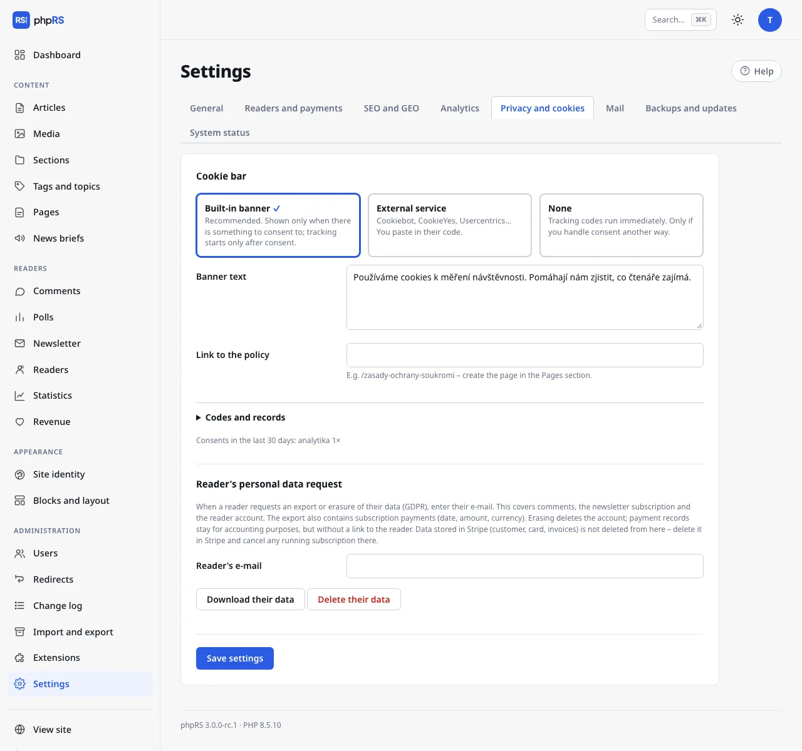

# Analytics and privacy

This page describes two settings tabs that are related: **Settings → Analytics** (what you measure traffic with) and **Settings → Privacy and cookies** (whether and how you ask the visitor for consent). Both are managed by an administrator.

The basic idea: what does not use cookies runs straight away and without a banner. What uses cookies waits for consent.

## Built-in statistics

The option **Built-in statistics** in the Analytics tab is turned on after installation. The **Statistics** extension (**Administration → Extensions**; default: on) and the **Readers → Statistics** screen belong to it.

The measurement uses no cookies and stores no IP addresses, so it does not need the visitor's consent:

- a visitor is recognised by a fingerprint composed of the IP address, the browser and a salt that is valid for one day; the IP address itself is not written anywhere,
- fingerprints are deleted after two days, so a reader cannot be tracked over time,
- robots and article previews from the administration are not counted.

For the chosen **Period** (7, 30 or 90 days) the **Statistics** screen shows:

| Figure | Meaning |
|---|---|
| **Visits** | the number of different visitors by day |
| **Page views** | the number of page views |
| **Pages per visit** | the ratio of the two numbers |
| **Page views and visits by day** | a bar chart; the light part of a bar is page views, the dark part visits |
| **Most read articles** | by page views in the period |
| **Where readers come from** | the 15 most frequent sites from which visitors came |

When the measurement is turned off, the screen reports **Analytics is turned off. Turn it on in Settings → Analytics.**

## External analytics

External tools are optional. Fill in only those you use.

| Field | What to enter | Consent |
|---|---|---|
| **Google Analytics** | the measurement ID in the form `G-XXXXXXXXXX` | runs only after consent |
| **Matomo – address** and **Matomo – site ID** | the address of your installation and the site number; measurement runs only when both are filled in | runs only after consent |
| **Plausible – domain** | the domain of the site, e.g. `example.com` | uses no cookies, loads without consent |
| **Custom code in the head** | any code | inserted into every page regardless of consent – only for codes that store no cookies |

Matomo, Plausible and the custom code are in the expandable section **Other tools (Matomo, Plausible, custom code)**.

Google Analytics is inserted with consent mode: until the visitor consents, all storage types have the state “denied” and the measurement script is not loaded.

## Cookie banner

In the **Privacy and cookies** tab choose one of three modes:

| Mode | Behaviour |
|---|---|
| **Built-in banner** | The default and recommended. The banner is shown only when there is something to consent to. Measurement starts only after consent. |
| **External service** | Cookiebot, CookieYes, Usercentrics… You paste their code; consent is controlled by their banner. |
| **None** | Measurement and marketing codes run straight away. Only when you handle consent some other way. |

### Built-in banner

The banner is shown only when you have Google Analytics, Matomo or **Marketing codes** filled in. A site that uses only the built-in statistics or Plausible does not show the banner at all – there is nothing to ask about.

The visitor has the buttons **Accept all**, **Only necessary** and **Settings**. In the settings they select categories:

- **Necessary – the site does not work without them** (always on),
- **Analytics – anonymous traffic measurement** (only when you measure with a tool that uses cookies),
- **Marketing – ad targeting** (only when you have marketing codes or advertising with an ad network code turned on),

and confirm them with the **Save selection** button. The choice is stored in the `phprs_souhlas` cookie for 6 months. They can change it at any time with the **Cookie settings** button, which stays on the site.

What to fill in:

| Field | Meaning |
|---|---|
| **Banner text** | A sentence for the visitor. The default: “We use cookies to measure traffic. They help us find out what interests our readers.” |
| **Link to the policy** | For example `/zasady-ochrany-soukromi`. Create the page in **Content → Pages**. In the banner it is shown as **More information**. |

The banner buttons are translated into the language of the site by themselves; the banner text is one for all language versions.

### Codes and the consent log

| Field | Meaning |
|---|---|
| **External service code** | The script from the provider (for Cookiebot the line with `data-cbid`). It is loaded first. It is used in the External service mode. |
| **Marketing codes** | Meta Pixel, Sklik retargeting, Google Ads… They run only after consent to marketing. |
| **Log consents** | Default: on. It stores the time, a random identifier and the chosen categories – without the IP address. Evidence for a possible inspection. |

Below the **Codes and records** section – as soon as any consent comes in – the row **Consents in the last 30 days:** appears with counts by category.

Measurement scripts waiting for consent also carry the marks that Cookiebot understands. In the **External service** mode its banner therefore runs them after consent. With another service, verify that it really enables the scripts after consent.

Ad network codes from the [Advertising system](../ctenari-a-prijmy/reklama.md) also wait for consent to marketing – the built-in banner asks about marketing because of them too. In the **External service** mode, scripts in marketing codes and ad network codes get the marking `type="text/plain" data-cookieconsent="marketing"`, which Cookiebot and services compatible with it understand; they are run only by that service.

## Which cookies the system itself stores

| Cookie | What it is for | When it is created |
|---|---|---|
| `phprs_souhlas`, `phprs_souhlas_id` | the choice on the cookie banner and a random identifier for the consent log | after a choice on the banner |
| `phprs_ctenar` | reader sign-in | after a reader signs in |
| `phprs_cteno` | the soft paywall counter | after a locked article is opened for free |
| `phprs_h…`, `phprs_a…` | a mark that the reader has already rated an article or voted in a poll; valid for 30 days | after rating or voting |
| the administration session cookie | sign-in of the editorial team | after signing in to the administration |

These are technical cookies. A reader who only reads the site – does not sign in, does not vote and does not see the cookie banner – gets none. You can use this overview as a basis for your privacy policy; the legal assessment is up to you.

## Embedded content only after a click

A video from YouTube or Vimeo, a Spotify player and social media posts embedded in an article are not loaded from the third-party service by themselves. The reader first sees a button with the name of the service, and the content is loaded only after a click. Until they click, the third-party service does not learn about their visit and stores no cookies. Nothing needs to be set for this, nor asked about in the cookie banner. Details are on the page [Embedding content](../psani/vkladani-obsahu.md).

The exception is code that you insert yourself as HTML – into an article or into a **Text** block. That is loaded straight away. If it stores cookies, consider whether it does not belong among the **Marketing codes** instead.

## Reader's personal data request

The section **Reader's personal data request** in the same tab can, by e-mail, download or delete the comments, the newsletter subscription and the reader account. The procedure is on the page [Reader accounts](../ctenari-a-prijmy/ucty-ctenaru.md).

## Related

- [SEO](seo.md)
- [Embedding content](../psani/vkladani-obsahu.md)
- [Advertising](../ctenari-a-prijmy/reklama.md)
- [Security](../provoz/bezpecnost.md)
