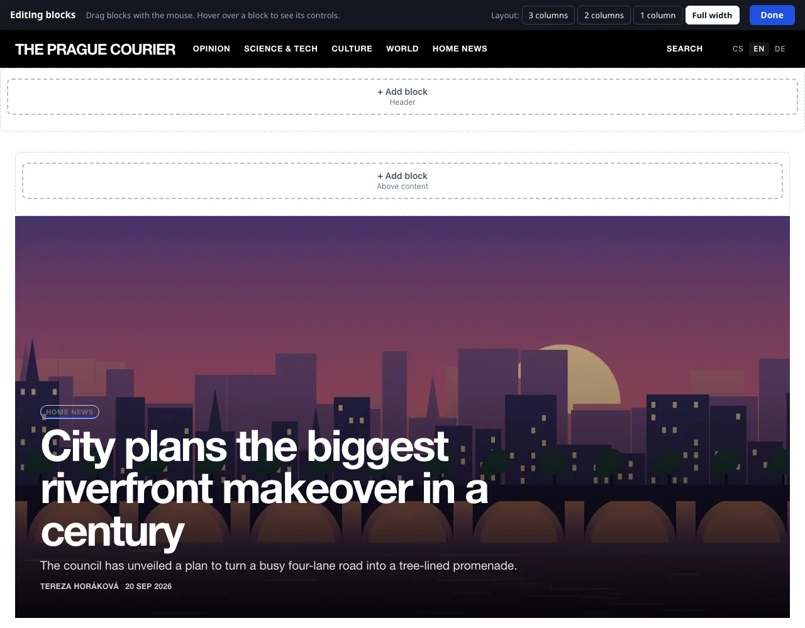

# Blocks and layout

A block is a self-contained element of the page outside the main content: a list of sections, the most read articles, search, a newsletter form, advertising or your own text. Blocks are arranged into zones around the content and are edited right on the live page of the site.

An administrator and an editor have access (unless the administrator has taken the area away from the editor, see [Roles and permissions](../redakce/role-a-opravneni.md)).

## Opening the editor

In the main menu click **Appearance → Blocks and layout**. The home page of the site opens in editing mode: the **Editing blocks** bar is at the top, the zones are outlined and each has a **+ Add block** button.

Links on the site keep you in editing mode. By clicking an article or a section you therefore go to its page and see what the blocks look like there – this is handy for blocks that are shown only in a certain section. You finish editing with the **Done** button, which takes you back to the administration.

Readers do not see editing mode. Every change, however, is saved straight away and applies on the site immediately.

## Zones

| Zone | Where it is |
|---|---|
| **Header** | below the site header, across the full width |
| **Left column** | to the left of the content (only the 3 columns layout) |
| **Above content** | above the article listing or above the article |
| **Below content** | below the article listing or below the article |
| **Right column** | to the right of the content (the 3 and 2 columns layouts) |
| **Footer** | at the bottom, above the site footer |

Which zones exist is determined by the page layout. You change it with the **3 columns**, **2 columns**, **1 column** and **Full width** buttons next to the **Layout:** label in the top bar. Blocks from a column that is removed move by themselves; details are on the page [Site templates](sablony.md).

## Adding a block

1. In the zone where the block belongs, click **+ Add block**.
2. In the **What do you want to add?** window click the card of a block.
3. The block is added at the end of the zone and its settings open. Adjust it and click **Save**.

### Block catalogue

| Group | Block | What it shows |
|---|---|---|
| Articles | **Lead story** | A large teaser for the pinned or latest article. |
| Articles | **Articles from a section** | A list of the latest articles from the section you choose. |
| Articles | **Most read** | A ranking of articles by number of reads. |
| Articles | **Tags** | The most used tags as links. |
| Articles | **Archive** | Articles by month. |
| Articles | **Authors** | A list of authors with their article counts. |
| Navigation | **Sections** | A list of the site's sections. |
| Navigation | **Menu** | Custom links – to pages of the site or elsewhere. |
| Navigation | **Pages** | Links to pages such as About us and Contact. |
| Navigation | **Search** | A field for searching articles. |
| Readers and newsroom | **News briefs** | Short notes from the newsroom. |
| Readers and newsroom | **Poll** | The current poll with voting. |
| Readers and newsroom | **Newsletter** | A sign-up form for news by e-mail. |
| Readers and newsroom | **Support us** | A short appeal and a button leading to a payment or a page with an account number. |
| Readers and newsroom | **Notifications** | A button that lets the reader turn on browser notifications about new articles. |
| Readers and newsroom | **Reader account** | A link to sign-in, registration and the reader's account. |
| Readers and newsroom | **Social networks** | Links to the profiles filled in under Settings. |
| Readers and newsroom | **Contact** | The newsroom e-mail and the footer text. |
| Custom | **Text** | Your own text, an image or embedded code (video, map…). |
| Custom | **Advertising** | A position where banners from the Advertising system rotate. |

The blocks **News briefs**, **Poll**, **Newsletter**, **Notifications**, **Reader account** and **Advertising** belong to extensions. They are on offer only when the respective extension is turned on in **Administration → Extensions**. After an extension is turned off, the block disappears from the site; its settings remain.

## Moving, settings and deleting

- **Moving:** grab the block with the mouse and drag it to a new place, even into another zone. The order is saved by itself.
- When you hover over a block, its controls appear: the arrows **↑** and **↓** (**Move up**, **Move down**), **Settings** and **✕** (**Delete block**). Deleting has to be confirmed.

### Block settings

Every block has a **Heading** and the option **Show the heading on the site**. The other fields differ by type:

| Block | Fields |
|---|---|
| Text | **Content** – a small editor |
| Menu | **Links** – pairs of text and address (`/o-nas` or `https://…`); **+ another link** adds another row |
| Articles from a section | **Section** (or **Latest from all sections**) and **Number of items** (1–20; a higher number is saved as 20) |
| Most read, Tags, Archive, Authors | **Number of items** (1–50) |
| Support us | **Call to action**, **Button text**, **Where the button leads** – see [Support and revenue](../ctenari-a-prijmy/podpora-a-prijmy.md) |
| Advertising | **Ad position** – see [Advertising](../ctenari-a-prijmy/reklama.md) |

The **Appearance** of a block has four forms: **Regular**, **Tinted**, **Highlighted heading** and **Framed**. What exactly they look like is determined by the template.

### When and where to show the block

The expandable section **When and where to show the block** restricts who the block is shown to:

| Field | Options |
|---|---|
| **Pages** | on all pages · only on the home page · everywhere except the home page |
| **Only in section** | the block is shown only on the page of the selected section and with its articles |
| **Language version** | in all languages, or only in one version (the field is visible only on a multilingual site) |
| **Device** | everywhere · only on mobile · only on desktop and tablet |
| **Hide the block temporarily** | the block stays saved, readers do not see it |

The boundary between mobile and desktop is a window width of 760 px. A block that is not shown to readers on the page currently displayed appears in the editor as a frame with its name and the reason, for example **Not shown right now: only on the home page.** A block without content (say News briefs without a single news brief) reports **Nothing to show yet.** and is not output for readers.

## A block with custom HTML

The **Text** block also serves for embedded code – a video, a map, a widget.

1. Add a **Text** block and open its settings.
2. In the editor of the **Content** field click the **HTML** button (switching to the source code).
3. Paste the code and click **Save**.

The system regards the content of blocks as trusted and outputs it unchanged. Therefore paste only code from sources you trust. Code that stores cookies or loads third-party services may require the visitor's consent – see [Analytics and privacy](../seo-a-ai/mereni-a-soukromi.md).

## Blocks for language versions

On a site with several languages the system blocks adapt by themselves: Sections, Articles from a section, Tags, Archive, Authors, Pages and News briefs list the content of the language version the reader is currently reading. The block heading and the content of the Text and Menu blocks are not translated. The solution is to have the block twice – once for each language – and to use the **Language version** field to determine where each one is shown. More on the page [Translating content](../jazykove-verze/preklad-obsahu.md).

## List of blocks without the visual editor

The fallback route is a form-based overview at the address `admin.php?modul=bloky&schema=1`. It works even without JavaScript and comes in handy when the page of the site cannot be operated because of faulty embedded code.

- The overview shows a diagram of the page with its zones. The **Page layout:** switch is at the top.
- You move blocks by dragging or with the arrows; **Edit** opens the form, **Delete** removes the block, **+ add block** creates a new one in the given zone.
- The form has the fields **Block type**, **Block heading**, **Custom content (HTML)** and, depending on the block type, **Menu links**, **Section**, **Number of items** or **Ad position**. The **Placement and display** section follows with **Placement**, **Block appearance**, **On which pages**, **Only in section**, **Language version** (only on a site with several languages), **Devices** and **Show block**. The Support us block adds the fields **Button text** and **Where the button leads**. Here the appearance has an extra fifth option, **No heading**, which corresponds to **Show the heading on the site** being turned off.
- **Open visual editor** leads back to the visual editor.

## Related

- [Site templates](sablony.md)
- [Editing right on the site](uprava-na-webu.md)
- [Advertising](../ctenari-a-prijmy/reklama.md)
- [Newsletter](../ctenari-a-prijmy/newsletter.md)
