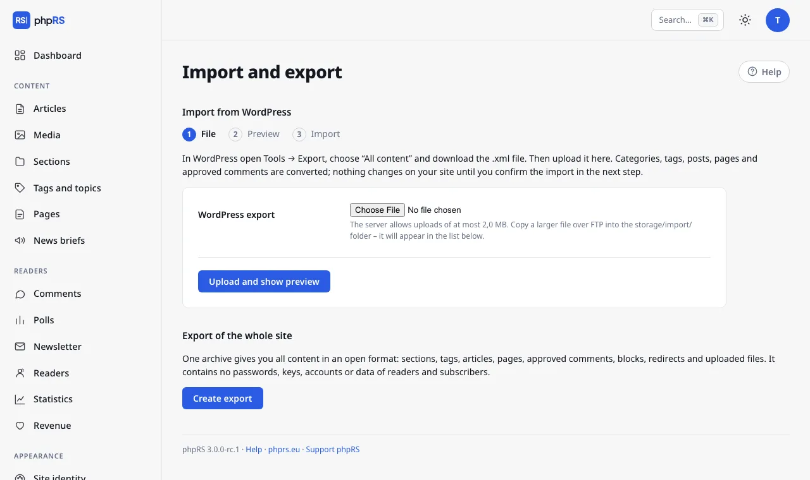

# Import from WordPress and site export

Do you have a site in WordPress and want to move it to phpRS? The import converts sections, tags, articles, pages and approved comments and turns the old addresses into redirects, so neither links nor positions in search engines go to waste. And because the content is meant to belong to you, phpRS can do the opposite direction too: it exports the whole site into a single archive in an open format.

You find both in the administration under **Administration → Import and export**. Only an administrator sees the screen.

## Before you start

- In WordPress open **Tools → Export**, choose **All content** and download the `.xml` file.
- In phpRS create a database backup in **Settings → Backups and updates**. The import can be run repeatedly and duplicates nothing, but a backup before a big change always comes in handy.
- Do not switch the old site off yet – images will be downloaded from it.

## Step 1: the file

Upload the file with the form and click **Upload and show preview**. Most hosting providers, however, allow uploads of only a few megabytes; the screen tells you how much it is in your case. Copy a larger export over FTP into the `storage/import/` folder – it appears in the list below the form and you select it with the **Show preview** button.

Only a genuine WordPress export is accepted. The file is read in pieces, so even an export of hundreds of megabytes is no problem; export a really large site (over 1 GB) from WordPress in parts, for example by year.

## Step 2: the preview

The preview writes nothing to the database. It shows how many posts (published, scheduled, drafts), pages, sections, tags, approved comments, images and authors are in the file – and points out what is **not converted**:

- **user accounts and passwords** – the author's name stays with the article; the article will belong to you;
- **e-mails and IP addresses of commenters** – they are not transferred at all;
- **menus, widgets, appearance and plug-in settings** – you put the navigation and blocks together again in phpRS;
- **custom content types of plug-ins** (shop products, events, portfolio…) – the preview lists them;
- **plug-in shortcodes** in square brackets (forms, page builders) – the tag disappears, the text inside stays;
- private posts, the trash, revisions and auto-drafts. A password-protected post is converted as a draft.

Below the overview you choose:

- the **language version** the content belongs to (offered only on a site with several languages),
- in the **What to import** row, whether to convert **drafts and posts pending review**, **pages**, **approved comments** and create **redirects from old addresses to new ones**,
- in the **Put posts without a category into** row, the section for posts that had none in WordPress (otherwise the section Uncategorized is created).

You start the import with the **Start import** button.

## Step 3: the import

The import runs in batches and the page refreshes by itself – keep it open and watch how many items out of how many are done. If you close the window or the connection drops, nothing bad happens: return to **Import and export** and click **Continue** next to the file.

What is converted into what:

- **Categories** become sections, including their hierarchy. Only those that have an article are created. A section with the same name and address that already exists on the site is used.
- **Tags** stay tags.
- **Posts** become articles. The standfirst is the excerpt from WordPress; when it is missing, the text before the “Read more” tag is taken, otherwise the first paragraph. The publication date stays, scheduled posts come out at their time, drafts stay drafts and a post pending review will have the status For review. A “sticky” post is pinned to the front page.
- **Text** is cleaned into the form the phpRS editor writes: block editor comments, scripts, inline styles and frames disappear; an image with a caption stays an image with a caption, a gallery becomes a photo gallery and the address of a YouTube or Vimeo video turns into a player on the site.
- **Pages** are converted as pages; they are not added to the footer menu by themselves, so that dozens of old pages do not flood it.
- **Comments** only approved ones, with the name, the date and the reply threads.

Imported articles are not announced anywhere – no webhook, IndexNow, Web Push or newsletter.

### Repeated import

The system remembers what it has already converted from the old site. You can therefore run the same (or a newer) export again: only what is not on the site yet is added, and articles you have edited in phpRS in the meantime stay unchanged. An article you deleted after the import comes back with the next import.

## Redirects from old addresses

For every article and page a redirect is created from the old address (for example `/2024/05/nazev-clanku/`) and from the numeric address `/?p=123` to the new address. They work when the **Redirects** extension is turned on, and you find them in **Administration → Redirects**. The prerequisite is that the new site runs on the same domain as the old one.

## Images from the old site

After the import the articles still point to the images of the old site. Therefore click **Download images from the old site** on the page with the result (you can return to it any time later with the **Result** link next to the file on the **Import and export** screen). The featured images of articles and the images in the texts are downloaded, scaled down, given thumbnails and saved to **Media** – the same as if you had uploaded them by hand – and the links in the texts are rewritten. Here too the work goes in batches and the page continues by itself.

For security reasons images are downloaded **only from the domain of the old site** stated in the export, only JPG, PNG, GIF and WebP images up to 15 MB. Images from other domains (for example from a CDN or from third-party sites) stay in the text as they were. The result lists what could not be downloaded; you repeat it with the **Try downloading again** button.

When the server cannot download (it has neither `curl` nor `allow_url_fopen` enabled), the screen says so. Then upload the images to Media by hand and replace them in the articles.

## After the import

- Go through a few articles on the site, and in **Sections** put the order right and merge sections if needed.
- Put together the navigation and blocks, choose a template and set up **Site identity**.
- **Delete** the export file (the button next to the file). It contains the e-mails of authors and commenters from the old site and is of no further use on the server.

## Export of the whole site

The **Create export** button on the same screen saves the archive `export-YYYYMMDD-HHMMSS.zip` to `storage/zalohy/` and offers it for download. It contains:

- `obsah.json` – sections, tags, series, articles with all their data (including the language and the links between translations), pages, approved comments, blocks, redirects, the media library and the basic site settings (name, description, identity, languages),
- `README.txt` – a description of the format,
- the `media/` folder with all uploaded files.

The export does **not contain** passwords, accounts of the editorial team, keys and tokens, mail and backup credentials, readers, newsletter subscribers or the e-mails of commenters.

When the media exceed 1 GB or there is not enough disk space, an export with the data only is created and the screen announces it – then download the `media/` folder over FTP. Without the PHP `zip` extension a plain JSON file is created instead of the archive. The last three exports are kept.

An export is not a backup for restoring the same site – the database backup serves that purpose. It is an insurance of freedom: content in a readable format that can be converted anywhere.
